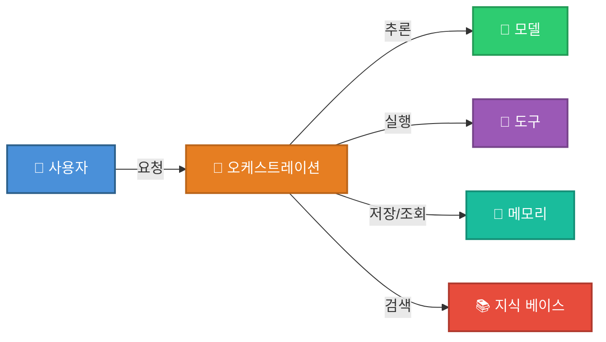

# Chapter2 에이전트 시스템 설계

## 2.1 에이전트 시스템 구축

- 에이전트의 작업 범위를 설정할 땐 늘 균형을 신경써야한다.
    - 작업 범위를 지나치게 좁히면 다른 요청을 놓쳐 큰 효과를 보지 못한다.
        - ex) 고객 대으에서 주문 취소만 처리한다면 환불이나 배송지 변경은 대응 못함
    - 작업 범위를 지나치게 넓히면 수많은 엣지케이스 대응에 작업 기간이 오래 걸린다.
        - ex) 모든 고객 문의 자동화
- 워크플로처럼 명확한 경계에 집중하면 구체적 입력, 구조화된 출력, 짧은 피드백 루프를 확보할 수 있다.
    - 구체적 입력 ex) 고객 메시지, 주문 레코드
    - 구조화된 출력 ex) 도구 호출 + 확인
- 에이전트가 잘 작동하는지 확인하려면 다음 사항 위주로 평가한다.
    - 올바른 도구를 호출했는가? ex) cancel_order
    - 올바른 파라미터를 전달했는가? ex) 정확한 주문 ID
    - 고객에게 명확한 확인 메시지를 보냈는가

## 2.2 에이전트 시스템 핵심 구성요소

## 2.3 모델 선택

- 모든 에이전트 기반 시스템 중심에는 모델(model)이 있다.
    - 모델은 에이전트의 의사결정, 상호작용, 학습 역량을 결정한다.
    - 모델은 시스템의 성능, 확장성, 지연, 비용에 직접 영향을 미친다.
    - 모델 선택은 일반적으로 작업 복잡도 평가에서 시작한다.
- GPT나 클로드 같은 대형 파운데이션 모델
    - 개방 환경에서 컨텍스트 이해, 유연한 추론, 창의성에 적합
    - 모호성, 문맥 뉘앙스, 다단계 작업에 적합
    - 다만 높은 연산, 클라우드 인프라, 큰 지연을 요구
- ModernBERT 파싱 모델이나 Phi-4 같은 소형 모델
    - 정의가 명확한 반복 작업에 적합
    - 로컬에서 효율적으로 실행되고 빠르고 저렴한 비용
    - 고객 지원, 정보 검색, 데이터 라벨링에서 유용
- 라마, 딥시크 같은 오픈 소스 모델
    - 오픈소스이기에 파인튜이닝이나 수정이 가능해 프라이버시가 중요하다면 적합
    - 다만 엔지니어링 노력이 더 듦
- 도메인 특수성과 민감도에 따라 모델 선택이 나뉜다.
    - 의료, 법률, 기술 지원 같은 특수 도메인에선 맞춤 학습 모델이 유용하다.
    - 그 외에는 범용 사전학습 모델을 적절히 파인튜닝하는 것만으로도 좋은 성능을 낸다.
- 실제로는 비용과 지연 시간이 모델 선택의 결정 요인이 되기도 한다.
    - 많은 개발자들이 하이브리드 전략을 채택한다.
    - 복잡한 요청엔 강력한 모델, 일상적인 요청엔 경량 모델을 사용

## 2.4 도구

- 에이전트에서 ‘도구’는 에이전트가 특정 작업을 수행하고 문제를 해결할 수 있게 한다.

### 2.4.1 특정 작업을 해결하는 도구 설계

- 로컬 도구
  - 외부 의존성 없이 내부 로직과 계산만을 수행
  - 규칙 기반 및 사전 정의된 함수를 실행하는 방식
- API 기반 도구
  - 외부 서비스나 데이터 소스와 상호작용할 수 있게 한다.
- MCP
  - 표준 스키마를 통해 구조화된 실시간 컨텍스트를 프롬프트에 직접 전달
  - 도구 호출을 표준화된 방식으로 지원
  - 불필요한 도구 사용을 줄이고 컨텍스트를 보존하여 상황 인식을 모델에 주입하는 데 특히 효과적

### 2.4.2 도구 통합과 모듈성

- 도구 개발에서 모듈형 설계는 필수다.
  - 필요에 따라 쉽게 교체 가능해야하기 때문

## 2.5 메모리

- 메모리를 통해 에이전트는 컨텍스트를 유지하고 과거 상호작용에 학습하며 더 나은 의사결정을 내리게 된다.
- 메모리 관리가 효과적이면 변화하는 환경에서도 새로운 상황에 적응할 수 있다.

### 2.5.1 단기 메모리

- 현재 작업이나 대화와 관련된 정보를 저장하고 관리하는 능력
- 컨텍스트 유지에 사용되며 실시간으로 일관된 의사결정을 하도록 돕는다.
- 롤링 컨텍스트 윈도우(rolling context window)
  - 최근 정보를 일정 범위 내에 계속 갱신하며 오래된 데이터를 버리는 방식
  - 최근 대화 내용을 기억해야 하지만 오래된 세부 정보를 잊어도 되는 앱에 유용 (ex. 챗봇)

### 2.5.2 장기 메모리

- 과거 정보를 바탕으로 향후 행동을 결정할 수 있게 하는 능력
- 시간이 지남에 따라 점점 발전해야하고 개인화된 경험을 제공해야 하는 에이전트에 특히 중요
- 장기 메모리는 주로 다음을 통해 구현된다.
  - 데이터베이스
  - 지식 그래프(knowledge graph)
  - 파인튜닝된 모델
- ex) 헬스 케어 모니터링 에이전트

### 2.5.3 메모리 관리 및 검색

- 효과적인 메모리 관리란
  - 저장된 데이터를 체계적으로 구성
  - 인덱싱을 통해 쉽게 검색 최적화
- 원할한 성능을 위해 경우에 따라 오래되거나 불필요한 디테일을 일부러 잊어야할 수도 있다.
  - ex) 전자 상거래 추천 에이전트의 경우 최신 선호도 기반으로 움직인다. 사용자의 선호도가 변할 수도 있기 때문

## 2.6 오케스트레이션

- 개별적인 기능을 end-to-end 솔루션으로 전환
- 여러 스킬과 도구를 상황에 따라 사용하여 전체 과정을 감독하여 명확한 목표를 이루도록 설계
- 현실 세계의 조건은 변경될 수 있기에 상황과 필요에 따라 워크플로를 통제해 목표에서 벗어나지 않게 한다.
- 견고한 오케스트레이션 계층이 없다면 아무리 강력한 스킬이라도 방향이 어긋나거나 전체 실행이 멈출 위험이 있다.

## 2.7 설계 트레이드

- 에이전트 시스템은 다양한 트레이드오프를 균형 있게 조절해야 한다.
  - 성능, 확장성, 신뢰성, 비용

### 2.7.1 성능: 속도와 정확도의 균형

- 높은 성능은 빠른 정보 처리로 작업을 수행하지만 그만큼 정밀도가 떨어질 수 있다.
  - ex) 자듈주행 차량이나 트레이딩 시스템은 밀리초 차이겨 결과를 바꿀 수 있어 정확도보다 속도가 우선이다.
- 정확도를 높이면 복잡한 모델이나 계산 집약적 기법이 필요해 전체 속도가 느려질 수 있다.
  - ex) 법률/의료 분석은 속도 저하를 감수하더라도 신뢰할 수 있는 결과를 내야 한다.
- 하이브리드 전략
  - 에이전트가 빠르고 대략적인 결과를 제시한 뒤 시간과 데이터를 활용해 정교하게 보완하는 방식
  - ex) 추천 시스템이나 진단 시스템에서 주로 사용

### 2.7.2 확장성: 에이전트 시스템의 엔지니어링적 확장

- 현대 에이전트 모델에서 확장성은 중요한 기술적 과제다
  - 딥러닝 모델과 실시간 처리에 크게 의존하기 때문
  - 시스템이 커질수록 데이터량, 동시 처리 수, 연산 리소스(GPU) 관리가 핵심
- GPU는 비싸기 때문에 효율적으로 활용하는 것이 최우선 과제
  - 동적 GPU 할당 - 실시간 수요에 따라 GPU를 배정해 활용도를 극대화하는 방식
  - 탄력적 GPU 프로비저닝 - 클라우드나 온프레미스 클러스토를 이용해 워크로드에 따라 리소스를 자동으로 확장/축소
  - 우선순위 큐잉 - 중요한 작업과 아닌 작업 간에 GPU 접근 권한을 다르게 해서 피그 시간대에 대기 시간 효율성을 높임
  - 분산 시스템 전반에 GPU 작업을 균형 있게 배분하여 지연 시간을 줄일 수 있도록 해야 한다.
  - 비동기 작업 실행 - GPU 작업을 병렬로 처리해 유휴 시간을 최소화
  - 로드 밸런싱 - 활용률 낮은 GPU로 작업을 분산시켜 GPU 병목을 최소화
  - 수평 확장 - GPU 처리 노드를 추가해 처리 능령을 향상

### 2.7.3 신뢰성: 견고하고 일관된 에이전트

- 신뢰성
  - 에이전트가 일정 기간 동안 일관되고 정확하게 작업을 수행할 수 있는 능력
  - 예상된/예상하지 못한 조건에서도 문제 없이 동작해야 한다.
  - 보장하려면 시스템 복작성, 비용, 개발 기간 측면에서 트레이드 오프가 필요
- 장애 허용
  - 신뢰성의 핵심 요소 중 하나로 오류를 감지하고 이를 잘 처리할 수 있어야 함
  - 네트워크, 하드웨어 문제 등을 감지, 정상 상태로 복구할 수 있어야 한다.
  - 일반적으로 중복 구조를 사용
- 일관성과 견고성
  - 다양한 시나리오, 입력, 환경에서 일관된 성능을 유지해야 신뢰성을 확보한다.
  - 이상적 조건 뿐 아니라 다양한 엣지케이스 검증이 필요
  - 철저한 테스트, 모니터링, 피드백 루프가 필요
