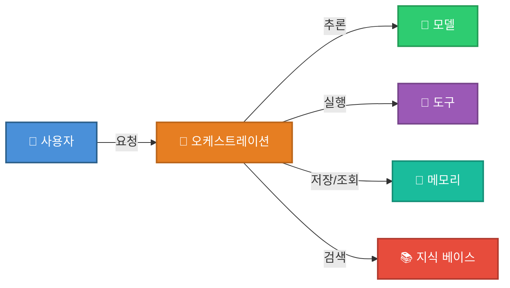

# Chapter2 에이전트 시스템 설계

## 2.1 에이전트 시스템 구축

- 에이전트의 작업 범위를 설정할 땐 늘 균형을 신경써야한다.
    - 작업 범위를 지나치게 좁히면 다른 요청을 놓쳐 큰 효과를 보지 못한다.
        - ex) 고객 대으에서 주문 취소만 처리한다면 환불이나 배송지 변경은 대응 못함
    - 작업 범위를 지나치게 넓히면 수많은 엣지케이스 대응에 작업 기간이 오래 걸린다.
        - ex) 모든 고객 문의 자동화
- 워크플로처럼 명확한 경계에 집중하면 구체적 입력, 구조화된 출력, 짧은 피드백 루프를 확보할 수 있다.
    - 구체적 입력 ex) 고객 메시지, 주문 레코드
    - 구조화된 출력 ex) 도구 호출 + 확인
- 에이전트가 잘 작동하는지 확인하려면 다음 사항 위주로 평가한다.
    - 올바른 도구를 호출했는가? ex) cancel_order
    - 올바른 파라미터를 전달했는가? ex) 정확한 주문 ID
    - 고객에게 명확한 확인 메시지를 보냈는가

## 2.2 에이전트 시스템 핵심 구성요소

## 2.3 모델 선택

- 모든 에이전트 기반 시스템 중심에는 모델(model)이 있다.
    - 모델은 에이전트의 의사결정, 상호작용, 학습 역량을 결정한다.
    - 모델은 시스템의 성능, 확장성, 지연, 비용에 직접 영향을 미친다.
    - 모델 선택은 일반적으로 작업 복잡도 평가에서 시작한다.
- GPT나 클로드 같은 대형 파운데이션 모델
    - 개방 환경에서 컨텍스트 이해, 유연한 추론, 창의성에 적합
    - 모호성, 문맥 뉘앙스, 다단계 작업에 적합
    - 다만 높은 연산, 클라우드 인프라, 큰 지연을 요구
- ModernBERT 파싱 모델이나 Phi-4 같은 소형 모델
    - 정의가 명확한 반복 작업에 적합
    - 로컬에서 효율적으로 실행되고 빠르고 저렴한 비용
    - 고객 지원, 정보 검색, 데이터 라벨링에서 유용
- 라마, 딥시크 같은 오픈 소스 모델
    - 오픈소스이기에 파인튜이닝이나 수정이 가능해 프라이버시가 중요하다면 적합
    - 다만 엔지니어링 노력이 더 듦
- 도메인 특수성과 민감도에 따라 모델 선택이 나뉜다.
    - 의료, 법률, 기술 지원 같은 특수 도메인에선 맞춤 학습 모델이 유용하다.
    - 그 외에는 범용 사전학습 모델을 적절히 파인튜닝하는 것만으로도 좋은 성능을 낸다.
- 실제로는 비용과 지연 시간이 모델 선택의 결정 요인이 되기도 한다.
    - 많은 개발자들이 하이브리드 전략을 채택한다.
    - 복잡한 요청엔 강력한 모델, 일상적인 요청엔 경량 모델을 사용

