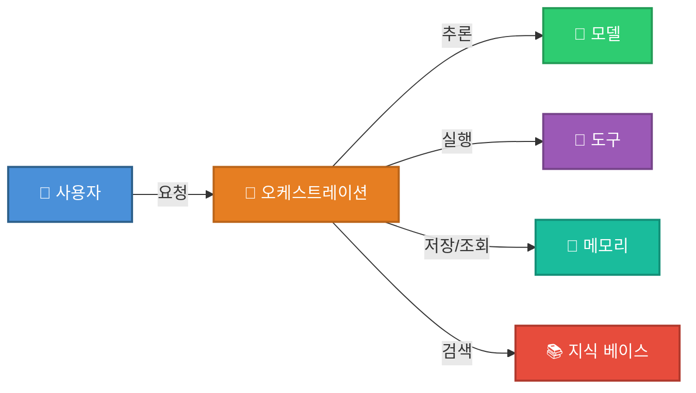

# Chapter2 에이전트 시스템 설계

## 2.1 에이전트 시스템 구축

- 에이전트의 작업 범위를 설정할 땐 늘 균형을 신경써야한다.
    - 작업 범위를 지나치게 좁히면 다른 요청을 놓쳐 큰 효과를 보지 못한다.
        - ex) 고객 대으에서 주문 취소만 처리한다면 환불이나 배송지 변경은 대응 못함
    - 작업 범위를 지나치게 넓히면 수많은 엣지케이스 대응에 작업 기간이 오래 걸린다.
        - ex) 모든 고객 문의 자동화
- 워크플로처럼 명확한 경계에 집중하면 구체적 입력, 구조화된 출력, 짧은 피드백 루프를 확보할 수 있다.
    - 구체적 입력 ex) 고객 메시지, 주문 레코드
    - 구조화된 출력 ex) 도구 호출 + 확인
- 에이전트가 잘 작동하는지 확인하려면 다음 사항 위주로 평가한다.
    - 올바른 도구를 호출했는가? ex) cancel_order
    - 올바른 파라미터를 전달했는가? ex) 정확한 주문 ID
    - 고객에게 명확한 확인 메시지를 보냈는가

## 2.2 에이전트 시스템 핵심 구성요소

