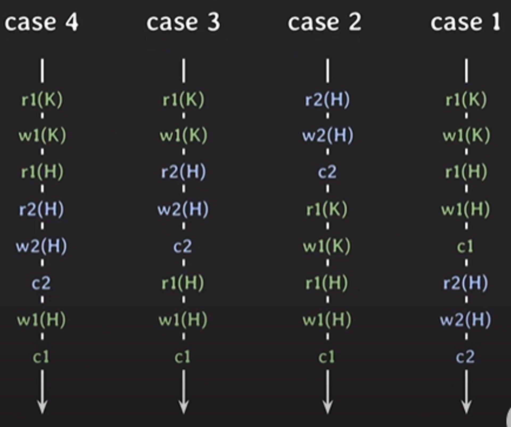
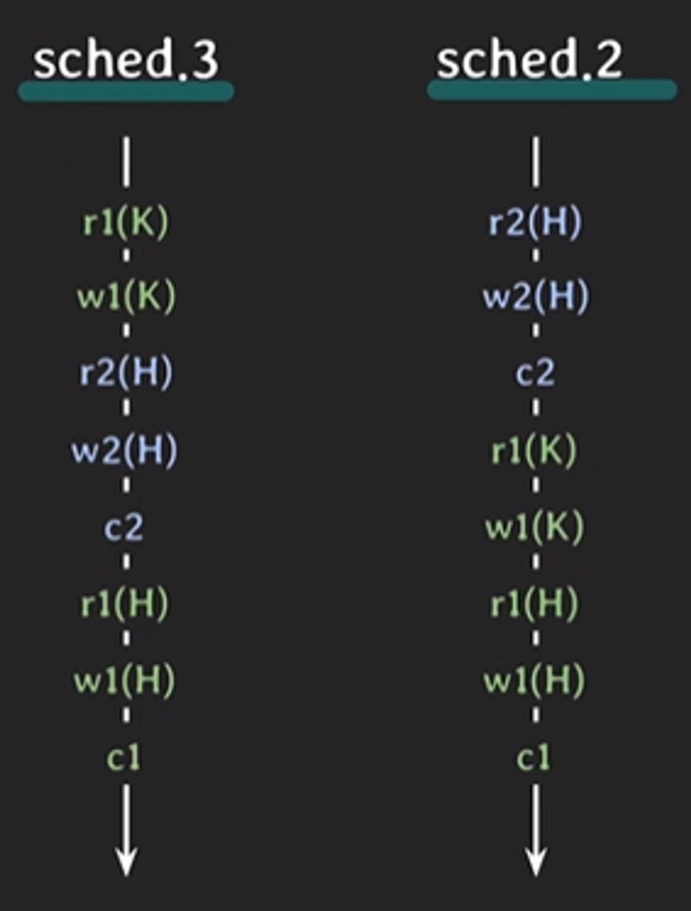
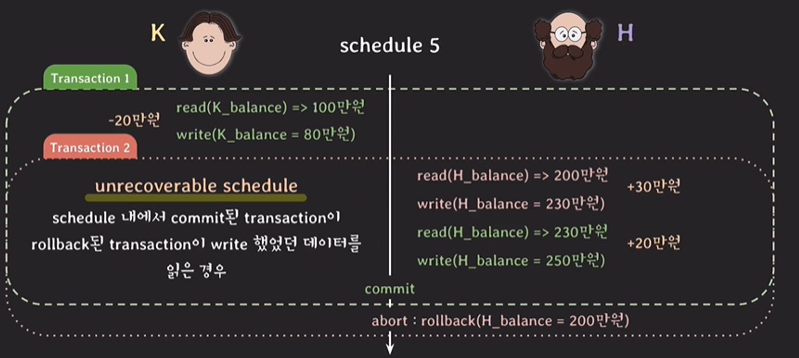
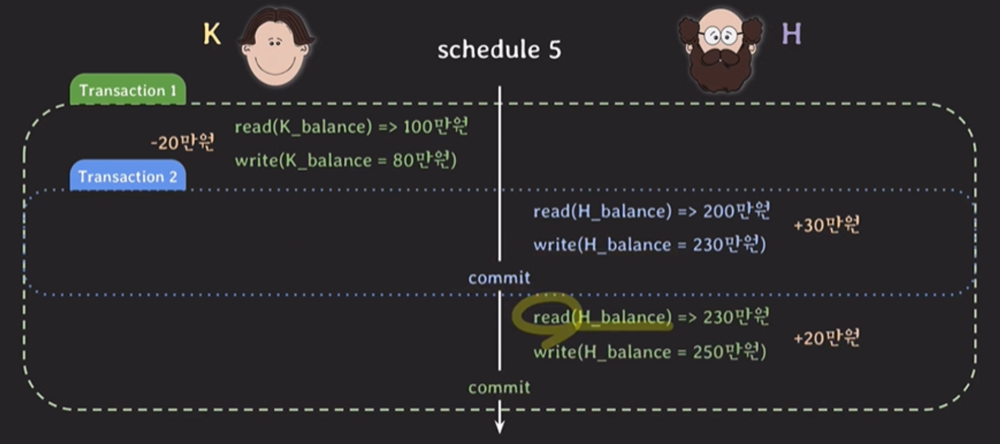
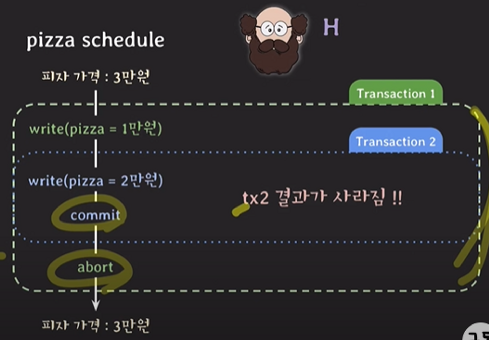

# 트랜잭션 Schedule, Recoverability

## Schedule

- 여러 트랜잭션들이 동시에 실행될 때 각 트랜잭션에 속한 Operation(sql)들의 실행 순서
- 각 트랜잭션 내의 operation들의 순서는 바뀌지 않는다.

**{read인지 write인지} {트랜잭션 번호} {건드리는 레코드}**

### Serial schedule
- 트랜잭션들이 겹치지 않고 한 번에 하나씩 실행되는 schedule
- 이상한 결과를 만든 가능성은 없지만 한 번에 하나의 트랜잭션만 실행되기 때문에 좋은 성능을 낼 수 없다.
    - read나 write를 할 때 I/O가 발생하는 데 이 때 CPU는 놀게 된다. 이 때 다른 트랜잭션을 처리하지 못하니 성능 문제가 생긴다.
- case1, case2

### Nonserial schedule

- 트랜잭션들이 겹쳐서 실행되는 schedule
- 같은 시간 동안 더 많은 트랜잭션들을 처리할 수 있다.
- 겹쳐서 실행되기에 이상한 결과가 나올 수도 있다. (변경 유실)
- case3, case4

### 고민거리

nonserial schedule로 실행해도 데이터 정합성을 맞출 수 있을까?

→ serial schedule과 동일한 nonserial shcedule을 실행하면 어떨까?

→ ‘schedule이 동일하다’는 무엇인가

### Conflict of two operations

세 가지 조건을 모두 만족하면 conflict

1. 서로 다른 트랜잭션에 소속
2. 같은 데이터에 접근
3. 최소 하나는 write operation
- 한 스케줄에서 여러 conflict가 발생할 수 있다.
- conflict operation은 순서가 바뀌면 결과도 바뀐다.

### Conflict equivalent for two schedules

스케줄들이 두 조건 모두 만족하면 conflict equivalent (스케줄이 동일하다)

1. 두 schedule은 같은 트랜잭션을 가진다.
2. 어떤 conflicting operations의 순서도 양쪽 schedule 모두 동일하다.

### **Conflict serializable**

두 schedule을 보자 sched.3과 sched.2는 다음의 모든 conflict의 순서가 동일하다.

- r2(H) → w1(H)
- w2(H) → r1(H)
- w2(H) → w2(H)

즉 Conflict equivalent하다고 볼 수 있는데 sched.2는 자세히 보면 serial schedule이다.

serial schedule과 conflict equivalent일 때 이를 **Conflict serializable**하다고 한다.

즉 sched.3는 nonserial shedule이였음에도 불구하고 이상한 결과가 나오지 않는다.

## Recoverability

특정 트랜잭션을 롤백 했을 때 전체적인 작업이 정상적으로 원래 상태로 돌아갈 수 있다는 속성을 Recoverability라고 한다. 롤백 되면 당연한 거 아니야라고 생각할 수 있지만 격리 레벨이 uncommited_read인 상황을 생각해 보자.

위 그림처럼 롤백 처리된 빨간 트랜잭션의 값을 초록 트랜잭션이 읽어서 그대로 커밋 한다면 정합성에 맞지 않는 결과가 커밋되게 된다. 이를 unrecoverable schedule이라고 한다.

이런 schedule은 DBMS가 허용하면 안 된다. 그렇다면 어떤 shedule이 recoverable한가?

### Recoverable Schedule

- schedule 내에서 그 어떤 트랜잭션도 자신이 읽은 데이터를 write한 트랜잭션이 먼저 commit/rollback 되기 전까지는 commit하지 않는 경우
- 이 경우를 Recoverable schedule이라고 한다.
- rollback을 할 때 이전 상태로 온전히 돌아갈 수 있기 때문에 DBMS는 이런 schedule만 허용해야 한다.

### Cascading rollback

- Recoverable schedule에서는 하나의 트랜잭션이 롤백하면 의존성이 있는 다른 트랜잭션도 rollback해야 하는데 이를 cascading rollback이라고 한다.
- cascading rollback은 여러 트랜잭션의 rollback이 연쇄적으로 일어나는 것이기에 처리하는 비용이 많이 든다.

### Cascadeless schedule

- schedule 내에서 어떤 트랜잭션도 commit되지 않은 트랜잭션들이 write한 데이터는 읽지 않는 경우 cascadeless schedule이라고 한다.

- 이 경우에는 파란 트랜잭션이 rollback되더라도 파란 트랜잭션을 의존하는 트랜잭션이 아무도 없기 때문에 연쇄적인 rollback을 방지할 수 있다.

### Strict schedule

- cascadeless shcedule에서도 아래와 같은 문제는 생긴다.

1. 초록 트랜잭션이 트랜잭션을 시작하여 피자 가격을 3만원에서 2만원으로 변경한다.
2. 커밋 전에 파란 트랜잭션이 시작되어 피자 가격을 3만원에서 2만원으로 변경하고 commit한다.
3. 초록 트랜잭션이 그 후에 rollback이 돼버리면 피자는 최초 가격인 3만원이 되어 파란 트랜잭션이 write한 결과가 사라진다.
- 이는 cascadeless schedule이 `commit 되지 않은 트랜잭션의 write한 데이터는 **읽지 않는** 경우`이기 때문에 발생하는 일이다.
- 이를 해결하기 위해서는 `commit 되지 않은 트랜잭션의 write한 데이터는 **읽지도 쓰지도** 경우`가 되어야 하고 이를 Strict schedule이라고 한다.

### 최종 정리

- **conflict serializable**한 **nonserial schedule**과 **Recoverable schedule**을 허용하자.
- 그 어떤 schedule도 serializable하게 만드는 것과 회복 가능하게 만드는 것이 바로 **concurrency control**이고 이것과 밀접하게 관련된 트랜잭션 속성이 바로 **Isolation**이다.

### 참고

[https://www.youtube.com/watch?v=DwRN24nWbEc](https://www.youtube.com/watch?v=DwRN24nWbEc)

[https://www.youtube.com/watch?v=89TZbhmo8zk](https://www.youtube.com/watch?v=89TZbhmo8zk)
