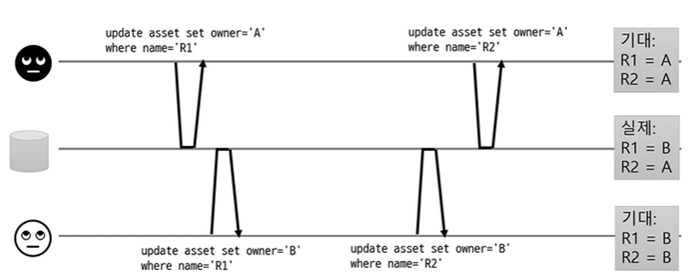
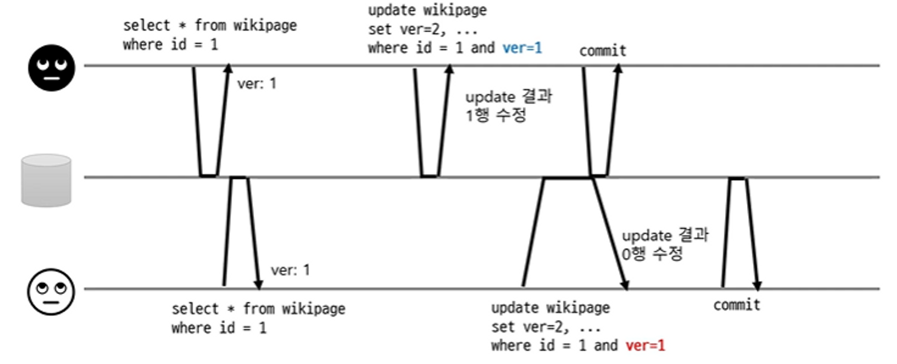
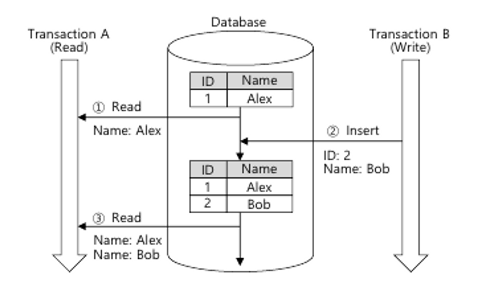

# 트랜잭션 격리 수준
## 트랜잭션 특징

- **원자성**: 트랜잭션 내 작업은 모두 성공하든가 모두 실패해야 한다.
- **일관성**: 모든 트랜잭션은 일관성 있는 데이터베이스 상태를 유지해야 한다.
    - (ex) DB 무결성 제약을 항상 만족)
- **격리성**: 동시에 실행되는 트랜잭션들이 서로에게 영향을 미치지 않는다.
    - 동시성과 관련
- **지속성**: 트랜잭션을 성공적으로 끝내면 결과가 DB에 항상 반영되어 있어야 한다.

## 트랜잭션 격리 수준

- 동시성 이슈를 해결하는 가장 쉬운 방법은 트랜잭션을 순서대로 실행하는 것
    - 동시 접근 문제 아예 없음
    - 하지만 한 번에 한 트랜잭션만 처리하므로 성능(처리량) 저하 가능
- 다양한 격리 수준 지원
    - **READ UNCOMMITED**
    - **READ COMMITED**
    - **REPEATABLE READ**
    - **SERIALIZABLE**

### 격리 수준 문제점

| 격리 수준 | DIRTY READ | NON-REPEATABLE READ | PHANTOM READ |
| --- | --- | --- | --- |
| READ UNCOMMITED | O | O | O |
| READ COMMITTED |  | O | O |
| REPEATABLE READ |  |  | O (InnoDB는 발생 X) |
| SERIALIZABLE |  |  |  |

**동시성 관련 다양한 문제들**

- 커밋 되지 않은 데이터 읽기 (DIRTY READ)
- 커밋 되지 않은 데이터 덮어쓰기
- 읽는 동안 데이터 변경1
- 변경 유실
- 읽는 동안 데이터 변경2

## READ UNCOMMITED

- **커밋하지 않은 데이터를 읽을 수 있다.**

### **DIRTY READ** 발생

- 트랜잭션A가 데이터를 수정하는 중에 커밋하지도 않았는데 트랜잭션B가 수정 중인 데이터를 조회할 수 있는 것을 DIRTY READ라고 한다.
- 트랜잭션1이 작업을 롤백하면 트랜잭션2의 작업 정합성에 심각한 문제가 생긴다.
- 롤백을 하지 않아도 아래처럼 dirty read가 발생할 수도 있다.
  - 돈 이체라고 했을 때 x와 y의 합은 100이어야 하는데 트랜잭션 2가 읽은 시점에 이 정합성이 깨진다.

### **DIRTY WRITE** 발생

- 커밋 되지 않은 데이터를 쓸 수 있다.
- 트랜잭션 A가 데이터를 수정하는 도중 트랜잭션 B가 같은 row에 수정 작업을 같이 하면 데이터 정합성에 문제가 생긴다.
## READ COMMITED

- **커밋한 데이터만 읽을 수 있다.** (DIRTY READ, WRITE 발생 X)
  - 커밋된 값과 트랜잭션 진행 중인 값을 따로 보관 (Undo 영역으로 백업)
  - 같은 데이터를 수정한 트랜잭션이 끝날 때까지 대기
  - 한 트랜잭션이 다른 트랜잭션 진행 중에 변경된 값을 조회한다면 Undo 영역에 백업된 변경 전 데이터를 조회한다.
- 커밋된 데이터만 덮어쓰기
  - 행 단위 잠금 사용
    - 같은 데이터를 수정한 트랜잭션이 끝날 때까지 대기

### 하지만 **NON-REPEATABLE READ** 발생

- read skew(데이터가 불일치 하는 읽기)
- 읽는 시점에 데이터가 바뀜

## REPEATABLE READ

- **트랜잭션 동안 같은 데이터를 읽게 함**
  - 구현 예: **MVCC(Multi-Version Concurrency Control)**
    - 읽는 시점에 특정 버전에 해당하는 데이터만 읽음
    - Undo영역에 백업된 이전 데이터를 통해 동일한 트랜잭션 내에는 동일한 결과를 보장

> **MVCC**는 다중 버전 병행 수행 제어의 약자로 DBMS에서는 쓰기(Write) 세션이 읽기(Read) 세션을 블로킹하지 않고, 읽기 세션이 쓰기 세션을 블로킹하지 않게 **서로 다른 세션이 동일한 데이터에 접근했을 때 각 세션마다 스냅샷 이미지를 보장** 해주는 메커니즘. 이는 RDBMS에서 **동시성을 높이기 위해 등장**한 기술로, 소수의 전산실 운영자들이 서버 컴퓨터를 사용하던 시절에는 MVCC가 선택 사항이었지만 인터넷이 보편화되고 온라인으로 업무를 처리하는 시대에서는 DBMS를 선택하는데 있어 MVCC가 가장 중요한 요소가 됐다.
출처 : 데이터넷([http://www.datanet.co.kr)](http://www.datanet.co.kr%29/)

- 트랜잭션 진행 중에 같은 버전의 데이터가 읽게 함으로써 read skew 방지

### 하지만 **변경 유실**이 발생할 수 있다. (Lost Update)

- 같은 데이터를 쓸 때 발생
- read count(조회 수 )가 원래 1이었고 2명이 조회 했으니 3이 되어야 하는데 결과는 2가 나왔다.
- 조회 수가 1인 데이터를 두 작업이 동시에 얻었고 서로 2로 조회 수를 update 했기 때문이다.
### **변경 유실 해결 방법**

- **원자적 연산 사용** (DB가 지원 안할 수도 있음)
  - DB가 지원하는 원자적 연산 사용 (ex) update article set readcnt = readcnt + 1;
- **명시적인 잠금**
  - `select … for update`
  - 다른 트랜잭션은 잠금이 없으면 select조차 하지 못한다.

- **CAS(Compare And Set)**
  - 데이터를 수정할 때 verson에 대한 조건도 추가해서 조회 시점에 가져온 verson이랑 같을 때만 변경하도록 한다.
  - 아래 트랜잭션에서는 version이 다르기 때문에 update를 실행하지 않는다.

### **읽는 동안 데이터 변경 2**

- **한 트랜잭션의 결과가 다른 트랜잭션의 쿼리 결과에 영향**
  - 같은 데이터를 쓰지 않지만 실제로는 경쟁 상태
    - 당직자가 1명만 있으면 되는 상황일 때 위 트랜잭션이 조회해보니 2명이다.
    - 위 트랜잭션이 자신의 당직 상태를 false로 바꾸었는데 커밋 전에 아래 트랜잭션도 당직를 조회해보니 2다.
    - 그래서 아래 트랜잭션도 자신의 당직 상태를 false로 바꾼다.
    - 결과적으로 당직은 0명이 되어서 정합성에 문제가 생긴다.

### PANTOM READ 발생

- 한 트랜잭션 내에서 같은 쿼리를 두 번 수행 시, 첫 번째 쿼리에서 없던 레코드가 두 번째 쿼리에서 발생하는 현상
  - for update로 조회 쿼리를 수행 시 발생할 수 있는데 이는 언두 영역에는 잠금을 걸 수 없어 실제 레코드에 잠금을 걸기 위해 언두 영역을 가져오지 않고 실제 레코드를 조회하기 때문

- 하지만 InnoDB에서는 REPEATABLE READ 격리 단계에서 PANTOM READ가 발생하지 않는다.
  - next-key lock을 사용하기 때문인데 이는 record lock과 gap lock을 함께 사용하는 것을 의미한다.
    - record lock: 레코드 자체에 거는 락으로 InnoDB에서는 레코드의 인덱스에 락을 건다.
    - gap lock: 레코드 자체가 아닌 해당 레코드의 인접 레코드 사이의 간격을 잠그는 락을 의미한다. 레코드와 레코드 사이에 새로운 레코드가 insert되는 것을 제어하는 용도이다.
  - A 트랜잭션에서 read할 때 레코드 인접에 gap lock을 걸어버리기 때문에 B 트랜잭션이 새로운 데이터를 insert하는 것이 불가능하다.

## SERIALIZABLE

- 글자 그대로 생각하면 모든 트랜잭션을 줄 세우는 것 같지만 성능 때문에 그렇게 하지 않는다.
- **인덱스 잠금(InnoDB)이나 조건 기반 잠금 등 사용**
---
[https://youtu.be/poyjLx-LOEU](https://youtu.be/poyjLx-LOEU)

[https://zzang9ha.tistory.com/381](https://zzang9ha.tistory.com/381)

[https://itpenote.tistory.com/616](https://itpenote.tistory.com/616)

[https://www.youtube.com/watch?v=bLLarZTrebU](https://www.youtube.com/watch?v=bLLarZTrebU)
