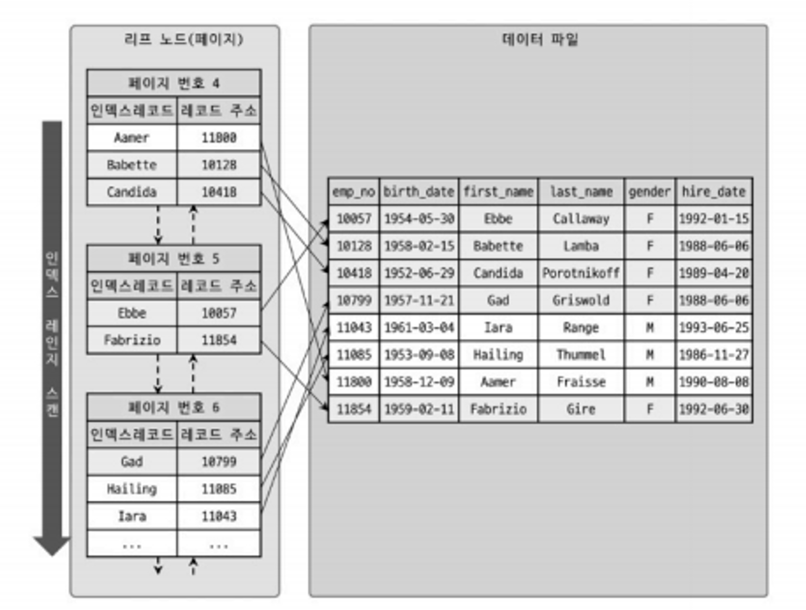
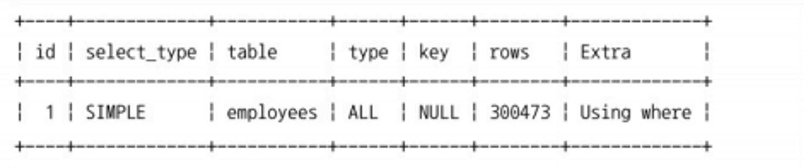
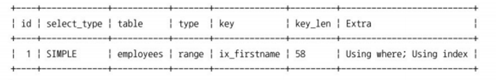

# 커버링 인덱스와 실행 계획
## 커버링 인덱스

- 커버링 인덱스란 쿼리를 충족하는데 필요한 모든 데이터를 갖는 인덱스를 뜻한다.
- `select, where, group by, order by` 등에 활용되는 모든 컬럼이 인덱스의 구성 요소인 경우를 말한다.
- **실제 데이터 접근 과정 없이** 인덱스에 존재하는 컬럼 값으로만 쿼리를 완성하는 것을 얘기한다.

## Using index

- 데이터 파일을 전혀 읽지 않고 인덱스만 읽어서 쿼리를 모두 처리할 수 있을 때 실행 계획 Extra 칼럼에 “Using index”가 표시 된다.
- 인덱스를 이용한 쿼리에서 가장 부하가 일어나는 작업이 데이터 파일을 검색하는 작업이다.

  - `select first_name, birth_date from employee where first_name between ‘Babette’ and ‘Gad’;`
  
  - **Using where** : MySQL 엔진이 별도의 가공, 필터링 작업을 처리할 경우 나타난다. 범위 조건은 스토리지 엔진에서 처리되어 레코드를 리턴하지만 체크 조건은 mysql 엔진에서 처리 된다.
  - 이렇게 되면 인덱스에 없는 정보인 `birth_date`를 찾기 위해 데이터 파일을 검색하는 작업이 일어날 것이고 이 작업이 많다고 판단되면 인덱스를 테우지 않고 풀스캔을 하는 경우가 많다.
- 그래서 기본적으로 select해서 가져오는 칼럼을 인덱스가 적용된 칼럼으로 가져 오는 경우 쉽게 Using index가 표시되는 것을 확인할 수 있다.
    - `select first_name from employee where first_name between ‘Babette’ and ‘Gad’;`
    - `select first_name, emp_no from employee where first_name between ‘Babette’ and ‘Gad’;`
    
    - `first_name, emp_no`를 가져오는 쿼리에서 커버링 인덱스가 적용된 이유는 InnoDB에서 논 클러스터링 인덱스의 레코드 주소가 그림에서처럼 PK(클러스터링 인덱스)를 가지고 있기 때문이다. 즉 인덱스 데이터 만으로 데이터 파일 검색 없이 결과를 반환할 수 있다.
- 그래서 기본적으로 select해서 가져오는 칼럼을 인덱스가 적용된 칼럼으로 가져 오는 경우 쉽게 Using index가 표시되는 것을 확인할 수 있다.
    - `select first_name from employee where first_name between ‘Babette’ and ‘Gad’;`
    - `select first_name, emp_no from employee where first_name between ‘Babette’ and ‘Gad’;`
    

   - `first_name, emp_no`를 가져오는 쿼리에서 커버링 인덱스가 적용된 이유는 InnoDB에서 논 클러스터링 인덱스의 레코드 주소가 그림에서처럼 PK(클러스터링 인덱스)를 가지고 있기 때문이다. 즉 인덱스 데이터 만으로 데이터 파일 검색 없이 결과를 반환할 수 있다.

- 실행 계획의 type 칼럼이 eq_ref, ref, range, index_merge, index 등과 같이 인덱스를 사용한다면 모드 Using index를 사용할 수 있다. 인덱스 풀 스캔(index)을 실행할 때도 커버링 인덱스가 적용된다면 속도는 훨씬 개선된다.

## Using index condition

- MySQL 옵티마이저가 **인덱스 컨디션 푸시 다운(Index condition pushdown)** 최적화를 사용하면 다음 예제와 같이 Extra 칼럼에 “Using index condition” 메시지가 표시된다.
- MySQL 5.6 버전부터 인덱스 컨디션 푸시다운이라는 기능이 도입 됐다.
    - 참고 : [https://jojoldu.tistory.com/474](https://jojoldu.tistory.com/474)
## Index Condition Pushdown

- ICP는 MySQL이 인덱스를 사용하여 테이블에서 행을 검색하는 경우에 대한 최적화다.
- ICP를 사용하지 않으면 스토리지 엔진은 인덱스를 통과하여 테이블에서 `where` 조건을 평가하는 MySQL 서버로 반환한다.
- ICP를 활성화시키면 인덱스의 열만 사용하여 `where` 조건의 일부를 평가할 수 있는 경우 MySQL 서버는 `where` 조건의 이 부분을 스토리지 엔진으로 푸시 한다.
- ICP는 스토리지 엔진이 기본 테이블에 엑세스 해야 하는 횟수와 MySQL 서버가 스토리지 엔진에 엑세스해야 하는 횟수를 줄일 수 있다.

### 더 알아보면 좋을 것

커버링 인덱스를 이용한 페이징 최적화 (jpa + querydsl)

[https://jojoldu.tistory.com/529?category=637935](https://jojoldu.tistory.com/529?category=637935)

### 참고

- [https://tecoble.techcourse.co.kr/post/2021-10-12-covering-index/](https://tecoble.techcourse.co.kr/post/2021-10-12-covering-index/)
- Real Mysql 8.0 (p.476~)
- [https://jojoldu.tistory.com/476](https://jojoldu.tistory.com/476)
- [https://dev.mysql.com/doc/refman/5.6/en/index-condition-pushdown-optimization.html](https://dev.mysql.com/doc/refman/5.6/en/index-condition-pushdown-optimization.html)
