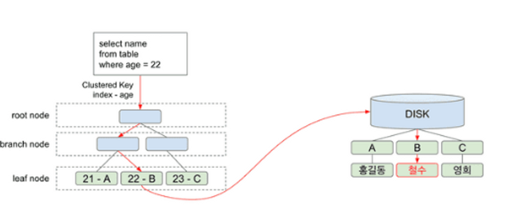

# 인덱스

### 인덱스란?

- 추가적인 쓰기 작업과 저장 공간을 활용하여 데이터베이스 검색 속도를 향상시키기 위한 자료구조
- 테이블의 모든 데이터를 검색하면 (full scan) 시간이 오래 걸리기 때문에 데이터와 데이터의 위치를 포함한 자료구조를 통해 빠르게 조회하도록 돕는다.
- select 외에도 update, delete에도 성능이 향상된다.
    - 대상을 조회해야 수정하거나 삭제할 수 있기 때문

### 인덱스 관리

- 인덱스를 항상 최신의 정렬 상태로 유지해야 원하는 값을 빠르게 탐색할 수 있기에 다음 작업들이 추가로 필요하다.
    - insert: 새로운 데이터의 인덱스 추가
    - delete: 삭제하는 데이터의 인덱스를 사용하지 않는다는 처리
    - update: 기존 인덱스 사용하지 않음 처리하고 갱신된 데이터에 대한 인덱스 추가

### 인덱스 종류

- **Clustered Index**
    - 테이블의 데이터를 인덱스로 지정한 칼럼에 대해 물리적으로 정렬한다.
    - 물리적으로 정렬하기 때문에 테이블 당 하나의 클러스터 형 인덱스만 존재할 수 있다.
    - 새로운 인덱스가 생성되면 데이터 페이지 전체를 다시 정렬한다.
    - PK를 지정하면 자동으로 클러스터 된 인덱스를 생성한다. (id 순 정렬이 기본인 이유)
    - 리프 페이지가 데이터 페이지
- **Non-Clustered Index**
    - 물리적으로 정렬하지 않고 인덱스는 테이블 데이터와 별도의 장소에 저장 된다.
        - 추가 공간 필요
    - 지정된 칼럼으로 정렬시킨 인덱스를 만듦
    - 물리적으로 정렬하지 않기 때문에 여러 개의 논 클러스터 형 인덱스를 설정할 수 있다.
    - 리프 페이지에 실제 데이터 페이지 주소를 담고 있음
        - 하지만 clustered Index와 non-clustered index가 함께 쓰인다면 리프 페이지에 clustered index (거의 pk)가 저장되게 된다.
        - 그래서 데이터를 찾을 때 non-clustered index에서 찾을 row의 pk를 찾고 clustered index에서 다시 탐색해 데이터를 찾는다.

### 인덱스의 장점과 단점

- 장점
    - 테이블 조회 속도 상승
        - 인덱스 테이블은 데이터가 정렬되어 있기 때문에 where, order by 절에서 빠른 조회 성능을 낼 수 있다.
    - 전반적인 시스템 부하를 줄일 수 있다.
- 단점
    - 인덱스 관리를 위해 DB의 약 10% 정도 저장 공간이 필요하다. (non-clustered)
        - 때문에 무턱대고 인덱스를 만들면 안 된다.
    - 인덱스 관리를 위한 추가 작업이 필요하다.
    - 잘못 사용할 경우 성능이 저하될 수도 있다.
        - 만약 데이터 삽입, 수정, 삭제가 많은 데이터에 인덱스를 걸면 인덱스 크기가 커져 성능이 저하될 수도 있다.
        - 사용하지 않는 인덱스를 삭제하는 것이 아니라 사용하지 않음 처리를 하기 때문이다
        - 데이터 수정이 많은 데이터라면 SQL 문을 효율적으로 짜는 방향을 생각해 보는 것이 좋을 수도 있다.
    - 데이터 양이 많지 않다면 풀 스캔이 더 빠르다. (리프 노드까지 내려가는 과정이 없기 때문)
        - [http://wiki.gurubee.net/display/DBSTUDY/Clustering+Factor](http://wiki.gurubee.net/display/DBSTUDY/Clustering+Factor) (Clustering Factor)
### 인덱스 생성 전략

- 조건절에 자주 등장하는 칼럼 (항상 = 으로 비교되는 칼럼)
- 중복되는 데이터가 최소한인 칼럼 (cardinality가 높은 칼럼)
    - 상황에 따라 다르겠지만 보통 전체 데이터의 5~10% 정도로 걸러낼 수 있는 칼럼일 때 인덱스는 좋은 효율을 낸다고 함 (1000만건 이상에서는 보통 5%)
    - 20%만 넘어가도 풀 스캔이 빠를 수도
- order by에서 자주 사용되는 칼럼
- join 조건으로 자주 사용되는 칼럼

### B-Tree

인덱스 구조를 이해하려면 B-트리에 대해서 알아야 한다.

- Balanced Tree
    - 이진 트리 검색의 문제점은 좌우 균형이 맞지 않으면 비효율적이라는 것이다.
    - Balanced Tred는 삽입과 삭제 시 필요하면 스스로 균형을 유지하여 항상 O(logN)의 검색 성능을 유지한다.
- B-Tree란?
    - 이진 트리가 아닌 하나의 노드에 여러 자료가 배치되는 트리 구조
    - 한 노드에 M개 자료가 배치될 수 있다.
        - M차 B-Tree (최소M/2개,  최대 M개)
        - 노드를 보다 효율적으로 사용 가능
    - 루트 노드는 리프 노드인 경우를 제외하고 최소 2개의 자식을 가진다.
    - 각 노드의 자료는 정렬된 상태여야 한다.
    - 왼쪽 서브 트리는 작은 값들이, 오른쪽 서브 트리는 큰 값들이 배치되어야 한다.

### B+Tree

B-Tree의 확장 개념, B-Tree는 순차 접근 시 과도한 디스크 I/O가 발생

- B-Tree는 브랜치 노드에 key와 data를 담을 수 있지만 B+Tree인 경우 브랜치 노드에는 key만 두고 리프 노드에만 key와 data를 저장하고 리프 노드끼리 Linked list로 연결 되어 있다.
- 장점
    - 리프 노드를 제외하고 데이터를 담지 않기 때문에 메모리를 더 확보
    - 메모리 확보로 인해 더 많은 key를 수용할 수 있어 트리의 높이가 낮아진다.
    - 풀 스캔 시, B+Tree는 리프에 모든 데이터가 있기 때문에 한 번만 선형 탐색 하면 된다.
        - B-Tree의 경우 모든 노드를 확인해야 해서 B+Tree 보다 느리다.

### 인덱스 검색 과정

age에 인덱스가 걸려 있는 상태에서 다음 쿼리를 실행

`select name from table where age = 22;`

1. 루트 노드에서 부터 리프 노드까지 age = 22인 노드를 찾는다.
2. 리프 노드에는 index 값과 (age) 디스크의 주소를 가지고 있다.
3. 만약 `select age` 였으면 디스크 접근이 필요가 없겠지만 name을 찾기 위해 디스크 I/O가 발생한다.
4. name 값을 반환한다.

### 인덱스 검색을 했지만 Full Scan으로 동작하는 경우

- 칼럼을 가공하는 경우 `where price * 0.9 > 10000`
    - `where price > 10000 / 0.9` ← 이렇게 해야 인덱스 검색 가능
- ≠ (부정형)
- like 앞 %
- count(*)
- 멀티 칼럼에서 두 번째 칼럼을 조건으로 사용하는 경우
    - 예) age, name 멀티 칼럼 인덱스에서 name만으로 데이터를 찾는 경우
    - age로 정렬 후 name으로 정렬한 값이기 때문에
- 멀티 칼럼에서 순서를 바꾸는 경우
    - 예) age, name 멀티 컬럼에서 `where age, name`으로 검색

### 인덱스가 효율적인 이유와 대수 확장성

- 대수 확장성: 트리 깊이가 리프 노드 수에 비해 매우 느리게 생성되는 것을 의미
- 인덱스 깊이가 증가할 때마다 최대 인덱스 항목 수는 4배씩 증가한다.

---

### 참고

[https://mangkyu.tistory.com/96](https://mangkyu.tistory.com/96)

[https://choicode.tistory.com/27](https://choicode.tistory.com/27)

[https://www.youtube.com/watch?v=WBqKyrL6u-Q](https://www.youtube.com/watch?v=WBqKyrL6u-Q)

[https://zorba91.tistory.com/293](https://zorba91.tistory.com/293)

[https://kyungyeon.dev/posts/66](https://kyungyeon.dev/posts/66)

[https://youtu.be/edpYzFgHbqs](https://youtu.be/edpYzFgHbqs)
