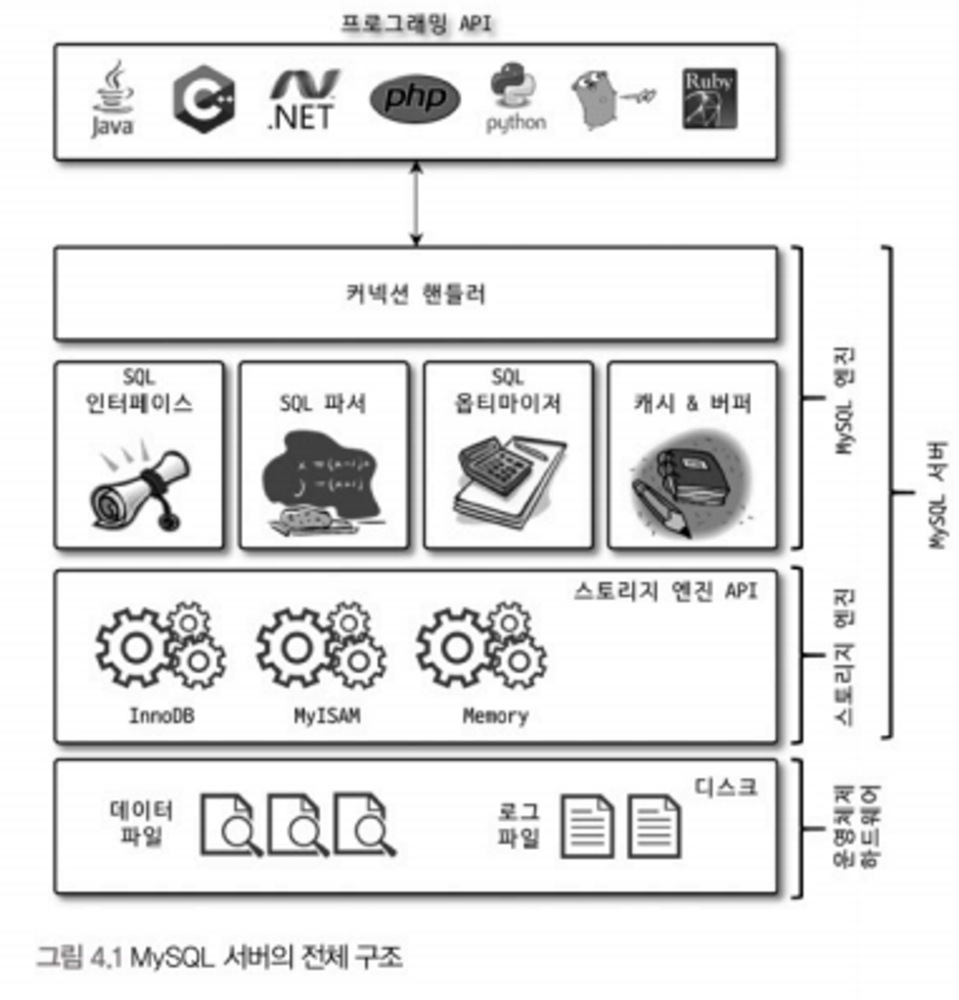
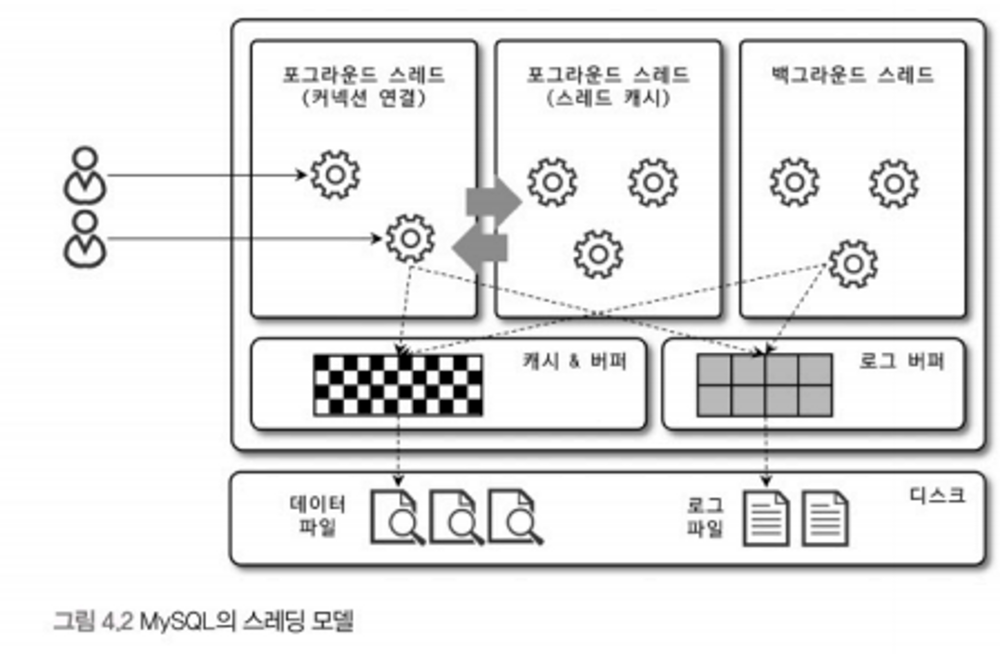

# 4.1 MySQL 엔진 아키텍처
## 4.1.1 MySQL 전체 구조

MySQL 서버는 크게 **MySQL 엔진**과 **스토리지 엔진**으로 구분할 수 있다. 이 둘을 합쳐서 MySQL 서버라고 표현한다.

### MySQL 엔진

- 요청된 SQL 문장을 분석하거나 최적화하는 등 DBMS의 두뇌에 해당하는 처리를 수행
- **커넥션 핸들러**
    - 클라이언트로부터 접속 및 쿼리 요청을 처리
- **SQL 파서 및 전처리기**
- **옵티마이저**
    - 쿼리의 최적화된 실행을 위한

### 스토리지 엔진

- 실제 데이터를 디스크 스토리지에 저장하거나 읽어오는 부분을 전담한다.
- MySQL 서버에서 MySQL 엔진은 하나지만, 스토리지 엔진은 여러 개를 동시에 사용할 수 있다.
- 각 스토리지 엔진은 성능 향상을 위해 키 캐시(MyISAM 엔진)나 InnoDB 버퍼 풀(InnoDB 엔진)과 같은 기능을 내장하고 있다.

### 핸들러 API

- MySQL 엔진이 쿼리 실행기에서 데이터를 쓰거나 읽어야 할 때, 스토리지 엔진에게 쓰기 또는 읽기를 요청하는데 이를 **핸들러 요청**이라고 한다.
- 핸들러 요청에 사용되는 API를 **핸들러 API**라고 한다.
- InnoDB 스토리지 엔진도 핸들러 API를 이용해 MySQL 엔진과 데이터를 주고 받는다.

## 4.1.2 MySQL 스레딩 구조

- MySQL은 스레드 기반으로 동작하며 크게 **포그라운드 스레드**와 **백그라운드 스레드**로 구분할 수 있다.
- **포그라운드 스레드 (클라이언트 스레드)**
    - 최소 MySQL 서버에 접속된 클라이언트의 수만큼 존재
    - 주로 각 클라이언트가 요청하는 쿼리 문장을 처리
    - 클라이언트가 커넥션을 종료하면 해당 커넥션을 담당하던 스레드는 스레드 캐시로 돌아감
        - 스래드 캐시에 이미 일정 개수 이상의 스레드가 있다면 캐시에 넣지 않고 종료시켜 캐시 안의 스레드 수를 유지시킴 (`thread_cache_size` 시스템 변수로 설정 가능)
    - 데이터를 데이터 버퍼나 캐시로부터 가져오며 버퍼나 캐시에 없는 경우 직접 디스크나 인덱스 파일에서 데이터를 읽어 처리한다.
    - MyISAM은 디스크 쓰기 작업까지 포그라운드 스레드가 처리하지만 InnoDB는 버퍼나 캐시까지만 포그라운드가 처리하고, 버퍼로부터 디스크까지 기록하는 작업은 백그라운드 스레드가 처리한다.
- **백그라운드 스레드**
    - MyISAM엔 해당 사항이 없지만 InnoDB는 다음의 작업이 백그라운드로 처리된다.
        - 인서트 버퍼를 병합
        - 로그를 디스크로 기록
        - InnoDB 버퍼 풀의 데이터를 디스크에 기록
        - 데이터를 버퍼로 읽어오기
        - 잠금이나 데드락을 모니터링

> 클라이언트 요청을 처리할 때 쓰기 작업은 지연(버퍼링) 되어 처리될 수 있지만 읽기 작업은 절대 지연될 수 없다. InnoDB 포함 많은 DBMS는 쓰기 작업을 버퍼링해서 일괄 처리하는 기능을 탑재하고 있다. (MyISAM은 그렇지 않고 클라이언트 스레드가 쓰기까지 함께 처리) 때문에 InnoDB에서는 `insert`, `update`, `delete` 쿼리가 나갈 때 데이터가 디스크에 완전히 저장될 때까지 기다리지 않아도 된다.
>

## 4.1.3 메모리 할당 및 사용 구조

MySQL에서 사용되는 메모리 공간은 크게 **글로벌 메모리 영역**과 **로컬 메모리 영역**으로 구분된다.

### 글로벌 메모리 영역

- MySQL 서버가 시작되면서 운영체제로부터 할당된다.
- 클라이언트 수와 무관하게 하나의 메모리 공간만 할당된다.
    - 필요에 따라 2개 이상을 할당 받을 수는 있지만 클라이언트 수와는 무관
    - 모든 스레드에 의해 공유됨
- 대표적인 글로벌 메모리 영역
    - 테이블 캐시
    - InnoDB 버퍼 풀
    - InnoDB 어댑티브 해시 인덱스
    - InnoDB 리두 로그 버퍼

### 로컬 메모리 영역 (세션 메모리 영역)

- 클라이언트 스레드가 쿼리를 처리하는 데 사용하는 메모리 영역
    - 클라이언트 스레드는 클라이언트 커넥션으로부터 요청을 처리
- 각 클라이언트 스레드별로 독립적으로 할당되어 공유되지 않는다.
- 대표적인 로컬 메모리 영역
    - 정렬 버퍼
    - 조인 버퍼
    - 바이너리 로그 캐시
    - 네트워크 버퍼

## 4.1.4 플러그인 스토리지 엔진 모델

- MySQL의 독특한 구조 중 대표적인 것이 바로 플러그인 모델이다.
- 스토리지 엔진, 검색어 파서, Native Authentication과 Caching SHA-2 Authentication 등도 모두 플러그인으로 제공된다.
- 대부분의 작업이 MySQL 엔진에서 처리되고 마지막 데이터 읽기/쓰기 작업만 스토리지 엔진에서 처리된다.
- 사용자 정의 스토리지 엔진을 만들어도 DBMS의 전체 기능이 아닌 일부 기능만 수행하는 엔진을 작성하게 된다는 의미이다.

## 4.1.5 컴포넌트

### MySQL 플러그인의 단점

- 오직 MySQK 서버화 인터페이스할 수 있고 플러그인끼리 통신 불가
- MySQL 서버의 변수나 함수를 직접 호출하기에 안전하지 않음
- 플러그인은 상호 의존 관계를 설정할 수 없어 초기화가 어려움

### 컴포넌트

- MySQL 8.0부터 플러그인 아키텍처를 대체하기 위해 컴포넌트 아키텍처가 지원된다.
- 플러그인 아키텍처의 단점을 보완한다.

## 4.1.6 쿼리 실행 구조

### 쿼리 파서

- 사용차 요청으로 들어온 쿼리를 토큰으로 분리해 트리 구조로 변환
- 쿼리 문법 오류는 이 과정에서 발견되고 사용자에게 오류를 전달

### 전처리기

- 파서 과정에서 만들어진 트리를 기반으로 구조적 문제점을 파악
- 테이블 이름, 칼럼 이름, 내장 함수 등의 존재 여부나 접근 권한을 확인

### 옵티마이저

- 쿼리를 가장 저렴한 비용으로 가장 빠르게 처리할 수 있도록하는 역할을 담당
- DBMS의 두뇌에 해당

### 실행 엔진

- 옵티마이저가 두뇌라면 실행 엔진과 핸들러는 손과 발에 비유할 수 있다.
- 실행 엔진은 옵티마이저가 만든 계획대로 각 핸들러에게 요청해서 받은 결과를 또 다른 핸들러 요청의 입력으로 연결하는 역할을 수행

### 핸들러(스토리지 엔진)

- MySQL 실행 엔진의 요청에 따라 데이터를 디스크로 저장하고 읽어 오는 역할을 담당
- InnoDB, MyISAM

## ~~4.1.8 쿼리 캐시~~

- MySQL 8.0부터 쿼리 캐시 기능은 완전히 제거되고 관련된 시스템 변수도 모두 제거되었다.
    - 테이블 데이터가 변경되면 캐시에 저장된 결과 중 변경과 관련 있는 것들은 모두 삭제해야 했고 이는 심각한 동시 처리 성능 저하를 유발했기 때문
    - 많은 버그의 원인이 되기도 했기 때문

## 4.1.9 스레드 풀

커뮤니티 에디션은 스레드 풀 기능이 없지만 엔터프라이즈 에디션은 스레드 풀 기능을 제공한다. 엔터프라이즈 에디션에 포함된 스레드 풀 대신 Percona Server에서 제공하는 스레드 풀도 존재한다.

### 스레드 풀이란

- 내부적으로 사용자 요청을 처리하는 스레드 개수를 제한해 CPU가 제한된 개수의 스레드 처리에만 집중할 수 있게 한다.
- 서버의 자원 소모를 줄이는 것이 목적
- CPU 스케줄링 과정에서 CPU 시간을 제대로 확보하지 못하는 경우 스레드 풀이 있어도 쿼리 처리가 더 느려지는 사례도 발생할 수 있다.
- CPU가 제한된 수의 스레드를 처리하도록 적절히 유도하면 프로세서 친화도를 높이고 불필요한 컨텍스트 스위치를 줄여 오버 헤드를 낮출 수 있다.

### Percona Server 스레드 풀

- 플러그인 라이브러리를 MySQL 서버에 설치하여 사용할 수 있다.
- 코어 개수만큼 스레드 그룹을 생성 (`thread_pool_size` 시스템 변수로 조정 가능)
    - 일반적으로 코어 수에 맞추는 것이 프로세서 친화도를 높이는 데 좋다.
- 만약 스레드 풀에 요청을 처리한 스레드가 남아 있지 않다면 `thread_pool_oversubscribe`(기본값 3) 시스템 변수에 설정된 개수만큼 더 받아들여서 처리한다.
    - 이 값이 너무 크면 스케줄링할 스레드가 많아져서 비효율 발생할 수도 있음
- 선순위 큐와 후순위 큐를 이용해 특정 트랜잭션이나 쿼리를 우선적으로 처리할 수도 있다.
    - 먼저 시작된 트랜잭션을 빠르게 처리해서 잠금을 빠르게 해제하여 경합을 낮춰 전체적인 처리 성능을 올린다.

## 4.1.10 트랜잭션 지원 메타데이터

- MySQL 8.0부터 딕셔너리(메타데이터)를 모두 InnoDB 테이블에 저장한다.
    - 딕셔너리 및 메타데이터 - 테이블 구조 정보나 스토어드 프로그램 등의 정보
- 시스템 테이블도 InnoDB 스토리지 엔진을 사용하며 mysql DB에 저장하고 있다.
    - 시스템 테이블 - MySQL 서버가 작동하는 데 필요한 테이블의 묶음
    - mysqlDB는 통째로 mysql.ibd라는 테이블 스페이스에 저장된다.

> 딕셔너리와 시스템 테이블 모두 트랜잭션 기반의 InnoDB 스토리지 엔진에 저장되도록 개선되면서 스키마 변경 작업 중간에 MySQL 서버가 비정상적으로 종료되어도 스키마 변경이 완전한 성공 또는 완전한 실패로 정리된다.
>
