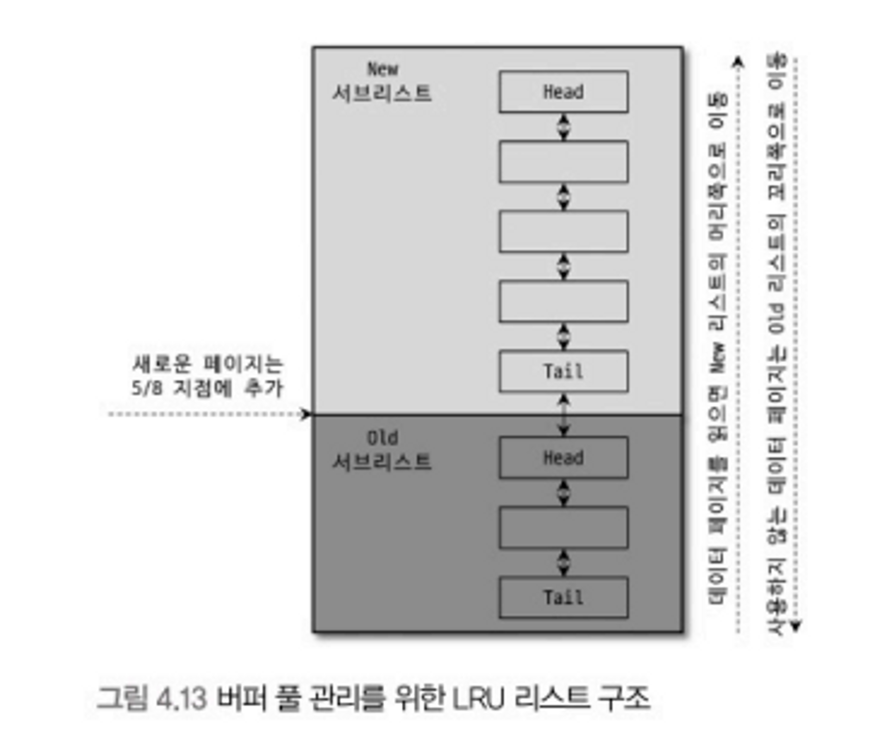
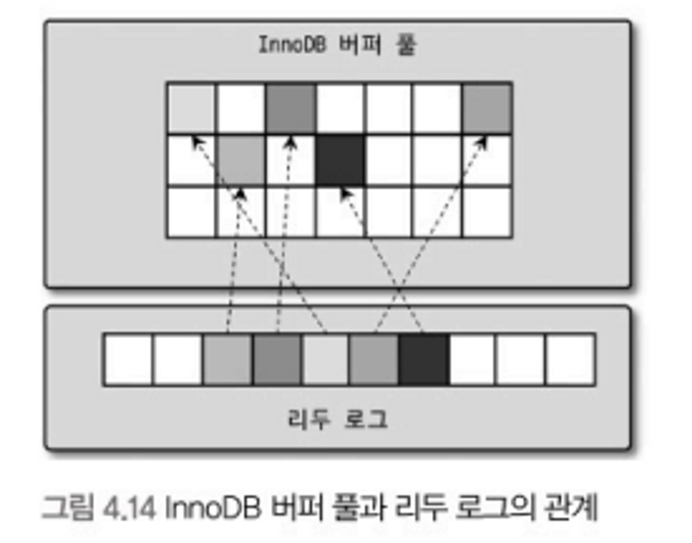

## 4.2.7 InnoDB 버퍼 풀

- 일반적인 애플리케이션에선 insert, update, delete 작업 처리 시 랜덤 디스크 I/O를 발생시킨다.
- InnoDB 스토리지 엔진은 쓰기 작업을 지연 시켜 일괄 작업으로 처리할 수 있게 하는 버퍼 공간을 가지고 있다. → 랜덤 디스크 작업 횟수를 줄일 수 있다.

### 버퍼 풀 크기 설정

- InnoDB 버퍼 풀은 `innodb_buffer_pool_size` 시스템 변수로 설정할 수 있으며 동적으로 확장할 수도 있다.
    - 가능하면 적절히 작은 값으로 설정해서 조금씩 증가시키는 방법이 최적이다.
- 버퍼 풀은 내부적으로 128mb 청크 단위로 쪼개어 관리된다. 버퍼 풀 크기를 조정할 때도 128mb 단위로 처리된다.

### 버퍼 풀의 구조

버퍼 풀은 페이지 크기 조각을 관리하기 위해 다음의 세 자료구조를 관리한다.

- **LRU(Least Recently Used) 리스트**
  

    - 엄밀하게 LRU와 MRU(Most Recently Used) 리스트가 결합된 형태
    - Old 서브 리스트 영역이 LRU, New 서브 리스트 영역이 MRU라고 이해하면 된다.
    - 디스크로부터 한 번 읽어온 페이지를 최대한 오래 버퍼 풀에 유지해 디스크 읽기를 최소화 시키는 것이 목적
    - 처음 읽힌 데이터는 Old 영역 헤더에 추가된다. 버퍼 풀의 데이터가 쿼리에 의해 사용되면 New 영역으로 이동하여 계속 사용된다면 New 영역에서 계속 남아있게 된다. 반대로 거의 사용되지 않는다면 새 데이터 페이지들에 밀려서 Old 영역 끝으로 밀려나 결국은 버퍼 풀에서 제거되는 방식이다.
- **플러시(Flush) 리스트**
    - 디스크로 동기화 되지 않은 데이터를 가진 데이터 페이지(더티 페이지)의 변경 시점 기준의 페이지 목록을 관리한다.
    - 데이터 변경이 가해진 데이터 페이지는 플러시 리스트에 관리되고 특정 시점에 디스크로 기록되어야 한다.
- **프리(Free) 리스트**
    - 실제 사용자 데이터로 채워지지 않은 비어 있는 페이지들의 목록
    - 사용자 커리가 새롭게 디스크의 페이지를 읽어와야 하는 경우 사용된다.

### 버퍼 풀과 리두 로그

InnoDB 버퍼 풀은 **캐시** 역할과 **쓰기 버퍼링**의 역할을 갖고 있다. 버퍼 풀 크기를 늘리면 성능이 빨라지는데 이는 캐시 기능만 향상 시키는 것이다. 버퍼 풀의 쓰기 버퍼링까지 향상 시키려면 버퍼 풀과 리두 로그의 관계를 이해할 필요가 있다.

- 버퍼 풀의 페이지 중 변경되지 않은 것을 클린 페이지, 변경된 데이터 페이지를 **더티 페이지**라고 한다.
- 데이터가 변경되면 변경 내용을 **리두 로그**에 기록하고 변경을 디스크에도 반영하기 위해 리두 로그의 엔트리는 해당 더티 페이지와 연결된다.
  - 리두 로그는 1개 이상의 고정 크기 파일을 연결해 순환 고리처럼 사용한다.
  - 데이터 변경이 계속 발생하면 로그 엔트리는 어느 순간 새로운 엔트리로 덮어 쓰인다.
  - 그래서 전체 리두 로그에서 **재사용 가능한 공간(활성 리두 공간, Active Redo Log)**과 불가능한 공간을 나눠 관리하게 된다. (그림에서 화살표가 있는 공간을 활성 리두 공간이라 함)
  - 리두 로그 공간은 순환되어 재사용되지만 매번 기록될 때마다 **LSN(Log Sequence Number)**은 계속 증가된 값을 갖는다.
- 하지만 리두 로그가 디스크에 기록되는 것이 데이터 페이지가 디스크에 기록되는 것을 보장하지는 않고 그 반대도 마찬가지다. 리두 로그와 데이터 페이지의 동기화를 **체크포인트** 이벤트를 통해 수행한다.
  - 체크포인트 - MySQL 서버가 시작될 때 InnoDB가 리두 로그의 어느 부분부터 복구를 실행해야 할지 판단하는 기준점의 역할을 한다.
  - 가장 최근의 체크포인트의 LSN이 활성 리두 로그 공간 시작점이 된다.
    - 활성 리두 공간의 마지막은 계속 증가하기 때문에 체크포인트와 무관
  - 가장 최근 체크포인트 LSN과 마지막 리두 로그 엔트리의 LSN의 차이를 **체크포인트 에이지(Checkpoint Age)**라고 한다. (체크포인트 에이지 == 활성 리두 공간 크기)
  - 체크포인트 이벤트가 발생하면 체크포인트 LSN보다 작은 리두 로그 엔트리와 관련된 더티 페이지는 모두 디스크로 동기화돼야 한다.
- 즉 버퍼 풀이 아무리 커봤자 리두 로그 공간이 부족하다면 쓰기 버퍼링을 위한 효과는 거의 못 보게 된다.
  - 쓰기 버퍼링을 위한 더티 페이지는 리두 로그 파일과 연결돼야 하기 때문
- 반대로 버퍼 풀에 비해 리두 로그 공간이 엄청 큰 상황에서는 갑작스러운 디스크 쓰기가 발생할 가능성이 높다.
  - 버퍼 풀의 더티 페이지 비율이 너무 높은 상황에서 갑자기 버퍼 풀이 필요해지면 많은 더티 페이지를 한 번에 기록해야 함
- 버퍼 풀 크기가 100GB 이하의 MySQL 서버에서는 리두 로그 파일 크기를 약 5~10GB 수준으로 선택하고 필요할 때마다 늘려가며 최적을 선택하는 것이 좋다.

### 버퍼 풀 플러시

- InnoDB 스토리지 엔진은 더티 페이지들을 성능상의 악영향 없이 디스크에 동기화하기 위해 다음의 2가지 플러시 기능을 백그라운드로 실행한다.
  - **플러시 리스트 플러시**
  - **LRU 리스트 플러시**
### 플러시 리스트 플러시

InnoDB 스토리지 엔진은 주기적으로 플러시 리스트 플러시 함수를 호출해 플러시 리스트에서 변경된 데이터 페이지를 순서대로 디스크에 동기화하는 작업을 수행한다. 이 때 언제부터 얼마나 많은 페이지를 한 번에 기록하느냐에 따라 사용자 쿼리 처리에 영향을 줄 수도 안 줄 수도 있다.

이를 위해InnoDB 스토리지 엔진은 다음의 시스템 변수들을 제공한다.

- `innodb_page_cleaners` - 더티 페이지를 디스크에 동기화하는 스레드인 클레너 스레드의 개수
  - innoDB 버퍼 풀 인스턴스는 여러 개일 수 있는데 클레너 스레드 수와 인스턴스 수를 동일하게 맞추는 것이 좋다.
- `innodb_max_dirty_page_pct` - 버퍼 풀 내의 더티 페이지 비율
  - 기본적으로 버퍼 풀이 가진 페이지의 90%까지 더티 페이지를 가질 수 있는데 이 값이 너무 높을 수도 있다.
  - 일반적으로 더티 페이지가 많을수록 쓰기 버퍼링을 많이 할 수 있기 때문에 가능하면 기본값을 유지하는 것이 좋다.
- `innodb_io_capacity` - 여기에 설정된 값을 기준으로 더티 페이지 쓰기를 실행한다.
  - 디스크로 동기화되는 페이지 수보다 더 많은 더티 페이지가 발생하고 이 비율이 90%를 넘어가면 디스크 쓰기 폭발 현상(Disk IO Burst)이 발생할 가능성이 높아진다.
- `innodb_max_dirty_pages_pct_lwn` - 이 값을 기준으로 일정 수준 이상의 더티 페이지가 발생하면 조금씩 더티 페이지를 디스크로 기록하게 한다.
  - 기본값은 10% 수준인데 상황을 봐서 더 높은 값으로 조정하는 것도 디스크 쓰기 횟수를 줄이는 효과를 얻을 수 있다.
- `innodb_flush_neighbors` - 더티 페이지를 디스크에 기록할 때 디스크에서 근접한 페이지 중 더티 페이지가 있다면 함께 묶어서 디스크에 기록하게 해주는 기능을 활성화할지 결정
  - 디스크 IO가 무거웠던 HDD에서 사용했던 설정이다.
  - 요즘 대부분 SSD를 사용하기에 비활성 모드로 유지하는 것이 좋다.

### LRU 리스트 플러시

LRU 리스트에서 사용 빈도가 낮은 데이터 페이지를 제거해 새로운 페이지를 읽을 공간을 만들 때 **LRU 리스트 플러시 함수**를 사용한다.

- InnoDB 스토리지 에진은 LRU 리스트 끝부분부터 시작해 최대 `innodb_lru_scan_depth` 변수에 설정된 개수만큼 페이지를 스캔한다.
- 스캔하면서 더티 페이지는 디스크에 동기화하고, 클린 페이지는 즉시 프리 리스트로 옮긴다.
- 버퍼 풀 인스턴스별로 스캔하기 때문에 실질적으로 LRU 리스트 스캔은 `innodb_buffer_pool_instances` * `innodb_lru_scan_depth` 수만큼 수행한다.

### 버퍼 풀 상태 백업 및 복구

MySQL 서버를 껐다가 다시 시작하면 InnoDB 버퍼 풀에 데이터가 없는 상태이므로 쿼리 성능이 평소보다 훨씬 나쁠 수도 있다. 반대로 디스크의 데이터가 버퍼 풀에 적재돼 있는 상태를 **워밍업(Warming Up)**이라고 표현하는 데 잘 워밍업된 상태에서 몇십 배의 쿼리 성능 향상이 일어나기도 한다.

MySQL 5.6부터는 버퍼 풀 덤프 및 적재 기능이 도입됐다.

- `SET GLOBAL innodb_buffer_pool_dump_now=ON;`
  - MySQL 서버 셧다운 전에 버퍼 풀의 상태를 백업
  - 버퍼 풀의 백업은 메타 정보만 저장하기 때문에 빠르다.
- `SET GLOBAL innodb_buffer_pool_load_now=ON;`
  - MySQL 서버 재시작 후, 백업된 버퍼 풀의 상태를 복구
  - 버퍼 풀 복구는 버퍼 풀 크기에 따라 상당한 시간이 걸릴 수도 있다.
  - 복구가 너무 오래 걸려 중간에 멈추고자 한다면 `innodb_buffer_pool_load_abort=ON;` 변수를 이용하면 된다.
- `innodb_buffer_pool_dump_at_shutdown`, `innodb_buffer_pool_load_at_startup`
  - 위 두 설정을 MySQL 서버 설정 파일에 넣어두면 자동으로 백업과 복구를 서버가 껐다 켜질 때 수행한다.

### 버퍼 풀의 적재 내용 확인

- MySQL 서버의 `inforamtin_schema` 데이터베이스의 `innodb_buffer_page` 테이블
  - MySQL 5.6부터
  - 어떤 테이블의 페이지들이 innoDB 버퍼 풀에 적재 되어 있는지 확인할 수 있는 테이블
  - 버퍼 풀이 큰 경우 이 테이블 조회가 상당한 부하를 일으켜 쿼리가 느려졌다.
- MySQL 서버의 `inforamtin_schema` 데이터베이스의 `innodb_cached_indexes` 테이블
  - MySQL 8.0부터
  - 테이블의 인덱스별로 데이터 페이지가 얼마나 innoDB 버퍼 풀에 적재돼 있는지 확인할 수 있다.
  - 쿼리를 응용하면 테이블 전체 페이지 중 어느 정도 비율이 버퍼 풀에 적재돼 있는지도 확인해볼 수 있다.
  - 개별 인덱스별로 전체 페이지 개수가 몇 개인지는 알 수 없기 때문에 테이블 인덱스 별로 버퍼 풀에 적재된 비율은 확인할 수 없다.

## 4.2.8 Double Write Buffer

InnoDB 스토리지 엔진의 리두 로그는 페이지의 변경된 내용만 기록하기 때문에 더티 페이지를 플러시할 때 일부만 기록된다면 그 페이지의 내용은 복구할 수 없다.

InnoDB에선 이 같은 문제를 막기 위해 **Double-Write** 기법을 이용한다.

- InnoDB 스토리지 엔진은 실제 데이터 파일에 변경을 기록하기 전에 더티 페이지들을 한 번의 쓰기로 시스템 더블 스페이스의 Double Write 버퍼에 기록한다.
  - Double Write 버퍼에 기록한 후에 각 더티 페이지를 디스크의 적당한 위치에 하나씩 랜덤으로 쓰기를 실행한다.
- Double Write 버퍼의 내용은 실제 데이터 파일 쓰기가 중간에 실패할 때만 사용된다.
  - 더티 페이지들이 정상적으로 기록되면 필요가 없어진다.
- 플러시할 페이지 중 일부만 기록되고 운영체제가 다운됐다고 했을 때, InnoDB 스토리지 엔진은 재시작될 때 Double Write 버퍼 내용과 데이터 파일 페이지들을 모두 비교해서 다른 내용이 있다면 동기화한다.
- `innodb_doublewrite` 변수로 Double Write 기능 사용 여부를 제어할 수 있다.
