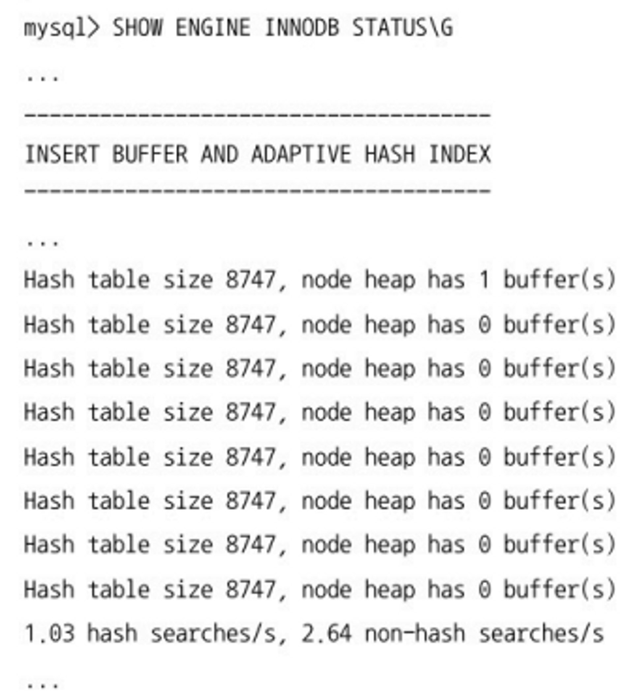

## 4.2.11 리두 로그 및 로그 버퍼

### 리두 로그

- **리두 로그**는 ACID 중 D(Durable)와 밀접하며 MySQL 서버가 비정상적으로 종료됐을 때 데이터 파일에 기록되지 못한 데이터를 잃지 않게 해주는 안전장치다.
- 데이터 파일 쓰기는 디스크의 랜덤 액세스가 필요해 비용이 크다. 때문에 DB 서버는 쓰기 비용이 낮은 자료 구조를 가진 리두 로그를 가진다.
- 데이터베이스는 ACID도 중요하지만 성능도 중요하기에 데이터 파일과 리두 로그를 버퍼링할 수 있는 InnoDB 버퍼 풀이나 로그 버퍼 같은 자료 구조를 가진다.

### 일관되지 않은 데이터

MySQL 서버가 비정상 종료되는 경우 다음의 두 가지 일관되지 않은 데이터를 가질 수 있다.

1. 커밋됐지만 데이터 파일에 기록되지 않은 데이터
    1. 리두 로그에 저장된 데이터를 데이터 파일에 다시 복사하기만 하면 된다.
2. 롤백됐지만 데이터 파일에 이미 기록된 데이터
    1. 리두 로그로는 해결할 수 없고 언두 로그의 내용을 가져와 데이터 파일에 복사하면 된다.
    2. 변경이 커밋됐는지, 롤백됐는지, 트랜잭션 실행 중간 상태였는지를 확인하기 위해 리두 로그가 필요하긴 하다.

### 리두 로그의 디스크 동기화 주기

- 리두 로그는 트랜잭션이 커밋되면 즉시 디스크로 기록되도록하는 것을 권장한다.
    - 그래야 서버 비정상 종료 시 트랜잭션 커밋 내용이 리두 로그에 기록될 수 있고, 그 로그로 복구가 가능해진다.
    - 하지만 커밋마다 디스크에 기록하는 것은 부하를 유발한다.
- `innodb_flush_logg_at_trx_commit` 시스템 변수로 리두 로그의 디스크 동기화 주기를 설정할 수 있다.
    - `=0` : 1초에 한 번씩 리두 로그를 디스크에 기록하고 동기화를 실행한다. 그래서 MySQL 서버 비정상 종료 시 1초 간의 데이터는 사라질 수 있다.
    - `=1` : 커밋마다 디스크로 기록되고 동기화까지 수행된다.
    - `=2` :  커밋마다 로그를 디스크로 기록하지만 실질적인 동기화는 1초에 한 번씩 실행된다. MySQL 서버가 비정상 종료되어도 데이터는 사라지지 않으나 운영체제까지 비정상 종료되면 1초간의 데이터는 사라질 수 있다.
    - 0이나 2인 경우에도 스키마 변경의 DDL이 실행되면 리두 로그가 디스크로 동기화되기에 1초보다 빠를 수도 있다.
    - `innodb_flush_log_at_timeout` 변수로 동기화 주기를 1초 말고 다른 값으로 바꿀 수도 있지만 바꿀 이유가 특별히 없다.

### 리두 로그 파일

- 리두 로그 파일들의 전체 크기는 InnoDB 버퍼 풀 효율성을 결정하기에 신중히 정해야 한다.
    - 적절히 정해져야 변경 내용을 버퍼 풀에 모았다가 한 번에 모아 디스크에 기록할 수 있다.
- `innodb_log_file` 변수로 리두 로그 파일의 크기를, `innodb_log_files_in_group` 변수로 리두 로그 파일 개수를 결정하기에 전체 리두 로그 파일 크기는 두 변수의 곱이다.
- 변경이 너무 많은 DBMS 서버의 경우 리두 로그 작업이 큰 문제가 되는데 ACID를 보장하는 수준에서 로그 버퍼를 통해 버퍼링한다.
    - 로그 버퍼 크기는 기본값 16MB가 적합한데 BLOB이나 TEXT 같은 큰 데이터의 변경이 잦다면 더 크게 설정하는 것도 좋다.

### 리두 로그 아카이빙

- MySQL 8.0부터 InnoDB 스토리지 엔진의 리두 로그를 아카이빙할 수 있게 됐다.
    - 데이터 파일을 복사하는 동안 리두 로그에 쌓인 내용을 계속 추적하며 새로 추가된 리두 로그 엔트리를 복사한다.
    - 데이터 변경이 너무 많아 리두 로그가 빠르게 증가하면 리두 로그 내용을 복사하기도 전에 덮어쓰일 수도 있다. → 백업이 실패하게 됨
    - 리두 로그 아카이빙 기능은 리두 로그가 덮어쓰여도 백업이 실패하지 않게 해준다.

### 리두 로그 활성화 및 비활성화

- MySQL 8.0 이후부터는 수동으로 리두 로그를 활성화하거나 비활성화할 수 있게 됐다.
    - 트랜잭션이 커밋되어도 데이터 파일은 즉시 디스크로 동기화되지 않지만 리두 로그는 항상 디스크로 기록된다. (또는 설정에 따라 1초 간격)
    - 데이터를 복구하거나 대용량 데이터를 한 번에 적재하는 경우 리두 로그를 비활성화해 적재 시간을 단축시킬 수 있게 된다.
    - `ALTER INSTANCE DISABLE INNODB REDO_LOG; //비활성화`
    - `ALTER INSTANCE ENABLE INNODB REDO_LOG; // 활성화`
- 어떤 목적에 의해 리두 로그를 비활성화 했다면 작업이 끝나면 반드시 활성화시켜야 한다. 그래야 장애 발생 시 리두 로그로 복구가 가능하다.

## 4.2.12 어댑티브 해시 인덱스

- **어댑티브 해시 인덱스**란 사용자가 수동으로 생성하는 B-Tree가 아닌 InnoDB 스토리지 엔진에서 사용자가 자주 요청하는 데이터에 대해 자동으로 생성하는 인덱스다.
  - `innodb_adaptive_hash_index` 변수로 활성화하거나 비활성화할 수 있다.
- 어댑티브 해시 인덱스는 B-Tree 검색 시간을 줄이기 위한 기능이다.
  - 일반적으로 인덱스에서 값을 찾는 것이 빠르다고는 하지만 DB 서버가 얼마나 많은 일을 하느냐에 따라 B-Tree에서의 탐색이 느려질 수도 빨리질 수도 있다.
  - B-Tree 탐색에는 루트 노드를 거쳐 브랜치 노드, 최종적으로 리프 노드까지 가야 원하는 레코드를 읽을 수 있다.
  - 동시에 몇천 개의 스레드로 인덱스 탐색이 실행한다면 CPU의 엄청난 프로세스 스케줄링에 의해 쿼리 성능이 떨어질 것이다.
- InnoDB 스토리지 엔진은 자주 읽히는 데이터 페이지의 키 값으로 **해시 인덱스**를 만들고 필요할 때 해시 인덱스를 통해 필요한 레코드로 즉시 찾아갈 수 있다.
  - 트리의 루트부터 리프까지 탐색하는 비용이 사라지고 쿼리 성능이 빨라진다.
  - 더 많은 쿼리를 처리하면서 CPU 사용률은 낮출 수 있다.
- 어댑티브 해시 인덱스는 버퍼 풀에 올려진 데이터 페이지에 대해서만 관리되기에 버러 풀에 적재되지 않은 데이터는 어댑티브 해시 인덱스에서도 사라진다.
- 다음과 같은 경우에 성능 향상에 많은 도움이 된다.
  - 디스크 데이터가 InnoDB 버퍼 풀 크기와 비슷한 경우 (디스크 읽기가 많지 않은 경우)
  - 동등 조건 검색(동등 비교와 In 연산자)이 많은 경우
  - 쿼리가 데이터 중에서 일부 데이터에만 집중되는 경우

### 어댑티브 해시 인덱스 주의할 점

- 다음과 같은 경우에 어댑티브 해시 인덱스가 크게 도움이 되지 않는다.
  - 디스크 읽기가 많은 경우 (버퍼 풀 내에서의 접근을 더 빠르게 만드는 기능이기 때문)
  - 특정 패턴의 쿼리가 많은 경우 (조인이나 LIKE 패턴 검색)
  - 매우 큰 데이터를 가진 테이블의 레코드를 폭넓게 읽는 경우
- 어댑티브 해시 인덱스도 결국은 메모리를 사용하기에 상당히 큰 메모리 공간을 사용할 수도 있다.
- 어댑티브 해시 인덱스는 테이블 삭제 작업에도 많은 영향을 미친다.
  - 어떤 테이블이 삭제 되거나 변경될 때 해당 테이블과 관련된 모든 데이터 페이지 내용을 어댑티브 해시 인덱스에서 제거해야 한다.
  - 이렇게 되면 상당한 CPU 자원을 사용하거 서버 처리 성능이 느려진다.
- 기본 설정은 어댑티브 해시 인덱스가 활성화된 상태이기에 통계를 확인해서 비활성화할지 판단하는 방법도 있다.

  - 초당 3.67번의 검색 중 1.03번만 어댑티브 해시 인덱스를 사용했다는 지표이다.
  - 어댑티브 해시 인덱스 효율은 **해시 인덱스 히트율**과 **어댑티브 해시 인덱스가 사용 중인 메모리 공간의 비율** 그리고 **CPU 사용률**을 종합해서 판단해야 한다.
  - 위 예제에선 28% 정도의 히트율을 보이고 있기에 CPU 사용량이 100%에 근접하다면 어댑티브 해시 인덱스는 효율적이라고 볼 수 있다. 하지만 CPU 사용률이 높지 않다면 비활성화하는 편이 나을 수도 있다.
  - 어댑티브 해시 인덱스가 사용 중인 메모리 사용량이 높다면 비활성화 해서 InnoDB 버퍼 풀이 더 메모리를 쓰도록 유도하는 것도 좋은 방법이다.
