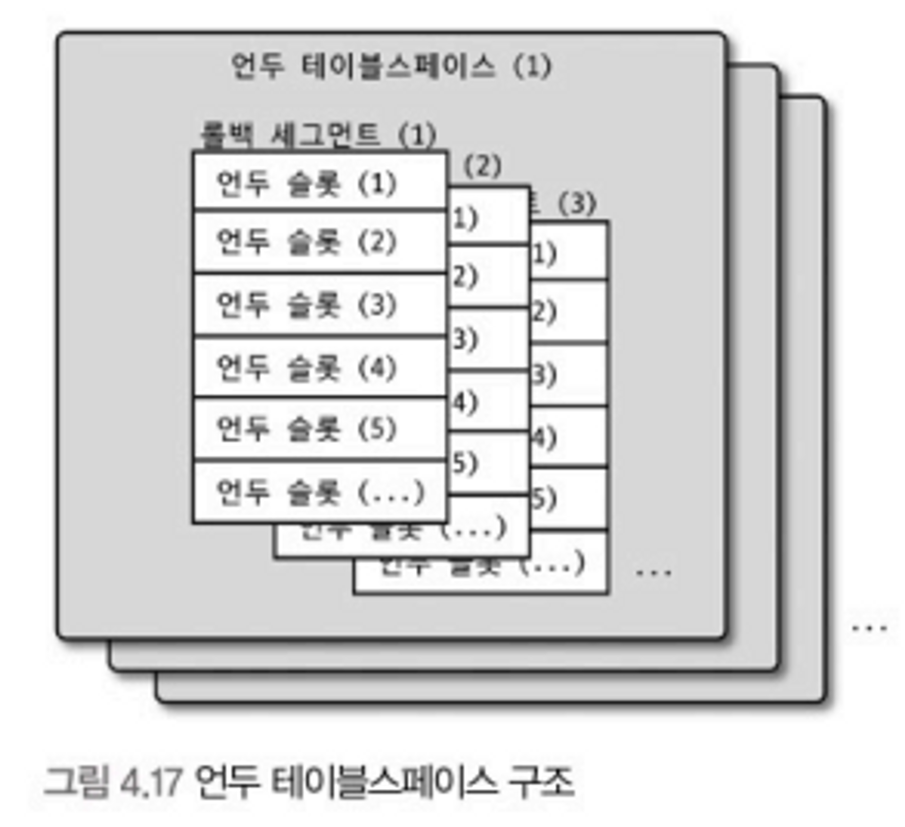

## 4.2.9 언두 로그

언두 로그란 트랜잭션과 격리 수준을 보장하기 위해 변경되기 이전 버전 데이터를 백업한 데이터를 말한다.

- **트랜잭션 보장**
    - 트랜잭션 롤백 시 이전 데이터로 복구하기 위해 언두 로그를 사용
- **격리 수준 보장**
    - 특정 커넥션에서 데이터를 변경하는 도중 다른 커넥션에서 해당 데이터 조회 시 격리 수준에 따라 실제 레코드를 읽을 수도, 언두 로그의 데이터를 읽을 수도 있다.
    - 격리 수준을 유지하면서 높은 동시성을 제공하는 것이 목적

### 언두 로그 레코드 모니터링

- MySQL 5.5 버전 이전에서는 한 번 증가한 언두 로그 공간은 다시 줄어들지 않았다.
    - 대용량 데이터를 변경하는 경우 언두 로그에 대용량 데이터가 그대로 복사 되어야 한다.
    - 한 트랜잭션이 오랜 시간 동안 실행될 때도 언두 로그의 양은 급격히 증가할 수 있다.
        - 트랜잭션이 끝났다고 언두 로그를 바로 지울 수 없다.
        - 해당 언두 로그를 필요로 하는 다른 트랜잭션도 모두 끝나야 비로소 삭제될 수 있다.
    - 디스크의 언두 로그 저장 공간이 너무 많이 증가했을 때, 빈번히 변경된 레코드를 조회하는 쿼리가 실행되면 쿼리의 성능이 떨어지게 된다.
    - 언두 로그 사용 공간이 한 번 늘어나면 MySQL 서버를 새로 구축하지 않는 한 줄일 수가 없다.
- MySQL 8.0에서는 언두 로그를 돌아가면서 순차적으로 사용해 디스크 공간을 줄이는 것도 가능하며 필요한 시점에 MySQL 서버가 사용 공간을 자동으로 줄여 주기도 한다.
- 그럼에도 트랜잭션이 장시간 유지되는 것은 성능 상 좋지 않기 때문에 모니터링이 필요하다.
    - 서버별로 안정적인 시점의 언두 로그 레코드 건수를 확인해 이를 기준으로 언두 로그 급증 여부를 모니터링하는 것이 좋다.

### 언두 테이블스페이스 관리

- **언두 테이블 스페이스**는 1개 이상 128개 이하의 **롤백 세그먼트**를 가진다.
- 롤백 세그먼트는 1개 이상의 **언두 슬롯**을 가진다.
- 롤백 세그먼트는 InnoDB 페이지 크기를 16byte로 나눈 값의 개수만큼 언두 슬롯을 가진다.
    - 예) InnoDB 페이지 크기 = 16KB라면 1024개의 언두 슬롯을 갖게 된다.
- 한 트랜잭션은 실행하는 `INSERT`, `UPDATE`, `DELETE` 문장의 특성에 따라 최대 4개까지 언두 슬롯을 사용한다. (일반적으로는 대략 2개 정도를 필요로 함)
- 최대 동시 처리 가능한 트랜잭션 개수 = 언두 슬롯의 총 개수
    - `= (InnoDB 페이지 크기) / 16 * (롤백 세그먼트 개수) * (언두 테이블스페이스 개수)`
- 가장 일반적인 설정은 다음과 같고 일반적인 서비스에선 이만큼의 동시 트랜잭션이 필요하지 않기 기본값을 유지하는 것이 좋다.
    - InnoDB 페이지 크기 = 16KB
    - `innodb_undo_tablespace=2`
    - `innodb_rollback_segment=128`
- 하지만 언두 슬롯이 부족하면 트랜잭션을 시작할 수 없는 문제가 발생하기에 변경해야 한다면 테이블스페이스와 롤백 세그먼트 개수를 적절히 설정해야 한다.
    - MySQL 8.0부터 `CREATE UNDO TABLESPACE`나 `DROP TABLESPACE` 같은 명령으로 동적으로 테이블스페이스를 추가하고 삭제할 수 있게 되었다.
- **Undo tablespace truncate**란 과도하게 할당된 언두 테이블스페이스 공간을 운영체제로 반납하는 것을 뜻한다. 자동과 수동 두 가지 방법이 있다.
    - **자동 모드** - InnoDB 엔진의 퍼지 스레드는 주기적으로 깨어나 불필요한 언두 로그를 삭제한다. 이 작업을 **언두 퍼지**(Undo Purge)라고 한다. `innodb_undo_log_trucate=ON`이 되면 퍼지 스레드는 주기적으로 사용하지 않는 언두 로그 공간을 잘라 운영 체제로 반납한다.
    - **수동 모드** - `innodb_undo_log_trucate=OFF`가 되면 언두 로그 잘라내기가 자동으로 실행되지 않는다. 이 경우에는 언두 테이블 스페이스를 비활성화 상태로 설정하면 퍼지 스레드는 비활성 상태의 언두 테이블 스페이스를 찾아서 불필요한 공간을 잘라 운영체제에 반납한다. 반납이 완료되면 언두 테이블스페이스를 다시 활성화 상태로 변경한다. 수동 모드는 언두 테이블스페이스가 최소 3개 이상이어야 작동한다.
        - `ALTER UNDO TABLESPACE tablespace_name SET INACTIVE;`
        - `ALTER UNDO TABLESPACE tablespace_name SET ACTIVE;`

## 4.2.10 체인지 버퍼

- 인덱스 파일을 업데이트할 때 이를 즉시 실행하지 않고 임시 메모리 공간에 저장해 두고 사용자에게 결과를 반환하는데 이 때 사용하는 임시 메모리 공간을 **체인지 버퍼**라고 한다.
    - InnoDB에서 레코드가 추가되거나 수정될 때 데이터 파일 변경 뿐만 아니라 인덱스를 업데이트하는 작업도 필요하다.
    - 인덱스 업데이트 작업은 디스크 랜덤 I/O가 발생해 자원 소모가 심하다
    - 변경할 인덱스 페이지가 버퍼 풀에 있으면 바로 업데이트를 수행할 수 있다.
    - 변경할 인덱스 페이지가 버퍼 풀에 없을 때는 체인지 버퍼를 사용해 성능을 향상시킨다.
- 중복 여부를 체크해야 하는 유니크 인덱스는 체인지 버퍼를 사용할 수 없다.
- 체인지 버퍼에 저장된 인덱스 레코드는 이후 **체인지 버퍼 머지 스레드**라는 백그라운드 스레드에 의해 병합된다.
- MySQL 5.5부터 `innodb_change_buffering` 변수가 도입되어 작업 종류별로 체인지 버퍼를 활성화할 수 있고 심지어 사용하지 않게 설정할 수도 있다.
    - `all`: 모든 인덱스 관련 작업을 버퍼링 (insert, delete, purge)
    - `none`: 버퍼링 안함
    - `inserts`: 추가 작업에만 버퍼링
    - `deletes`: 삭제 작업에만 버퍼링 (삭제됐다는 마킹 작업)
    - `changes`: 인덱스에 추가하고 삭제하는 작업만 버퍼링
    - `purges`: 인덱스 아이템을 영구적으로 삭제하는 작업만 버퍼링 (백그라운드 작업)
- 체인지 버퍼는 기본적으로 버퍼 풀의 25%까지 사용할 수 있으며 필요하다면 50%까지 사용하게 설정 가능하다.
    - `innodb_change_buffer_max_size` 변수로 비율을 설정할 수 있다.
