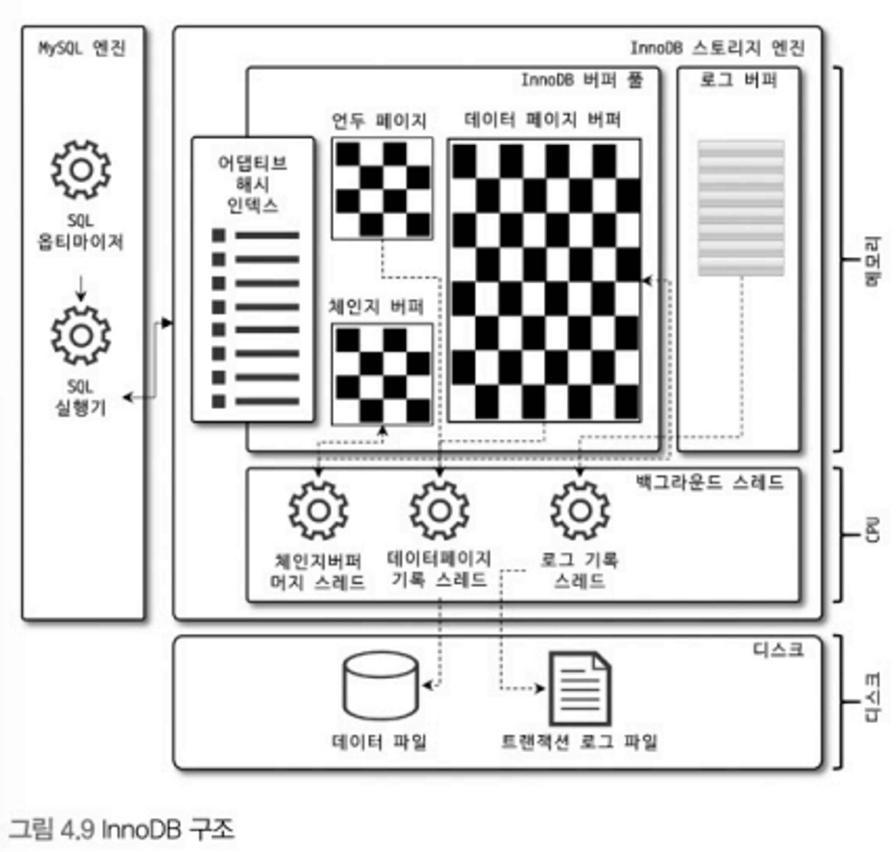

# 4.2 InnoDB 스토리지 엔진 아키텍처

- MySQL에서 사용할 수 있는 스토리지 엔진 중 거의 유일하게 **레코드 기반 잠금** 제공
- 때문에 높은 동시성 처리가 가능하고 안정적이며 성능이 뛰어나다.

## 4.2.1 프라이머리 키에 의한 클러스터링

- InnoDB의 모든 테이블은 **프라이머리 키를 기준으로 클러스터링** 되어 저장된다.
    - pk 값 순서대로 디스크에 저장된다는 뜻
    - 모든 세컨더리 인덱스는 레코드 주소 대신 pk 값을 논리적인 주소로 사용
    - pk를 사용한 레인지 스캔은 상당히 빠르기 때문에 다른 보조 인덱스에 비해 비중이 높게 설정 된다.
- MyISAM에서는 pk 클러스터링을 지원하지 않는다.

## 4.2.2 외래 키 지원

- InnoDB 스토리지 엔진 레벨에서 지원하는 기능으로 MyISAM에선 사용할 수 없다.
- 외래 키는 부모 자식 테이블 모두 해당 칼럼에 인덱스 생성이 필요하다.
- 변경 시에는 부모나 자식 테이블이 있는지 체크하는 작업이 필요하므로 잠금이 여러 테이블로 전파된다.
    - 그로 인한 데드락 발생이 흔하기 때문에 외래 키는 주의하는 것이 좋다.
- 테이블의 무언가를 변경 시에 외래 키가 복잡하게 얽힌 경우 `SET foreign_key_checks=OFF`를 통해 일시적으로 제약을 해제할 수도 있다.

## 4.2.3 MVCC (Multi Version Concurrency Control)

- 레코드 레벨의 트랜잭션을 지원하는 DBMS가 제공하는 기능으로 **잠금을 사용하지 않는 일관된 읽기를 제공하는 것이 가장 큰 목적**이다.
- InnoDB는 **언두 로그**를 이용해 이 기능을 구현한다.
    - 트랜잭션 격리 수준에 따라 실제 디스크의 값을 읽어 올지, 언두 로그를 읽어 올지 달라진다.
    - 트랜잭션이 길어지면 언두에서 관리하는 데이터가 오래 남아 있게 되서 테이블스페이스 공간이 늘어나는 상황이 발생할 수도 있다.
    - 쿼리가 롤백되면 언두 로그를 이용해 데이터를 복구하고 언두를 삭제해버린다.
    - 커밋 된다고 언두가 바로 삭제되는 것은 아니고 언두를 필요로 하는 트랜잭션이 더는 없을 때 비로소 삭제된다.
- 멀티 버전이라 함은 한 레코드에 대해 여러 버전이 동시에 관리된다는 의미이다.

## 4.2.4 잠금 없는 일관된 읽기(Non-Locking Consistent Read)

- InnoDB에서 읽기 작업은 다른 트랜잭션이 가지고 있는 잠금을 기다리지 않고 수행 가능하다.
    - 격리 수준이 `SERIALIZABLE`이 아니면서 `INSERT`와 연결되지 않은 순수한 읽기는 기다리지 않는다.
    - 언두 로그를 통해 조회할 수 있기 때문

> 오랜 시간 동안 트랜잭션이 끝나지 않는다면 언두 로그를 삭제하지 못하고 계속 유지해야 한다. 때문에 MySQL 서버가 느려지거나 문제가 발생할 수도 있다. 따라서 트랜잭션이 시작됐다면 가능한 빨리 롤백이나 커밋을 하는 것이 좋다.
>

## 4.2.5 자동 데드락 감지

- InnoDB는 내부적으로 데드락에 빠지지 않았는제 체크하기 위해 잠금 대기 목록을 **그래프(Wait-forList**) 형태로 관리한다.
- **데드락 감지 스레드**를 사용하여 그래프를 검사해 데드락에 빠진 트랜잭션을 찾아 그 중 하나를 강제 종료한다.
- 트랜잭션의 언두 로그 레코드를 더 적게 가진 트랜잭션이 일반적으로 롤백의 대상이 된다.
    - 언두 레코드를 적게 가진다는 뜻은 롤백을 해도 언두 처리할 내용이 적다는 것이고 이는 서버 부하도 덜 유발하게 된다.
- 일반적으로 데드락 감지는 크게 부담은 없지만 동시 처리 스레드나 트랜잭션이 가진 잠금의 개수가 많아지면 데드락 감지 스레드는 느려진다.
    - 데드락 감지 스레드가 느려지면 서비스 쿼리를 처리하는 스레드도 많이 대기하게 되면서 서비스에 약영향을 미친다. → 더 많은 CPU 자원 소모
    - `innodb_deadlock_detect` 시스템 변수를 OFF로 하면 데드락 감지는 수행하지 않게 되지만 데드락이 발생하면 무한정 대기하게 된다.
    - `innodb_lock_wait_timeout` 시스템 변수를 활성화하면 일정 시간 후에 요청이 실패하도록 만들 수는 있다.

  > 만약 pk 또는 세컨더리 인덱스 기반으로 매우 동시성 높은 처리를 요구해야 한다면 `innodb_deadlock_detect`를 비활성화해서 성능 비교를 해보는 것도 좋은 시도일 것이다.

## 4.2.6 자동화된 장애 복구

- MySQL 서버와 무관하게 디스크나 하드웨어 이슈로 InnoDB가 자동 복구를 못 하는 경우가 발생할 수 있지만 InnoDB 데이터 파일은 기본적으로 MySQL 서버가 재시작될 때 항상 자동 복구를 수행한다.
    - 이 단계에서 자동 복구 불가한 손상이 있다면 복구를 멈추고 서버는 종료돼 버린다.
- 복구 불가 손상 때문에 서버를 시작할 수 없다면 `innodb_force_recovery` 변수를 조정하고 MySQL 서버를 가동해야 한다.
    - 로그 파일이 손상됐다면 6
    - 테이블 데이터 파일이 손상됐다면 1
    - 문제 원인을 알 수 없다면 1부터 6까지 변경하면서 재시작 해본다.
        - 값이 커질수록 심각한 상황이고 복구 가능성은 적어진다.
- 일단 서버를 가동 시켰다면 `mysqldump`를 이용해 데이터를 백업하고 다시 서버 DB와 테이블을 생성하는 것이 좋다.
- 더 자세한 내용은 MySQL 메뉴얼의 `innodb_force_recovery` 시스템 변수 내용 참조
