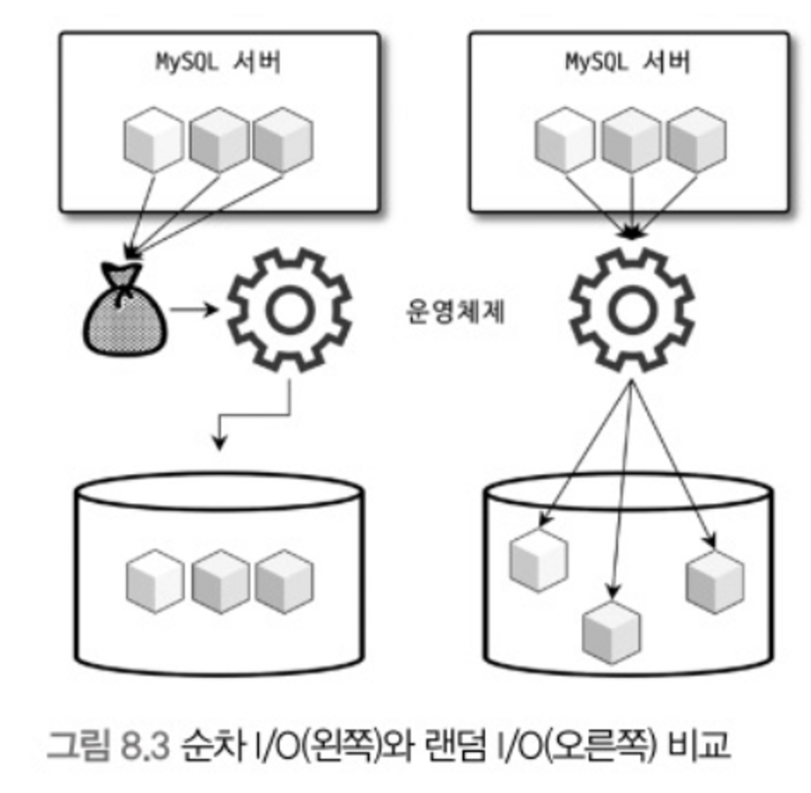

# 8.1 디스크 읽기 방식

여전히 데이터 저장 매체는 컴퓨터에서 가장 느린 부분이다. 데이터베이스 성능 튜닝은 어떻게 디스크 I/O를 줄이느냐가 관건일 때가 상당히 많다.

## 8.1.1 하드 디스크 드라이브(HDD)와 솔리드 스테이트 드라이브 (SSD)

- CPU나 메모리 같은 주요 장치는 전자식 장치지만 **하드 디스크 드라이브**(HDD)는 기계식 장치이기 때문에 디스크 장치는 병목의 주된 원인이다.
- 이를 대체하기 위해 전자식 저장 매체는 SDD가 많이 출시되고 있다.
- SSD 특징
    - 데이터 저장용 플래터(원판)를 제거하고 대신 플래시 메모리를 장착
    - 디스크 원판을 회전시킬 필요가 없어 빨리 데이터를 읽고 쓸 수 있다.
    - 플래시 메모리는 전원이 공급되지 않아도 데이터가 삭제 되지 않는다.
    - 컴퓨터의 메모리(D-RAM)보다는 느리지만 HDD보다 훨신 빠르다.
    - SSD가 HDD에 비해 성능이 순차 I/O에서는 조금 빠르거
    - 나 비슷하지만 랜덤 I/O에서는 훨씬 빠르다. (DB에서는 랜덤 I/O가 대부분)

## 8.1.2 랜덤 I/O와 순차 I/O

랜덤 I/O나 순차 I/O나 하드 디스크 드라이브의 플래터(원판)를 돌려 데이터 위치로 디스크 헤더를 이동시킨 다음 데이터를 읽는 것을 의미한다.

- 위 그림으로 순차와 랜덤 I/O의 차이를 알아보자.
    - 순차 I/O는 3 페이지를 디스크에 쓰기 위해 1번 시스템 콜을 요청한다.
    - 랜덤 I/O는 3 페이지를 디스크에 쓰기 위해 3번 시스템 콜을 요청한다.
    - 디스크에 데이터를 읽고 쓰는 작업은 디스크 헤더를 움직여 읽고 쓸 위치로 옮기는 단계에서 결정된다.
    - 결국 위 그림에선 순차가 랜덤보다 3배는 빠르다는 것이다.
- 즉 디스크 성능은 디스크 헤더의 위치 이동 없이 얼마나 많은 데이터를 한 번에 기록하느냐에 의해 결정된다.
- 디스크 원판이 없는 SDD 또한 순차보다 랜덤 I/O가 전체 스루풋(Throughput)이 떨어진다.

> 일반적으로 쿼리 튜닝이란 랜덤 I/O 자체를 줄이는 것이 목적이다. 랜덤 I/O를 줄인다는 것은 쿼리를 처리하는 데 꼭 필요한 데이터만 읽도록 쿼리를 개선하는 것을 의미한다.
>

> 인덱스 레인지 스캔은 주로 랜덤 I/O를, 풀 테이블 스캔은 순차 I/O를 사용한다. 그래서 읽을 범위가 많은 경우에는 인덱스를 사용하지 않고 풀 테이블 스캔을 유도할 때도 있다.
>
