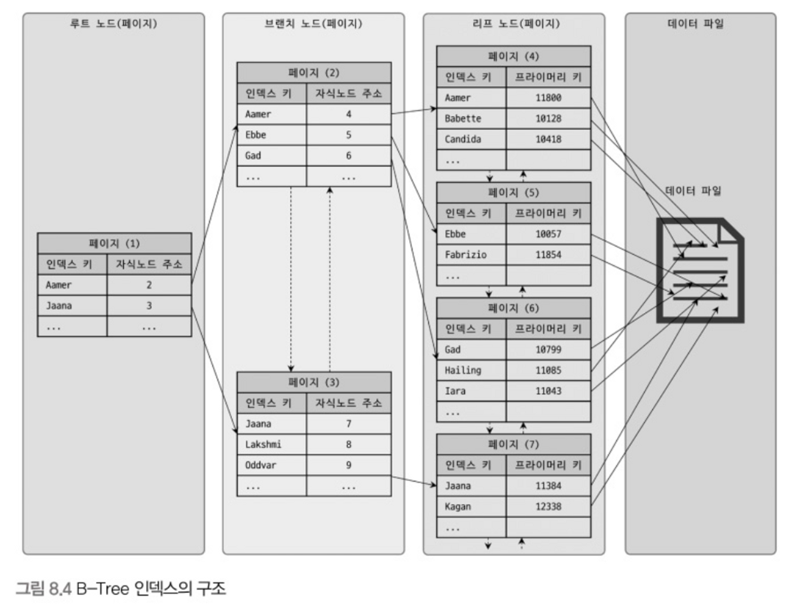

# 8-3(1) B-Tree 인덱스

## 8.3.1 구조 및 특성

B-Tree는 가장 일반적인 인덱싱 알고리즘으로 B는 Balanced를 의미한다.

- B-Tree 기본적인 구조
    - 최상위에 하나의 **로트 노드**가 존재한다. ****
    - 로트 노드 하위에 자식 노드가 붙어 있는데 가장 하위의 노드를 **리프 노드**라 한다.
    - 루트 노드와 리프 노드 사이의 노드를 브랜치 노드라 한다.
    - 인덱스의 리프 노드에는 실제 데이터 레코드의 주솟값을 가지고 있다.
        - 주솟값 = 레코드의 프라이머리 키

- 인덱스의 키 값은 모두 정렬되어 있다.
- 데이터 파일의 레코드는 정렬돼 있지 않다.
    - 레코드가 삽입만 된다면 파일 레코드도 정렬될 수도 있지만 삭제된 자리에 다시 삽입도 되기 때문에 정렬을 보장하지 않는다.
- 인덱스는 테이블의 인덱스 칼럼만 가지고 있으므로 나머지 칼럼을 읽으려면 리프 노드의 주소를 이용해 데이터 파일에 접근해야 한다.

## 8.3.2 B-Tree 인덱스 키 추가 및 삭제

테이블의 레코드를 저장, 수정하는 경우 인덱스에도 키 추가 및 삭제 작업이 발생한다.

### 인덱스 키 추가

- 새로운 인덱스 키 값이 B-Tree에 저장될 때 스토리지 엔진에 따라 즉시 인덱스에 저장될 수도 있고 그렇지 않을 수도 있다.
    - InnoDB에선 체인지 버퍼를 사용해 쓰기를 버퍼링할 수 있다.
    - 4.2.10절 체인지 버퍼 참조
- 상대적으로 쓰기 작업에 비용이 많이 든다.
    - 새로운 인덱스 키가 저장될 위치를 검색해야 하기 때문이다.
    - 저장될 위치가 결정되면 키 값과 레코드 주소 정보를 넣은 새 리프 노드를 추가해야 하는데 리프 노드가 꽉 차면 분리(split) 되어야 한다.
    - split이 발생하면 상위 브랜치 노드까지 처리 범위가 넓어진다. 이는 또 비용이다.

### 인덱스 키 삭제

- 삭제할 인덱스 키 값이 저장된 리프 노드를 찾아서 삭제 마크만 하면 작업이 완료된다.
    - 삭제 마킹도 디스크 I/O가 필요
    - 5.5 이상 버전 InnoDB에선 이 또한 버퍼링이 가능하다.
- 삭제 마킹된 공간은 그대로 방치하거나 재활용할 수 있다.

### 인덱스 키 변경

- B-Tree의 키 값 변경 작업은 먼저 키 값을 삭제한 후 다시 새로운 키 값을 추가하는 형태로 처리된다.
    - 삭제와 추가 작업은 앞에서 설명한 절차대로 처리된다.
- 결국 키를 추가하고 삭제하는 작업이기 때문에 모두 체인지 버퍼를 활용해 지연 처리 될 수 있다.

### 인덱스 키 검색

- 인덱스를 추가하는 가장 큰 이유는 빠른 검색을 위해서다.
- 트리 탐색을 통해 `SELECT` 문을 처리하고 `UPDATE`나 `DELETE`에서도 해당 레코드를 검색하기 때문에 트리 탐색을 한다.
- 인덱스 활용할 수 있는 경우
    - B-Tree 인덱스 검색은 키 값이 완전 일치 또는 값의 앞부분만 일치하는 경우에 사용 가능하다.
    - 부등호 비교 조건에서는 활용할 수 있다.
- 인덱스를 활용하지 못하는 경우
    - 키 값의 뒷부분만으로는 인덱스를 활용할 수 없다.
    - 인덱스 키 값에 변형이 가해지면 빠른 검색을 사용할 수 없다.
        - 변형된 값은 트리에 존재하지 않기 때문
- InnoDB에서는 `UPDATE`나 `DELETE` 수행 시 일치하는 인덱스에 대해 넥스트 키락을 사용해 잠근다.
    - 사용할 수 있는 인덱스가 없으면 불필요한 레코드를 잠궈버리기 때문에 인덱스 설계가 InnoDB에선 중요하다.