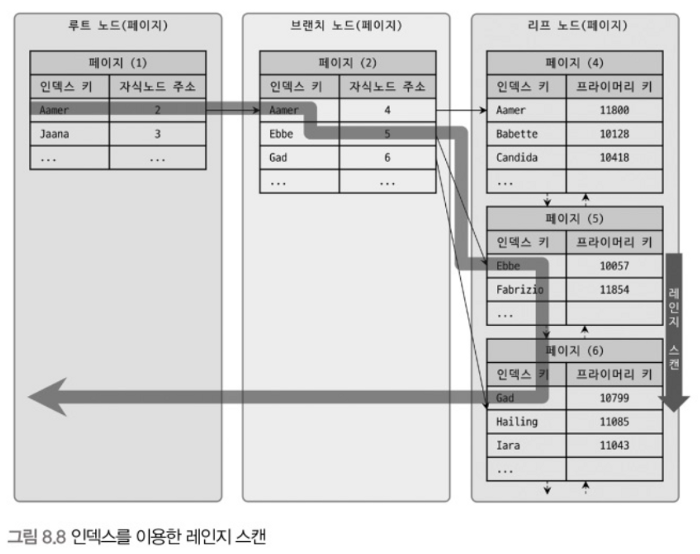
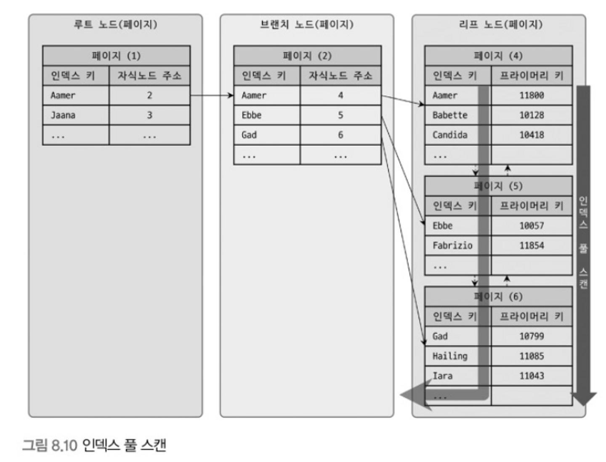
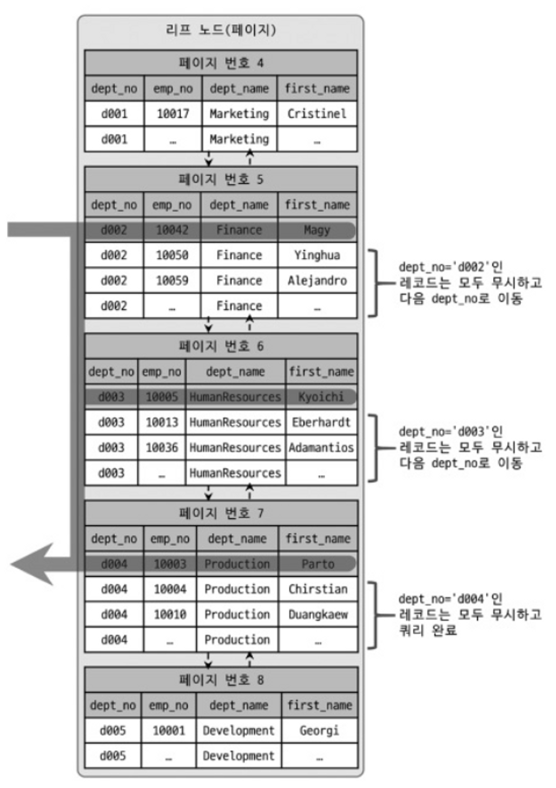
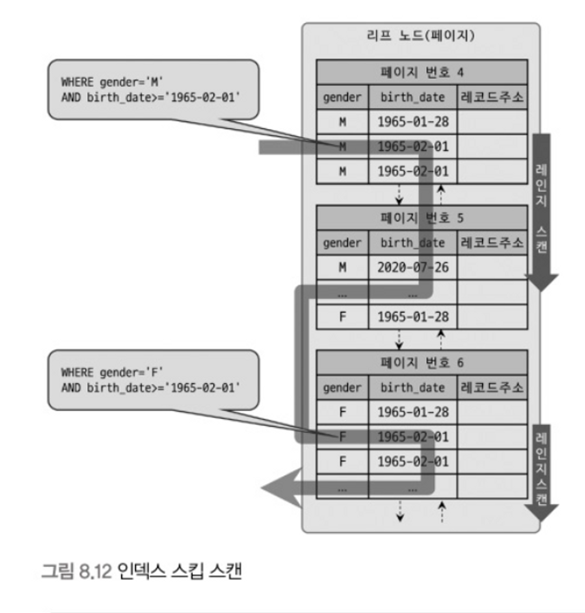

# 8.3(2) B-Tree 인덱스 사용과 읽기

## 8.3.3 B-Tree 인덱스 사용에 영향을 미치는 요소

B-Tree 인덱스는 인덱스를 구성하는 칼럼의 크기와 레코드 건수, 그리고 유니크 인덱스 키 값의 개수 등에 의해 검색이나 변경 작업 성능이 영향을 받는다.

### 인덱스 키 값의 크기

- InnoDB 스토리지 엔진은 페이지(또는 블록) 단위로 디스크에 읽기 및 쓰기 작업을 한다.
    - 페이지 또는 블록은 디스크에 데이터를 저장하는 가장 기본 단위
    - 페이지는 버퍼 풀에서 데이터를 버퍼링하는 기본 단위이기도 하다.
    - 인덱스 트리의 루트와 브랜치, 리프를 구분한 기준이 바로 페이지 단위다.
- B(Balanced)-Tree는 인덱스의 페이지 크기와 키 값에 크기에 따라 자식 노드의 개수가 정해진다.
    - `innodb_page_size`로 페이지 크기를 정할 수 있고 (4~62KB) 기본값은 16KB이다.
    - 인덱스 키 값이 작으면 인덱스 페이지에 담을 수 있는 가키 값 개수가 많아져 자식 노드를 더 많이 가질 수 있다.
    - 인덱스 키 값이 커서 인덱스 페이지 안에 더 적은 수의 키, 그리고 적은 수의 자식 노드를 담게 되면 인덱스 스캔 한 번으로는 해결하지 못하는 경우가 늘어 디스크 읽기가 더 늘어나야 한다. → 느려진다
- 인덱스 키 값의 길이가 길어진다는 것은 인덱스 크기가 커진다는 것을 의미한다.
    - 버퍼 풀 키 캐시 영역을 크기가 제한적이기 때문에 인덱스 크기가 커지면 메모리 효율이 떨어지는 결과를 가져온다.

### B-Tree 깊이

- B-Tree 인덱스의 깊이는 중요하지만 직접 제어할 방법은 없다.
- 인덱스 키 값의 평균 크기가 늘어나면 발생하는 현상
    - 하나의 인덱스 페이지에 담을 수 있는 인덱스 키 값 개수가 적어진다.
    - 같은 레코드 건수라 하더라도 인덱스 깊이가 깊어져 디스크 읽기가 더 많이 필요해지게 된다.
- 실제로 아무리 대용량 데이터베이스라도 B-Tree 깊이가 5단계 이상으로 깊어지는 경우는 흔치 않다.

### 선택도(기수성)

- 인덱스에서 선택도 또는 기수성은 거의 같은 의미로 인덱스 키 값 가운데 유니크한 값의 수를 의미한다.
    - 전체 100개 중 유니크한 값 수가 10개라면 기수성은 10
- 선택도가 높을수록 검색 대상이 줄어들어 그만큼 빠르게 처리된다.
    - 선택도가 안좋아도 정렬이나 그루핑 처리를 위해 인덱스를 만드는 것이 훨씬 나은 경우도 있으므로 여러 용도를 고려해 인덱스 설계를 할 필요가 있다.
- 똑같은 쿼리를 실행해 똑같은 결과를 받아도 선택도에 따라 쿼리를 처리하기 위한 수행 작업의 차이가 매우 클 수 있다.
    - 1개의 결과를 반환하는데 선택도가 낮다면 많은 레코드를 쓸데 없이 읽고 버려야 한다.

### 읽어야 하는 레코드의 건수

- 인덱스를 통해 레코드를 읽는 것은 바로 직접적으로 테이블의 레코드를 읽는 것보다 비용이 높은 작업이다.
    - 일반적인 DBMS 옵테마이저는 레코드 1건을 읽는데 인덱스를 통해 읽는 것이 4~5배 정도 더 비용이 든다고 예측한다.
- 옵티마이저가 판단했을 때 읽을 레코드 건수가 전체 레코드의 20~25%를 넘어서면 인덱스를 이용하지 않고 테이블을 모두 읽는 방법을 택한다. (더 효율적)
- 쿼리 힌트를 추가하여 인덱스를 사용하도록 할 수는 있지만 더 비효율적이다.
    - 옵티마이저가 기본적으로 힌트를 무시하고 직접 읽기로 처리하긴 한다.

## 8.3.4 B-Tree 인덱스를 통한 데이터 읽기

### 인덱스 레인지 스캔

- 가장 대표적인 인덱스 접근 방법으로 비교적 빠른 방법이다.
- 검색해야 할 인덱스 범위가 결정 됐을 때 사용하는 방식
    - `SELECT…WHERE…BETWEEN…;`

1. **인덱스 탐색(index seek)** - 인덱스에서 조건을 만족하는 값이 저장된 위치를 찾는다. (리프 노드의 시작점을 찾음)
2. **인덱스 스캔(index scan)** - 1번에서 탐색한 위치부터 필요한 만큼 인덱스를 차례대로 쭉 읽는다.
3. 2번에서 읽은 인덱스 키와 레코드 주소를 이용해 레코드가 저장된 페이지를 가져오고 최종 레코드를 읽어 온다. (랜덤 디스크 I/O)
   - 쿼리가 필요로 하는 데이터에 따라 필요하지 않을 수도 있는데 이를 **커버링 인덱스**라고 한다.
   - 랜덤 디스크 접근을 하지 않아도 되기 때문에 상당히 빨라진다.
   - 디스크 접근할 데이터가 많으면 (손익 분기점보다 많아짐) 인덱스를 통하지 않고 읽는 것이 더 효율적이다.

### 인덱스 풀 스캔

- 인덱스 레인지 스캔과 비슷하지만 레인지 스캔과 달리 인덱스의 처음부터 끝까지 모두 읽는 방식을 인덱스 풀 스캔이라고 한다.
- 쿼리의 조건절에 사용된 칼럼이 인덱스의 첫 번재 칼럼이 아닌 경우 인덱스 풀 스캔이 사용된다.
    - (A, B) 인덱스가 사용된 테이블에 칼럼 B를 조건으로 검색하는 경우

- 인덱스 레인지 스캔보다는 느리지만 테이블 풀 스캔보다는 효율적이다.
    - 테이블 자체 크기 보다는 인덱스의 전체 크기가 훨씬 작기 때문
- 인덱스를 사용하기는 하지만 효율적인 방식은 아니기 때문에 일반적으로 인덱스를 생성하는 목적은 아니다.

### 루스 인덱스 스캔

- 루스 인덱스 스캔이란 레인지 스캔과 비슷하지만 중간에 필요치 않은 인덱스 키 값은 무시하고 다음으로 넘어가는 형태로 처리한다.
    - 일반적으로 `GROUP BY` 또는 집합 함수 가운데 `MAX()`, `MIN()` 함수에 대한 최적화에 사용
- 아래 쿼리는 `dept_emp` 테이블에 `(dept_no, emp_no)`로 인덱스가 생성된 상태에서 처리한 결과를 보여준다.
    - `WHERE` 조건을 만족하는 `dept_no` 중 `emp_no`는 최솟값만 알면 되기 때문에 첫 줄만 읽고 나머지는 읽지 않고 스킵하고 있다.

```sql
SELECT dept_no, MIN(emp_no) 
FROM dept_emp
WHERE dept_no BETWEEN 'd002' AND 'd004'
GROUP BY dept_no;
```

### 인덱스 스킵 스캔

- 보통 복합 인덱스인 경우 `WHERE` 조건으로 검색할 때 첫 번째 순서가 아닌 칼럼으로 검색하면 인덱스를 사용하지 못한다.
    - (A, B) 인덱스인데 `…WHERE b = …`으로 검색하는 경우
- MySQL 8.0 버전부터는 옵티마이저가 첫 순서 칼럼을 건너 뛰어 검색하게 해주는 인덱스 스킵 스캔으로 최적화를 제공한다.
    - 루스 인덱스 스캔은 `GROUP BY` 작업 처리를 위해 인덱스를 사용하는 경우에만 적용 가능하지만 인덱스 스킵 스캔은 `WHERE` 조건절 검색을 위해서도 사용 가능하도록 용도가 넓어졌다.
- `employees` 테이블에 (gender, birth_date) 순서로 인덱스가 생성되어 있고 아래 쿼리를 살펴보자.

```sql
EXPLAIN SELECT gender, birth_date
FROM employees
WHERE birth_date>='1965-02-01';
```

- 인덱스 스킵 스캔을 하지 않는 경우
    - (gender, birth_date) 인덱스를 사용하지만 인덱스 풀 스캔으로 동작한다.
    - 모든 칼럼을 가져와야 했다면 테이블 풀 스캔을 실행했을 것이다.
- 인덱스 스킵 스캔을 사용하는 경우
    - 인덱스를 사용하여 인덱스 레인지 스캔으로 동작한다.
    - 실행 계획 extra에 `Using index for skip scan`이 표시된다.

    ```sql
    SELECT gender, birth_date FROM emplooyees WHERE gender='M' AND birth_date>='1965-02-01';
    SELECT gender, birth_date FROM emplooyees WHERE gender='F' AND birth_date>='1965-02-01';
    ```

    - 옵티마이저가 내부적으로 위 2개의 쿼리를 실행하는 것과 비슷하게 최적화를 수행하게 된다.

- 인덱스 스킵 스캔의 단점
    - WHERE 조건절에 조건이 없는 인덱스 선행 칼럼의 유니크한 값의 개수가 적어야 한다.
    - 쿼리가 인덱스에 존재하는 칼럼만으로 처리가 가능해야 한다. (커버링 인덱스)

## 8.3.5 다중 칼럼(Multi-column) 인덱스

- 실제 서비스용 데이터베이스에서는 2개 이상의 칼럼을 포함하는 인덱스가 많이 사용된다.
- 두 번째 칼럼은 첫 번째 칼럼에 의존해서 정렬돼 있기 때문에 인덱스 내의 칼럼의 순서는 상당히 중요해진다.
    - 검색 조건에 칼럼 순서에 따라 인덱스를 사용하지 못할 수도 있다.