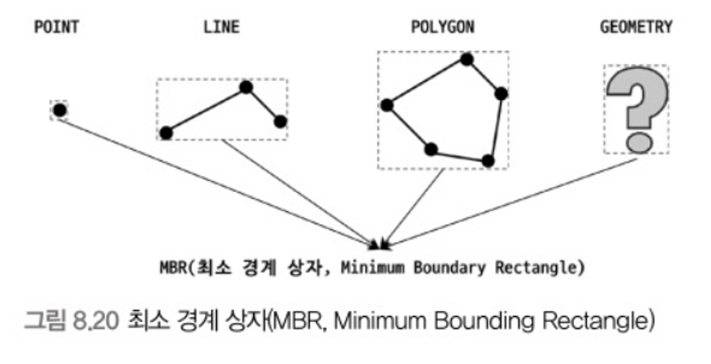

# 8.4 R-Tree 인덱스

- R-Tree 인덱스 알고리즘을 이용해 2차원 데이터를 인덱싱하고 검색할 수 있다.
    - B-Tree 인덱스를 구성하는 칼럼 값이 1차원 스칼라 값인 반면, R-Tree 인덱스는 2차원 공간 개념 값이라는 것
- 위치 기반 서비스를 구현하려면 MySQL의 공간 확장을 이용할 수 있다.
    - 공간 데이터를 저장할 수 있는 데이터 타입을 지원한다.
    - 공간 데이터 검색을 위한 공간 인덱스(R-Tree 알고리즘)를 지원한다.
    - 공간 데이터 연산 함수(거리 또는 포함 관계 처리)를 지원한다.

## 8.4.1 구조 및 특성

- MySQL이 제공하는 공간 데이터 타입
    - POINT
    - LINE
    - POLYGON
    - GEOMETRY
        - 나머지 3개 타입의 슈퍼 타입으로 POINT, LINE, POLYGON 객체 모두 저장할 수 있다.
- MBR(Minimum Bounding Rectangle)

  - 도형을 감싸는 최소 크기의 사각형
- **MBR들의 포함 관계를 B-Tree 형태로 구현한 인덱스가 R-Tree 인덱스다.**

### R-Tree 구조

- 위 그림은공간 데이터들이 있고 도형들의 MBR을 3개 레벨로 나눠 그린 것이다.
  - 최상위 레벨: R1, R2
    - R-Tree 루트 노드에 저장되는 정보
  - 차상위 레벨: R3, R4, R5, R6\
    - 중간 크기의 MBR로 R-Tree 브랜치 노드에 저장되는 정보
  - 최하위 레벨: R7 ~ R14
    - 각 도형을 제일 안쪽에서 둘러싼 사각형
    - R-Tree의 리프 노드에 저장되는 정보

## 8.4.2 R-Tree 인덱스의 용도

일반적으로는 WGS84(GPS) 위도, 경도 좌표 저장에 사용되지만 CAD/CAM 소프트웨어 또는 회로 디자인 등 좌표 시스템 기반 정보에 대해서는 모두 적용할 수 있다.

### 현재 사용자 위치로부터 반경 5KM 지점 검색

- `ST_Contains()` 또는 `ST_Within()` 등과 같은 포함 관계를 비교하는 함수로 검색을 수행할 때 인덱스를 이용할 수 있다.
  - 현재 출시되는 버전의 MySQL에서 거리를 비교하는 `ST_Distance()`와 `ST_Distance_Sphere()` 함수는 공간 인덱스를 효율적으로 사용하지 못함

- 기준점 P로부터 반경 5KM 이내 점을 검색하려면 5KM 원을 포함하는 최소 사각형(MBR)으로 포함 관계 비교를 수행하면 된다.

```sql
-- // '사각 상자'에 포함된 좌표 Px만 검색

SELECT * FROM tb_location WHERE ST_Contains(사각 상자, px);

SELECT * FROM tb_location WHERE ST_Within(px, 사각 상자);
```

- `ST_Contains()`와 `ST_Within()` 함수는 거의 동일한 비교를 수행하지만 파라미터는 반대로 사용해야 한다.
  - ‘포함 경계를 가진 도형’과 '포함되는 도형(또는 점 좌표)’를 명시
- 하지만 이렇게만 하면 원 안에 포함되지 않는 P6도 포함하게 된다. 필터링하려면 아래와 같이 쿼리를 실행하면 된다.

```sql
SELECT * FROM tb_loocation 
WHERE ST_Contains(사각 상자, px) 
	AND ST_Distance_Sphere(p, px)<=5*1000 /* 5KM */;
```