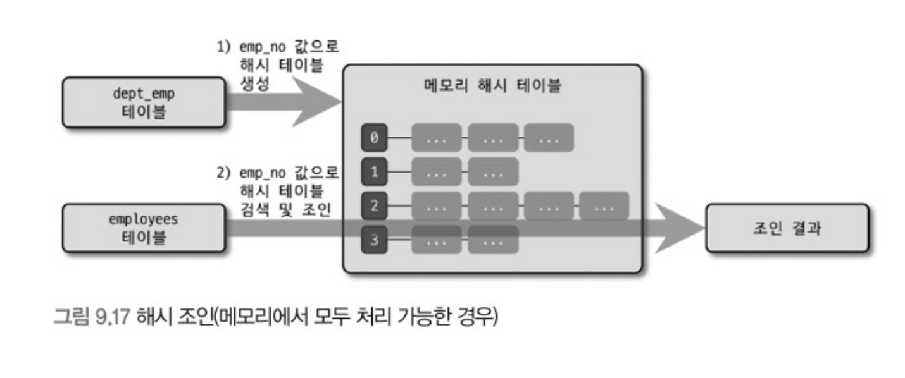
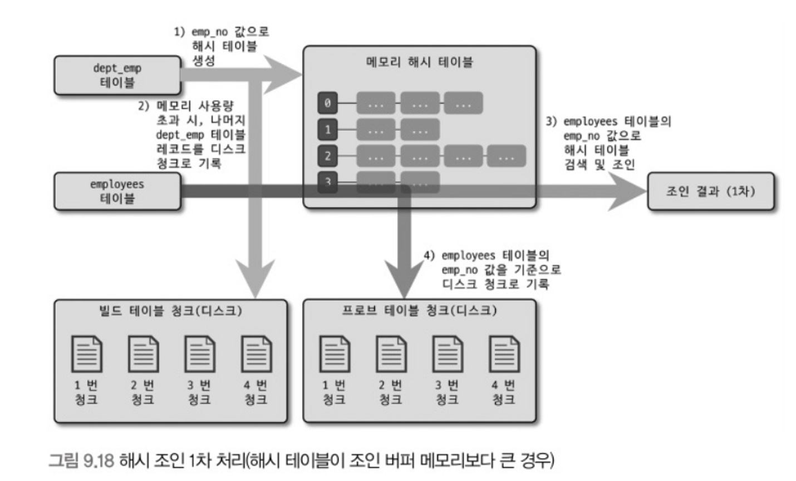
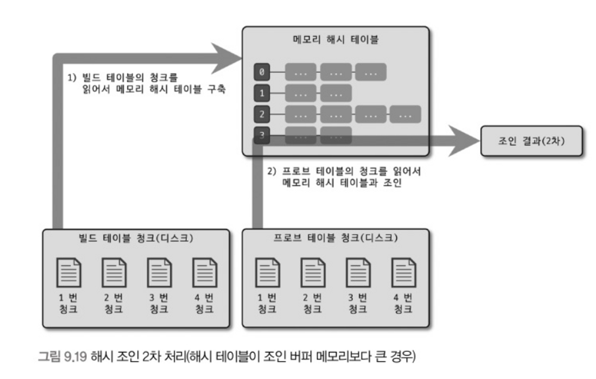

# 9.3(7) 해시 조인

## 해시 조인(hash_join)

- MySQL 8.0.18 버전부터 해시 조인이 지원되기 시작했다.
    - 8.0.17 버전 이전에는 블록 네스티드 루프 조인 최적화가 있었지만 8.0.20 버전부터는 네스티드 루프 조인을 사용할 수 없는 경우 항상 해시 조인이 사용되도록 바뀌었다.
- 해시 조인이 네스티드 루프 조인보다 빠르다고 하는데 항상 옳은 이야기는 아니다.
- **해시 조인**
    - 해시 조인은 첫 번째 레코드를 찾는 데 시간이 많이 걸리지만 최종 레코드를 찾는 데까지는 시간이 많이 걸리지 않는다.
    - 즉 해시 조인 쿼리는 최고 스루풋(throughput) 전략에 적합
- **네스티드 루프 조인**
    - 네스티드 루프 조인은 첫 번째 레코드를 찾는 것은 훨씬 빠르지만 마지막 레코드를 찾는 시간은 시간이 많이 걸린다.
    - 즉 네스티드 루프 조인은 최고 응답 속도(response time) 전략에 적합
- 일반적인 웹 서비스는 응답 속도가 더 중요하기 때문에 옵티마이저 힌트로 강제로 해시 조인을 유도하는 것은 좋지 않다.
- MySQL에서는 주로 조인 조건 칼럼이 인덱스가 없거나 조인 대상 테이블 중 일부 레코드 건수가 매우 적은 경우에 대해서만 해시 조인을 사용하도록 설계되어 있다.

### 해시 조인 최적화 방식

- 아래 쿼리는 IGNORE INDEX 힌트를 통해 네스티드 루프 조인을 사용되지 못하게 했기에 해시 조인을 사용했다.

```sql
EXPLAIN SELECT * 
FROM employees e IGNORE INDEX(PRIMARY, ix_hiredate)
	INNER JOIN dept_emp de IGNORE INDEX(ix_empno_fromdate, ix_fromdate)
		ON de.emp_no=e.emp_no AND de.from_date=e.hire_date;
```

| id | select_type | table | type | Extra |
| --- | --- | --- | --- | --- |
| 1 | SIMPLE | de | ALL | NULL |
| 1 | SIMPLE | e | ALL | Using where; Using join buffer(hash join) |

- 일반적으로 해시 조인은 **빌드 단계**와 **프로브 단계**로 나뉘어 처리된다.
    - **빌드 단계**: 조인 대상 테이블 중 레코드 수가 적어 해시 테이블로 만들기 용이한 테이블을 골라 메모리에 해시 테이블을 생성(빌드)하는 작업 수행
    - **프로브 단계**: 나머지 테이블의 레코드를 읽어 해시 테이블의 일치 레코드를 찾는 과정
    - 아래는 메모리로 해시 테이블을 모두 처리할 수 있는 경우 `demp_emp`가 빌드 테이블, `employees` 테이블이 프로브 테이블로 처리되는 그림이다.

  

- MySQL 서버는 해시 테이블을 메모리에 저장할 때 `join_buffer_size` 변수로 크기를 제어할 수 있는 조인 버퍼를 제공한다. (기본값 256KB)
- 해시 테이블 레코드 수가 많아 조인 버퍼 크기보다 커질 때는 빌드 테이블과 프로브 테이블을 적당한 크기의 청크로 분리한 뒤 청크별로 해시 조인과 동일 방식으로 처리한다.

  

    1. 빌드 테이블로 해시 테이블을 준비하다가 `join_buffer_size`를 넘어서면 빌드 테이블의 나머지 레코드를 디스크 청크로 구분해 저장 (빌드 테이블 청크)
    2. 프로브 테이블을 이용해 메모리의 해시 테이블을 검색해서 1차 조인 결과를 생성
    3. 2단계와 동시에 `employees` 테이블에서 읽은 레코드를 디스크 청크로 구분해서 저장 (프로브 테이블 청크)

  

    1. 3단계까지 해서 1차 조인이 완료되면 위 그림처럼 빌드 테이블 청크에서 첫 청크를 읽어 메모리 해시 테이블 구축
    2. 프로브 테이블 청크에서 첫 청크로 해시 테이블을 읽어 2차 결과를 가져온다.
    3. 디스크에 저장된 청크 개수만큼 위 과정을 반복한다.

