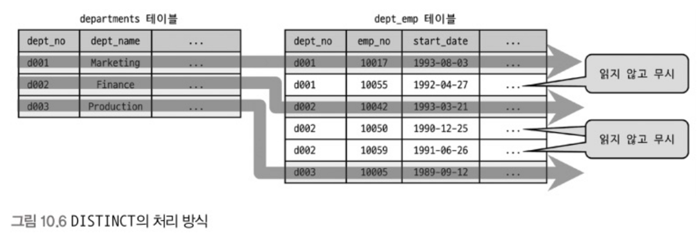

# 10.3(5) 실행 계획 분석 (Extra)

## 10.3.12 Extra 칼럼

Extra 칼럼에는 주로 내부적인 처리 알고리즘에 대해 더 깊이 있는 내용을 보여주는 경우가 많다.

### const row not found

- const 접근 방벙으로 테이블을 읽었지만 해당 테이블 레코드가 1건도 존재하지 않는 경우 표시된다.
- 이런 경우 테이블에 적절히 테스트용 데이터를 저장하고 다시 쿼리 실행 계획을 확인해 보는 것이 좋다.

### Distinct

- 아래 쿼리는 두 테이블에 모두 존재하는 `dept_no`만 중복 없이 유니크하게 가져오기 위한 쿼리다.
    - 두 테이블을 조인하면 중복되는 `dept_no`가 발생하게 되기 때문에 `DISTNCT` 명령을 추가했다.

```sql
EXPLAIN 
SELECT DISTINCT d.dep_no 
FROM departments d, dept_emp de 
WHERE de.dept_no=d.dept_no;
```

| id | select_type | table | type | key | Extra |
| --- | --- | --- | --- | --- | --- |
| 1 | SIMPLE | d | index | ux_deptname | Using index; Using temporary |
| 1 | SIMPLE | de | ref | PRIMARY | Using index; Distinct |



- 쿼리의 `DISTINCT`를 처리하기 위해 조인하지 않아도 되는 항목은 모두 무시하고 필요한 것만 조인한 것을 나타낼 때 Extra 칼럼에 Distinct가 표시된다.

### FirstMatch

- 세미 조인 최적화 중 FirstMatch 전략이 사용되면 Extra 칼럼에 FirstMatch(table_name)이 표시된다.
- 표시되는 테이블 기준으로 첫 번째로 일치하는 한 건만 검색한다는 것을 의미한다.
- 자세한 내용은 9.3.11절 ‘퍼스트 매치’ 참고

### Full scan on NULL key

- `col1 IN (SELECT col2 FROM …)`과 같은 쿼리에서 `col1`이 `NULL`인  경우 서브 쿼리에 대해 풀 테이블 스캔을 해서 다음 2가지 중 결론을 내야 한다.
    - 서브 쿼리가 1건이라도 결과 레코드를 가지면 최종 결과는 `NULL`
    - 서브 쿼리가 1건도 결과 레코드를 가지지 않는다면 최종 결과는 `FALSE`
- Extra 칼럼에 ‘Full scan on NULL key’가 표시되는 경우가 바로 `col1`이 `NULL`인 경우 서브 쿼리 테이블을 풀 테이블 스캔 하는 경우다.
    - `col1`이 `NOT NULL`로 정의된 칼럼이라면 표시되지 않을 것이다.
- `IN`이나 `NOT IN` 연산자의 왼쪽 값이 NULL인 레코드가 있고 서브 쿼리에 개별적인 WHERE 조건이 지정돼 있다면 풀 테이블 스캔으로 인해 성능 문제가 발생할 수 있다.
    - 연산자 왼쪽 칼럼이 `NOT NULL`이 아니라면 `WHERE` 조건절에 `IS NOT NULL` 조건을 추가하는 것도 방법이다.

### Impossible HAVING

- 쿼리에 사용된 `HAVING` 절 조건을 만족하는 레코드가 없을 때 표시된다.
- ‘Implossible HAVING’ 메세지가 출력되면 쿼리를 잘못 작성한 경우가 대부분이므로 쿼리를 다시 저검하는 것이 좋다.

### Impossible WHERE

- `WHERE` 조건이 항상 `FALSE`가 될 수밖에 없는 경우 표시된다.

### LooseScan

- 세미 조인 최적화 중 LooseScan 최적화 전략이 사용되면 표시된다.
- 자세한 내용은 9.3.1.12절 ‘루스 스캔(loosescan)’을 참조하자.

### No matching min/max row

- 아래 쿼리처럼 `WHERE` 조건절에 만족하는 레코드가 하나도 없지만 `MIN()`이나 `MAX()` 같은 집합 함수가 있는 쿼리엔 ‘No matching min/max row’가 표시된다.

```sql
EXPLAIN SELECT MIN(dept_no), MAX(dept_no)
FROM dept_emp WHERE dept_no='';
```

### no matching row in const table

- const 방법으로 접근할 때 일치하는 레코드가 없을 때 표시된다.

### No matching rows after partition pruning

- 없는 파티션에서 `UPDATE`나 `DELETE` 쿼리를 실행할 때 표시된다.
- 단순히 삭제할 레코드가 없음을 의마하는 것이 아니라 대상 파티션이 없다는 것을 의미한다.

### No tables used

- `FROM` 절이 없거나 `FROM DUAL` 형태의 쿼리 실행 계획에서 표시된다.
    - `SELECT 1;`, `SELECT 1 FRO dual;`
    - 다른 DBMS와 달리 MySQL에선 `FROM` 절이 없는 쿼리도 허용된다.
    - DUAL은 상수 테이블을 의미한다. (카럼과 레코드를 각각 1개씩만 가지는 가상의 상수 테이블)

### Not exists

- ‘Not exists’는 아우터 조인을 이용해 안티 조인(Anti-JOIN)을 수행하는 쿼리에서 표시된다.
    - **안티 조인**이란 A 테이블에 존재하지만 B 테이블에 없는 값을 조회해야할 때 `NOT IN(subquery)`나 `NOT EXISTS` 연산자를 사용할 때 실행되는 조인을 뜻한다.
    - 똑같은 처리를 아우터 조인으로도 할 수 있는데 레코드 건수가 많을 땐 아우터 조인을 이용하면 빠른 성능을 낼 수 있다.
- 아래 쿼리에선 옵티마이저가 `dept_emp` 테이블 레코드로 `departments` 테이블을 조인할 때 `departments` 테이블의 레코드가 존재하는지 아닌지만 판단한다.
    - 일치하는 레코드가 여러 건 있다고 해도 딱 1건만 조회해보고 처리를 완료하는 최적화를 의미한다.

    ```sql
    EXPLAIN SELECT *
    FROM dept_emp de
    	LEFT JOIN departments d ON de.dept_no=d.dept_no
    WHERE d.dept_no IS NULL;
    ```

  | id | select_type | table | type | key | Extra |
  | --- | --- | --- | --- | --- | --- |
  | 1 | SIMPLE | de | ALL | NULL | NULL |
  | 1 | SIMPLE | d | eq_ref | PRIMARY | Using where; Not exists |


### Range checked for each record(index map: N)

- ‘Range checked for each record’는 레코드마다 인덱스 레인지 스캔을 체크하면서 조인의 최적화를 수행하는 방법이다.
- 아래 쿼리는 사원의 사원 번호가 다른 사원의 사원 번호보다 큰 경우에 모두 조회하는 쿼리이다.

    ```sql
    EXPLAIN SELECT * 
    FROM employees e1, employees e2
    WHERE e2.emp_no >= e1.emp_no;
    ```

  - e1 테이블 `emp_no`가 작을 때는 풀 테이블 스캔으로 접근하고 크면 인덱스 레인지 스캔으로 접근하게 된다.
  - `e1.emp_no=1`이라면 e2 테이블의 거의 모든 레코드를 읽어 `e2.emp_no≥e1.emp_no` 조건을 만족하는 레코드를 찾아야 한다.
- 이처럼 인덱스 레인지 스캔과 풀 테이블 스캔 중 어느 것이 효율적일지 판단할 수 없어 레코드를 하나씩 읽을 때마다 최적의 방법으로 접근하는 형태다.

### Recursive

- MySQL 8.0부터 CTE(Common Table Expression)으로 **재귀 쿼리**를 작성할 수 있게 됐다.
- `WITH` 구문을 이용해 CTE를 사용할 수 있다.

    ```sql
    WITH RECURSIVE cte (n) AS
    (
    	SELECT 1
    	UNION ALL
    	SELECT n + 1 FROM cte WHERE n < 5
    )
    SELECT * FROM cte;
    ```

  1. ‘n’이라는 칼럼 하나를 가진 cte라는 이름의 내부 임시 테이블 생성
  2. ‘n’ 칼럼 값이 1부터 5까지 1씩 증가하면서 레코드 5건을 만들어 cte 임시 테이블에 저장
  3. WITH 절 다음 `SELECT` 쿼리에서는 임시 테이블을 풀 스캔해서 결과를 반환한다.

  | id | select_type | table       | type | key | Extra |
  | --- |-------------| --- | --- | --- | --- |
  | 1 | PRIMARY | <derived2\> | ALL | NULL | NULL |
  | 2 | DERIVED | NULL        | NULL | NULL | No tables used |
  | 3 | UNION | cte         | ALL | NULL | Recursive; Using where |


- `WITH` 구문을 이용한 CTE가 사용됐다고 해도 재귀 쿼리가 아니면 Recursive가 표시되지 않는다.

### Rematerialize

- **Rematerializing**: 래터럴 조인 시 래터럴로 조인되는 테이블이 선행 테이블의 레코드 별로 서브 쿼리를 실행해서 그 결과를 임시 테이블에 저장하는 것
- 아래 예제를 살펴 보자.

    ```sql
    EXPLAIN SELECT * FROM employees e
    	LEFT JOIN LATERAL (
                    SELECT *
    	    		FROM salaries s
    	    		WHERE s.emp_no=e.emp_no
    	    		ORDER BY s.from_date DESC LIMIT 2
        ) s2 ON s2.emp_no=e.emp_no
    WHERE e.first_name='Matt';
    ```

  | id | select_type | table       | type | key | Extra                      |
  | --- |-------------| --- | --- |----------------------------| --- |
  | 1 | PRIMARY | e           | ref | ix_firstname | Rematerialize(<derived2\>) |
  | 1 | PRIMARY | <derived2\> | ref | <auto_key0> | NULL                       |
  | 2 | DEPENDENT DERIVED | s           | ref | PRIMARY | Using filesort             |


  1. `employees` 테이블 레코드마다 `salaries` 테이블에서 `emp_no`가 일치하는 레코드 중 `from_date` 칼럼 역순으로 2건만 가져와 임시 테이블 derived2로 저장
  2. `employees` 테이블과 derived2 테이블을 조인
  3. derived2 임시 테이블은 `employees` 레코드마다 새로 내부 임시 테이블을 생성
- 위처럼 매번 임시 테이블을 새로 생성하는 경우 ‘Rematerialize’ 문구가 표시된다.

### Select tables optimized away

- 다음 형태의 쿼리에 Select tables optimized away가 표시된다.
  - `MIN()` 또는 `MAX()`만 `SELECT` 절에 사용됨
  - `GROUP BY`로 `MIN()`, `MAX()`를 조회하는 쿼리가 인덱스를 오름차순 또는 내림차순으로 1건만 읽기

```sql
EXPLAIN SELECT MAX(emp_no), MIN(emp_no) FROM employees;

EXPLAIN SELECT MAX(from_date), MIN(fron_date) FROM salaries WHERE emp_no=10002;
```

- 위의 첫 번째 쿼리는 `emp_no`가 인덱스이기 때문에 `employees` 테이블 인덱스의 레코드의 제일 처음과 제일 마지막만 읽어 최적화가 가능하다.
- 위의 두 번째 쿼리는 `(emp_no, from_date)`로 인덱스가 있기 때문에 `emp_no=10002`를 먼저 검색하고 오름차순 또는 내림차순으로 하나만 조회하면 되기에 이런 최적화가 가능하다.

### Start temporary, End temporary

- 세미 조인 최적화 중 Duplicate Weed-out 최적화 전략이 사용되면 표시된다.
- Duplicate Weed-out 최적화는 불필요한 중복을 제거하기 위해 내부 임시 테이블을 사용한다.
  - 내부 임시 테이블에 저장되는 테이블을 식별할 수 있어야 하기에 실행 계획에 표시해 준다.
  - 조인의 첫 번째 테이블에 ‘Start temporary 문구를, 조인이 끝나는 부분에 ‘End temporary’문구를 표시한다.
- 자세한 내용은 9.3.1.14절 ‘중복 제거(Duplicated Weed-out) 참조

### unique row not found

- 두 테이블이 각각 유니크 칼럼으로 아우터 조인을 수행하는 경우 아우터 테이블에 일치하는 레코드가 존재하지 않을 때 표시된다.

### Using filesort

- `ORDER BY`를 처리할 때 적절한 인덱스를 사용하지 못할 때 표시된다.
  - 이는 조회된 레코드를 정렬용 메모리 버퍼에 복사해 퀵 소트 또는 힙 소트 알고리즘을 이용해 정렬을 수행한다는 의미이다.
- ‘Using filesort’는 많은 부하를 일으키므로 가능하다면 쿼리를 튜닝하거나 인덱스를 생성하는 것이 좋다.

### Using index(커버링 인덱스)

- ‘Using index’는 데이터 파일을 전혀 읽지 않고 인덱스만 읽어 쿼리를 모두 처리할 수 있을 때 표시된다.
  - 쿼리에서 가장 큰 부하는 인덱스 검색 후 실제 레코드를 읽기 위해 데이터 파일을 검색하는 작업이다.
  - 커버링 인덱스를 사용하면 풀 테이블 스캔으로 동작할 쿼리도 인덱스를 사용하도록 최적화시킬 수 있다.
  - eq_ref, ref, range, index_merge, index 접근 방법에서도 ‘Using index’가 표시될 수 있다.
- 커버링 인덱스로 동작시키기 위해선 SELECT 절을 인덱스 칼럼과 프라이머리 키만으로 구성해야 한다.
  - 인덱스 칼럼의 주소값으로 프라이머리 키가 저장되어 있기 때문에 프라이머리 키도 실제 데이터 파일을 검색하지 않아도 알 수 있다.
- 커버링 인덱스로 처리하면 성능이 수십 배에서 수백 배까지 날 수도 있는 좋은 방법이다.
  - 하지만 무조건 커버링 인덱스로 처리하려고 인덱스 칼럼을 추가하면 메모리 낭비와 인덱스 변경 작업 부하가 발생한다.

### Using index condition

- MySQL 옵티마이저가 인덱스 컨디션 푸시 다운 최적화를 사용하면 표시된다.
- 자세한 내용은 9.3.1.3절 인덱스 컨디션 푸시다운 참조

### Using index for group-by

- `GROUP BY` 처리에 인덱스를 이용할 때 ‘Using index for group-by’가 표시된다.
  - MySQL 서버는 `GROUP BY` 처리를 할 때 인덱스를 이용해 별도의 정렬 작업 없이 칼럼을 순서대로 읽으며 그루핑 작업을 수행한다.
  - 인덱스를 이용할 수 없다면 그루핑 기준 칼럼으로 정렬을 수행한 뒤 결과를 그루핑하는 형태의 고부하 작업을 필요로 한다.
- `GROUP BY` 처리를 위해 인덱스를 읽는 방법을 루스 인덱스 스캔이라고 한다.
  - 단순히 인덱스를 순서대로 쭉 읽는 것과 루스 인덱스 스캔은 다르다.

### 타이트 인덱스 스캔(인덱스 스캔)을 통한 GROUP BY 처리

- `GROUP BY`를 인덱스로 처리할 수 있더라도 집계 연산이 포함된 쿼리는 루스 인덱스 스캔 처리를 할 수 없다.
  - 필요한 레코드만 듬성듬성 읽는 루스 인덱스 스캔과 달리 집계를 하기 위해선 모든 레코드를 읽어야 한다.
  - 이 경우엔 ‘Using index for group-by’가 표시되지 않는다.

### 루스 인덱스 스캔을 통한 GROUP BY 처리

- 단일 칼럼으로 구성된 인덱스에선 그루핑 칼럼 말고 아무것도 조회하지 않는 쿼리에선 루스 인덱스 스캔을 이용할 수 있다.
- 다중 칼럼으로 구성된 인덱스에서는 `MIN()`이나 `MAX()` 등으로 조회할 때 루스 인덱스 스캔을 사용할 수 있다.
- `WHERE` 절에서 사용하려는 인덱스에 의해서도 `GROUP BY` 인덱스 사용 여부가 영향을 받는다.
  - `WHERE` 조건절이 없는 경우엔 `GROUP BY` 절과 `SELECT`로 가져오는 칼럼이 루스 인덱스 스캔을 사용할 수 있는 조건만 갖추면 된다.
  - `WHERE` 조건절이 있지만 조건절이 인덱스를 사용하지 못하면 타이트 인덱스 스캔(인덱스 스캔) 과정을 통해 처리 된다.
  - `WHERE` 절의 조건과 `GROUP BY` 처리가 똑같은 인덱스를 공통으로 사용할 수 있을 때만 루스 인덱스 스캔을 사용할 수 있다.
    - 옵티마이저는 `WHERE` 절과 `GROUP BY` 절이 다른 인덱스를 각각 사용하는 경우에 일반적으로 WHERE 절의 인덱스를 사용하는 경향이 있다.
- `GROUP BY`와 `WHERE` 절을 함께 사용하는 쿼리에서 루스 인덱스 스캔을 사용할 수 있는 상황이더라도 검색된 레코드 수가 적다면 루스 인덱스 스캔을 사용하지 않을 수도 있다.
  - 루스 인덱스 스캔은 대량의 레코드를 그루핑하는 경우 성능 향상 효과가 있기에 옵티마이저가 적절히 손익 분기점을 판단하기 때문이다.

### Using index for skip scan

- 옵티마이저가 인덱스 스킵 스캔 최적화를 사요하면 ‘Using index for skip scan’이 표시된다.
- 자세한 내용은 8.3.4.4절 ‘인덱스 스킵 스캔’ 참조

### Using join buffer(Block Nested Loop), Using join buffer(Batched key Access), Using join buffer(hash join)

- 조인 수행 시 드리븐 테이블에 적절한 인덱스가 없다면 블록 네스티드 루프 조인이나 해시 조인을 사용하면서 조인 버퍼를 사용하는 데 이 때 ‘Using join buffer’ 메시지가 표시된다.
- `join_buffer_size` 시스템 변수로 조인 버퍼 크기를 설정할 수 있다.
  - 조인되는 칼럼에 인덱스가 있다면 조인 버퍼는 크게 신경 쓰지 않아도 된다.
  - 아니라면 너무 부족하거나 과다하게 사용되지 않게 적절히 설정해야 한다.
- MySQL 5.6 버전부터 ‘Batched Key Access’나 ‘Hash join’이 도입되면서 ‘Using join buffer’ 문구에 조인 알고리즘 추가로 표시된다.
  - Using join buffer (hash join), Using join buffer (Batched Key Access)

### Using MRR

- MySQL 엔진은 여러 개 키 값을 한 번에 스토리지 엔진으로 전달해 스토리지 엔진이 키 값들을 정렬하여 최소한의 페이지 접근만으로 데이터를 읽을 수 있게 최적화하는데 이 때 ‘Using MRR’이 표시된다.
- MRR 최적화 덕에 스토리지 엔진은 디스크 접근을 최소화할 수 있게 되었다.
- 자세한 내용은 9.3.1.1절 ‘MRR과 배치 키 엑세스’를 참조

### Using sort_union(…), Using union(…), Using intersect(…)

- index_merge 접근 방법으로 실행되는 경우 2개 이상의 인덱스를 사용한 결과를 어떻게 병합했는지 Extra 칼럼에서 확인할 수 있다.
  - **Using intersect(…)**: 인덱스를 사용할 수 있는 조건들이 AND로 연결된 경우 교집합을 추출
  - **Using union(…)**: 인덱스를 사용할 수 있는 조건들이 OR로 연결된 경우 합집합을 추출
  - **Using sort_union(…)**: Using union과 같은 작업을 수행하지만 프라이머리 키만 먼저 읽어 정렬한 뒤 병합한 이후 비로소 레코드를 읽어 반환하는 작업을 한다. (OR로 연결된 상대적으로 대량의 range 조건들인 경우)

### Using temporary

- ‘Using temporary’가 표시된다면 쿼리를 실행하면서 임시 테이블을 사용한 것이다.
  - 임시 테이블이 메모리에 생성됐는지 디스크에 생성됐는지는 실행 계획만으로는 판단할 수 없다.
- 인덱스를 이용하지 못하는 `GROUP BY` 쿼리가 대표적인 임시 테이블을 사용하는 쿼리이다.
  - `GROUP BY` 칼럼과 `ORDER BY` 칼럼이 다른 쿼리의 경우도 임시 테이블이 필요한 작업이다.
- ‘Using temporary’가 표시되지 않았어도 임시 테이블을 사용하는 경우가 있다.
  - `FROM` 절에 서브 쿼리를 사용하는 경우 (파생 테이블이라 부름)
  - `COUNT(DISTINCT column1)`를 포함하는 쿼리가 인덱스를 사용할 수 없는 경우
  - `UNION`이나 `UNION DISTINCT`가 사용된 쿼리
  - 인덱스를 사용하지 못하는 정렬 작업은 임시 버퍼 공간을 사용하는데 버퍼도 결국 임시 테이블이다. (Using filesort가 표시된다.)

### Using where

- 스토리지 엔진으로부터 받은 레코드를 MySQL 엔진이 별도의 가공을 해서 필터링 작업을 처리한 경우에 ‘Using where’가 표시된다.
  - 스토리지 엔진은 디스크나 메모리상에서 필요한 레코드를 읽거나 저장하는 역할을 하고, MySQL 엔진은 받은 레코드를 가공 또는 연산하는 작업을 수행한다.
- ‘Using where’는 가장 흔히 표시되는 내용이고 실제로 왜 표시됐는지 전혀 이해할 수 없을 때도 많기에 filtered 칼럼으로 성능상의 이슈가 있는지 판단해야 한다.

### Zero limit

- 쿼리에 `LIMIT 0`을 사용하면 데이터 값이 아닌 결과값의 메타데이터만 가져올 수 있는데 이 때 ‘Zero limit’가 표시된다.
  - 메타데이터에는 쿼리의 결과가 몇 개의 칼럼을 가지는지, 각 칼럼 타입은 무엇인지 등의 정보이다.
  - 이 때 옵티마이저는 실제 테이블의 레코드는 전혀 읽지 않는다.
