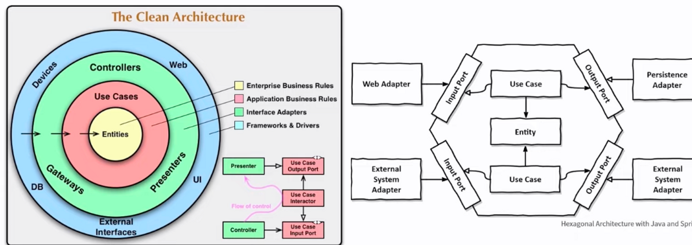
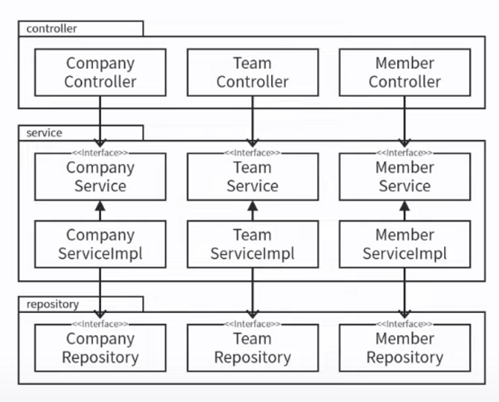
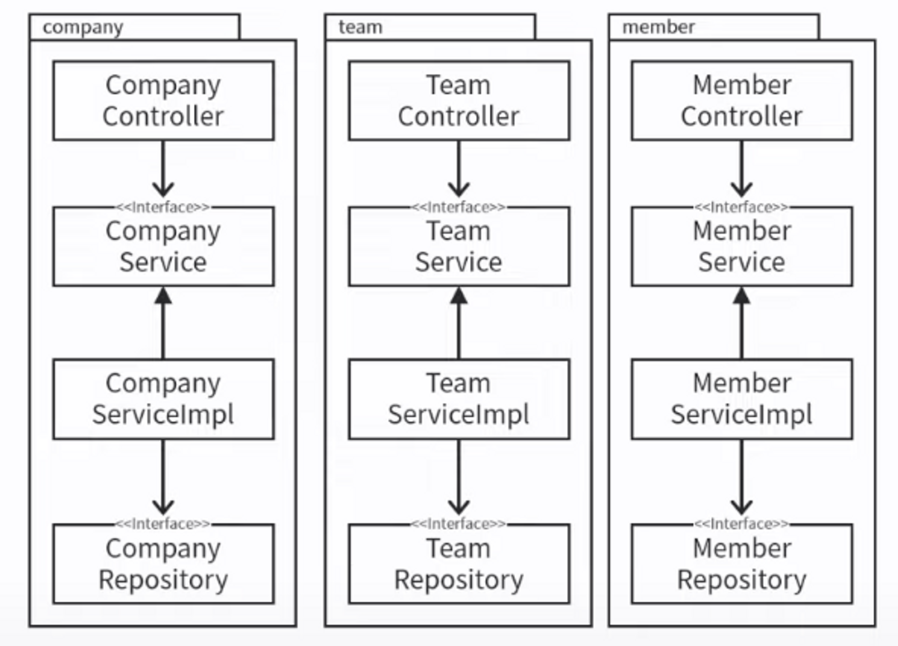
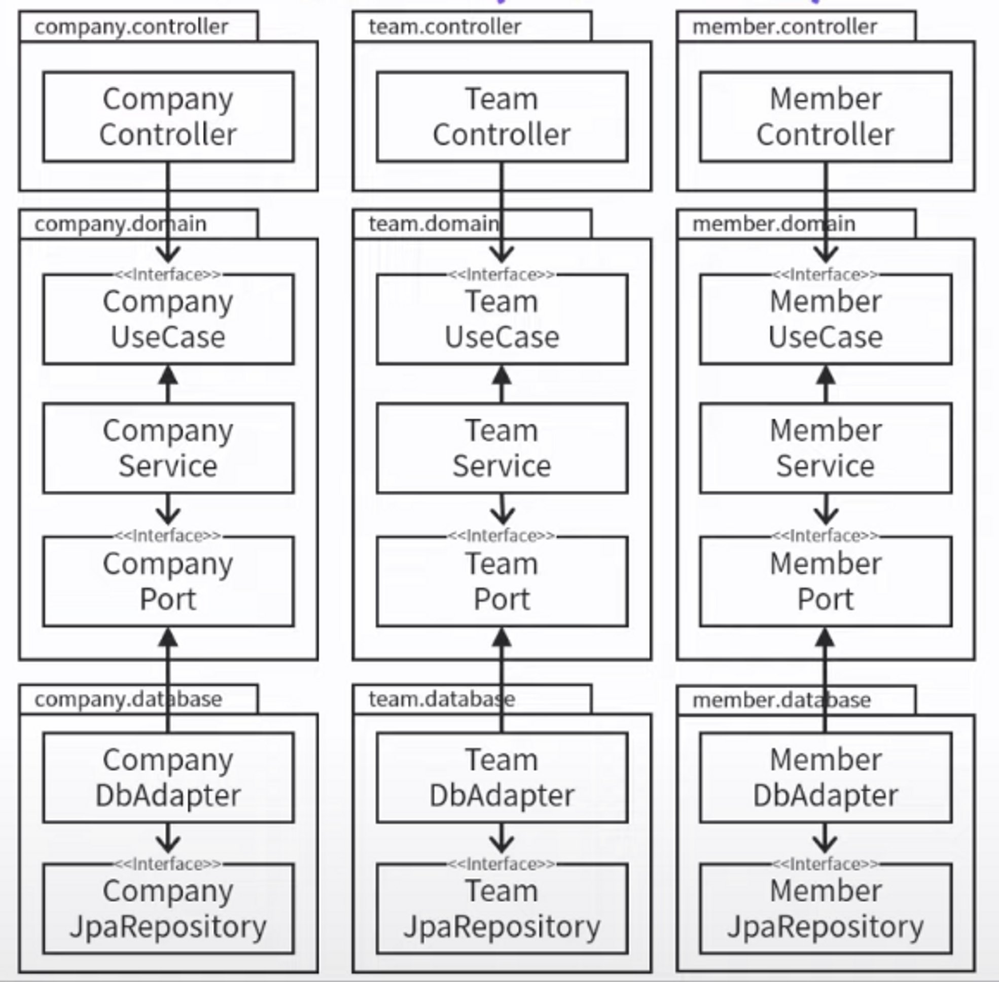

# 클린 아키텍처 애매한 부분 정리해 드립니다.
https://youtu.be/g6Tg6_qpIVc

## 소프트웨어 아키텍처가 뭐죠?

- 소프트웨어가 제공하는 가치
    - `기능`
    - `구조`
    - 소프트웨어 아키텍처는 `구조`에 대한 이야기

보통 우리는 `기능`에 집중을 하지만 로버트 마틴은 `구조`를 더 중요시 한다.

`구조`가 잘 정리가 되어 있어야 `기능`을 더하거나 변경하기 용이하다.

## 좋은 아키텍처가 왜 중요한가요?

### 프로젝트 시작

코딩을 자세히 들여다보면 프로젝트를 시작할 때

- 목적: 컴퓨터에게 원하는 `기능`을 시키기 위해
- 행위: 신규 프로젝트 생성, 코드 작성

실제로는 유지보수를 더 많이 한다.

- 목적: 컴퓨터에게 원하는 `기능`을 시키기 위해
    - 더 정확히 (버그 수정)
    - 더 빠르게 (성능 개선)
    - 더 많이 (기능 추가)
- 행위: 코드를 읽고, 이해하고, 코드 수정/추가

이를 위해선 `구조`가 중요하다.

`기능`은 `구조`에 의지한다.

> 소프트웨어 아키텍처의 목표는 필요한 시스템을 만들고 유지보수하는 데 투입되는 인력을 최소화하는 것 (로버트 마틴)
>

### 좋은 아키텍처의 중요성 by 로버트 마틴

- 기능 잘 동작 + 구조 엉망
    - 지금은 좋다.
    - 수정하는 데 비용이 많이 듦
    - 곧 버려질 프로그램
- 기능 부족 + 구조 좋음
    - 지금은 부족
    - 수정하는 데 비용 적음
    - 기능 추가해서 사용하면 됨
    - 앞으로 개선해 나가면 된다.
- 논외
    - 기능이 완성 되어 앞으로 변경 사항이 없을 프로그램
    - 우리가 신경 쓸 필요가 없다.

## 좋은 아키텍처를 구성하는 방법

### 좋은 아키텍처를 만드는 방법

- 코드를 쉽게 파악하고 쉽게 변경할 수 있게 돕는 규칙
    - 패러다임
    - 설계 원칙 (SOILD)
    - 컴포넌트 응집성 원칙
    - 컴포넌트 결합 원칙

### 아키텍처 패턴

- 계층형, 클린, 핵사고날 아키텍처
- 좋은 아키텍처를 잡기 위한 레시피
- 따라하는 것만으로 앞의 원칙들이 일부는 지켜지고 원칙을 지키며 코딩하기 쉽도록 도와주는

### 레시피(패턴) 사용법

1. 일단 레시피를 따라해 보기
2. 원칙들을 학습하고 이해한 후에 다시 레시피대로 따라해 보기
3. 각자의 프로젝트에 레시피를 적용해 보기
4. 고민이 되는 지점들은 원칙에 맞게, 혹은 크게 벗어나지 않는 선에서 타협하며 적용해 보기

## 어떤 아키텍처를 써야 하나요?

### 후보 1. 계층형 아키텍처

`웹` → `도메인` → `영속성`

- 전통적인 수평적 계층화
- 장점
    - 구조 단순
    - 처음에 적합
    - 보편적이라 모두 익숙
- 단점
    - 업무 도메인에 대해 아무 것도 말해 주지 않음
    - 소프트웨어가 커지고 복잡해지면 조직화에 도움이 안 됨
    - 데이터베이스 주도 설계 유도

### 후보 2. 클린 아키텍처

`웹` → `도메인` ← `영속성`

- 도메인이 중심 (의존성 역전)
- 장점
    - 규칙 단순
    - 도메인이 세부 사항에 의존하지 않는다.
        - DDD 적용 용이
        - 비즈니스 규칙에 집중 쉬움
- 단점
    - 패키지 구조가 계층형보다 복잡
    - 익숙하지 않아 처음에 버벅일 수 있다.
    - 레퍼런스가 적다.

## 클린 아키텍처

- 공통의 목표: 관심사의 분리
- 공통의 핵심 규칙: 의존성의 방향성은 안쪽, 고수준을 향함
    - 다형성을 이용하여 의존성은 어디서든 역전 가능

### 바이블과 쿡북

- 클린 아키텍처 (로버트 C. 마틴)
    - 유형: 바이블
    - 특징: 수많은 원칙
- 만들면서 배우는 클린 아키텍처 (톰 홈버그)
    - 유형: 쿡북
    - 특징: 실제로는 핵사고날 아키텍처 다룸

### 클린 아키텍처 vs 핵사고날 아키텍처

잘 모르겠을 땐 핵사고날 아키텍처부터

- 클린 아키텍처 기본 다이어그램과 가장 비슷함
- 따라할 수 있는 쿡북이나 레퍼런스가 가장 많음

## 아키텍처별 패키지/클래스 구조 비교
### 계층형 아키텍처

- 전통적인 수평적 계층화
- 장점
    - 구조 단순
    - 처음에 적합
    - 보편적이라 모두 익숙
- 단점
    - 업무 도메인에 대해 아무 것도 말해 주지 않음
    - 소프트웨어가 커지고 복잡해지면 조직화에 도움이 안 됨
    - 데이터베이스 주도 설계 유도

  ### 기능 기반 패키지

  

    - 서로 연관된 기능, 도메인 개념에 따라 수직의 얇은 조각으로 나눔
    - 수평적 계층화의 문제를 깨닫고 수직적 계층화로 넘어오는 경우가 많음
    - 장점
        - 코드의 상위 수준 구조가 업무 도메인에 대해 무언가를 알려줌
        - 유스케이스가 변경될 경우 변경해야 할 코드를 모두 찾는 작업이 더 쉬워짐
    - 단점
        - 계층 구조가 분리되지 않음

### 포트와 어댑터 (핵사고날)

- 수직, 수평으로 나눔
- DB 계층에 대한 의존성 역전
- 장점
    - 도메인이 다른 세부 사항에 의존하지 않음
    - 수직, 수평형 계층 구조의 장점을 모두 가짐
- 단점
    - 클래스와 패키지 구조가 더 많아짐

## 클린 아키텍처는 애매하다

### 규칙이 너무 단순

- 핵심 규칙 2가지 외에는 case by case라 애매한 점이 많다.
- 애매한 것을 판단할 기준
    - 시스템을 만들고 유지보수하는 데 투입되는 인력 최소화에 유리한가?
    - 소스 코드 의존성이 안쪽으로, 고수준 정책을 향하고 있는가?
    - 세부 사항이 변경되어도 도메인에 변경이 없을 것인가?
    - 테스트하기 쉬운가?
    - 각각의 아키텍처 원칙들을 잘 지키고 있는가?

### 클린 아키텍처, 이럴 땐 쓰지 말자

- 소규모 프로젝트를 진행할 때
- 프로젝트 개발자 모두가 클린 아키텍처를 이해하고 있지 않을 때
- 모두가 사용하기로 합의하지 않았을 때

### 클린 아키텍처, 코드양과 패키지 수

- 라인 수나 파일 수보다 패키지 수가 많이 늘어난다.
- 경계를 뚜렷하게 긋기 위해서는 패키지와 클래스가 더 필요

### 내가 작업하는 부분에만 적용해도 되나요?

- No! 팀 구성 전부 합의하고 진행해야 한다.
- 코드 일부가 아닌 패키지 구조가 바뀐다.
- 다른 개발자가 이해할 수 없을 수도 있다.

### 원칙을 모두 다 지켜야 하나요?

- 알아서 적당히 잘 조심스럽게 지키자
