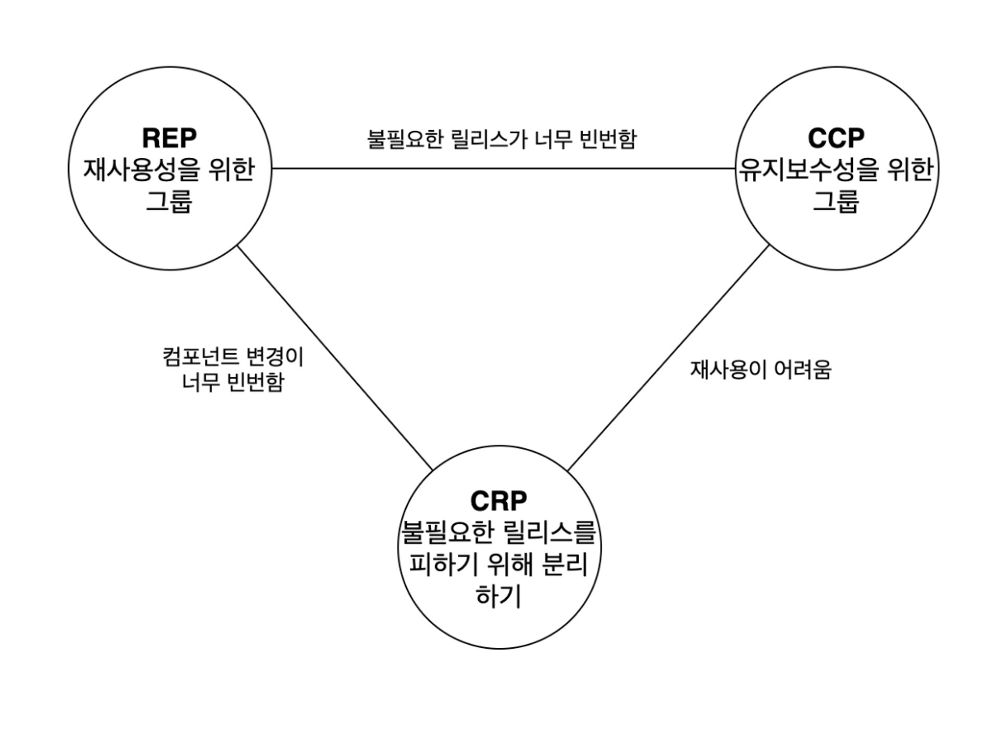
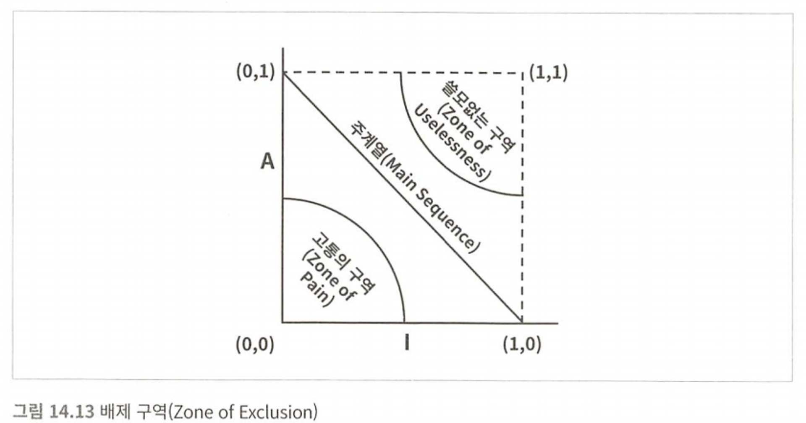

# 컴포넌트
# 컴포넌트 응집도

컴포넌트는 배포 단위다. 자바의 경우 .jar 파일이 컴포넌트다. 잘 설계된 컴포넌트라면 반드시 독립적으로 배포 가능한, 따라서 독립적으로 개발 가능한 능력을 갖춰야 한다. 이 장에서는 컴포넌트 응집도와 관련된 세 가지 원칙을 논의한다.

## REP 재사용/릴리스 등가 원칙

**Reuse/Release Equivalence Principle**

> 재사용 단위는 릴리스 단위와 같다.
>

단일 컴포넌트는 응집성 높은 클래스와 모듈로 구성되어야 한다. 컴포넌트를 구성하는 모든 모듈은 서로 공유하는 중요한 테마나 목적이 있어야 한다.

하나의 컴포넌트로 묶인 클래스와 모듈은 버전 번호가 같아야 하며, 동일한 릴리스로 추적 관리되고, 동일한 릴리스 문서에 포함되어야 한다.

## CCP 공통 폐쇄 원칙

**Common Closure Principle**

> 동일한 시점에 동일한 이유로 변경되는 것들을 한데 묶어라. 서로 다른 시점에 다른 이유로 변경되는 것들은 서로 분리하라.
>

이 원칙은 SRP를 컴포넌트 관점에서 다시 쓴 것이다.

대다수의 애플리케이션에서 유지보수성은 재사용성보다 훨씬 중요하다. 코드가 변경 됐을 때 이 변경이 여러 컴포넌트 도처에 분산되는 것보다 한 컴포넌트에서 발생하는 것이 낫다. 만약 한 컴포넌트에만 변경이 일어난다면 그 컴포넌트만 재배포하면 된다. 이 원칙은 OCP와도 밀접하게 관련되어 있다.

## CRP 공통 재사용 원칙

**Common Reuse Principle**

> 컴포넌트 사용자들을 필요하지 않는 것에 의존하게 강요하지 말라.
>

CRP에서는같이 재사용되는 경향이 있는 클래스와 모듈들은 같은 컴포넌트에 포함해야 한다고 말한다. 개별 클래스가 단독으로 재사용되는 경우는 거의 없고 대체로 재사용 가능한 클래스는 재사용 모듈의 일부로써 해당 모듈의 다른 클래스와 상호작용하는 경우가 많다.

CRP는 동일한 컴포넌트로 묶어서는 안 되는 클래스가 무엇인지도 말해준다. 어떤 컴포넌트를 변경하면 그 컴포넌트를 의존하던 컴포넌트도 영향을 받는다. 단 하나의 클래스만 의존하더라도 말이다. 따라서 의존하는 컴포넌트가 있다면 해당 컴포넌트의 모든 클래스에 대해 의존함을 확실히 인지해야 한다.

즉 CRP는 강하게 결합되지 않은 클래스들을 동일한 컴포넌트에 위치시켜서는 안 된다고 말한다.

### ISP와의 관계

CRP는 ISP의 포괄적인 버전이다. ISP는 사용하지 않는 메서드가 있는 클래스에 의존하지 말라고 조언한다. CRP는 사용하지 않는 클래스를 가진 컴포넌트에 의존하지 말라고 강조한다.

## 컴포넌트 응집도에 대한 균형 다이어그램

응집도에 관한 세 원칙은 서로 상충한다.

- REP와 CCP는 포함 원칙이다. 두 원칙은 컴포넌트를 더욱 크게 만든다.
- CRP는 배제 원칙이며 컴포넌트를 더욱 작게 만든다.

이 원칙들이 균형을 이루는 점을 찾아야 한다.

- REP와 CRP에만 중점을 두며 사소한 변경이 생겼을 때 너무 많은 컴포넌트에 영향을 미친다.
- 반대로 CCP와 REP에만 과도하게 집중하면 불필요한 릴리스가 빈번해진다.

## 응집도 결론

어느 클래스를 묶어서 컴포넌트로 만들지는 재사용성과 개발 가능성이라는 상충하는 힘을 반드시 고려해야 한다. 이들 사이의 균형점은 항상 유동적이며 잘 분배했더라도 내년엔 맞지 않을 수 있다. 시간이 흐름에 따라 프로젝트의 초점이 개발 가능성에서 재사용성으로 바뀌고, 그에 따라 컴포넌트를 구성하는 방식도 조금씩 흐트러지고 또 진화한다.

# 컴포넌트 결합도

## ADP 의존성 비순환 원칙

**Acyclic Dependencies Principle**

> 컴포넌트 의존성 그래프에 순환이 있어서는 안 된다.
>

다른 누구가에 의해 수정된 코드 때문에 그 코드에 의존하던 컴포넌트가 제 기능을 하지 못하게 되는 현상을 숙취 증후군이라고도 부른다. 개발팀이 커지면 커질 수록 이는 문제가 된다. 문제를 해결하기 위한 방법으로 **주 단위 빌드**와 **의존성 비순환 원칙**이 있다.

### 주 단위 빌드

- 개발자는 일주일의 첫 4일 동안은 개인적으로 작업한다.
- 금요일이 되면 변경된 코드를 모두 통합하여 시스템을 빌드한다.
- 5일 중 5일 동안 개발자를 고립된 세계에서 살 수 있게 보장해 준다는 장점이 있다.
- 하지만 프로젝트가 커지면 통합이라는 짐은 점점 커진다.

### 순환 의존성 제거하기

이 문제의 해결책은 개발 환경을 릴리스 가능한 컴포넌트 단위로 분리하는 것이다. 개발자가 해당 컴포넌트가 동작하도록 만든 후, 릴리스하여 다른 개발자가 사용할 수 있도록 만든다.

새로운 컴포넌트가 릴리스되면 다른 팀에서는 새 릴리스를 당장 적용할 수도 있고 과거를 잠시 동안 계속 사용할 수도 있다.

따라서 특정 컴포넌트가 변경되더라도 다른 팀에 즉각 영향을 주지 않는다. 특정 시점에 모든 개발자가 한데 모여서 진행 중인 작업을 모두 통합하는 일은 사라진다.

**하지만 이 절차가 성공적이기 위해선 컴포넌트 사이 의존성에 순환이 있어서는 안 된다.** 즉 어느 컴포넌트에서 시작하더라도 의존성을 따라가면서 최초의 컴포넌트로 돌아갈 수 없다는 사실이다.

### 순환이 컴포넌트 의존성 그래프에 미치는 영향

- 한 컴포넌트를 릴리스할 때 신경 써야 할 다른 컴포넌트가 커진다.
    - A가 B를 의존하고 있고 B, C, D가 의존성 순환 문제를 안고 있다고 가정해보자.
    - A는 B와 호환되어야 한다. 그런데 의존성이 B → C → D → B이기 때문에 B, , C, D 전체와 호환되어야 하기 때문에 릴리스하기가 훨씬 어려워 진다.
    - B, C, D는 사실상 하나의 거대한 컴포넌트가 되어 버린다.
- 하나의 컴포넌트를 테스트해야 할 때 다른 컴포넌트들을 많이 포함할 수밖에 없어진다.
- 컴포넌트를 어떤 순서로 빌드해야 올바를지 파악하기가 상당히 힘들어진다.

### 순환 끊기

1. 의존성 역전 원칙을 적용한다.
2. 제 3의 컴포넌트를 만들고 이 컴포넌트를 의존하게 해서 순환을 끊는다.

**흐트러짐**

두 번째 해결책에서 시사하는 바는 요구 사항이 변경되면(요구 사항 변경에 의해 새로운 의존이 생겨 순환이 생기는 경우) 컴포넌트 구조도 변경될 수 있다는 사실이다. 실제로 애플리케이션이 성장함에 따라 컴포넌트 의존성 구조는 흐트러지며 또 성장한다.

## SDP 안정된 의존성 원칙

**Stable Dependencies Principle**

> 안정성의 방향으로 (더 안정된 쪽에) 의존하라
>

컴포넌트 중 일부는 변동성을 지니도록 설계된다. 변경이 쉽지 않은 컴포넌트가 변동이 예상되는 컴포넌트에 의존하게 만들어서는 절대로 안 된다.

### 안정성

‘안정성’이란 무슨 뜻인가? 소프트웨어 컴포넌트를 변경하기 어렵게 만드는 확실한 방법 하나는 다른 컴포넌트가 해당 컴포넌트에 의존하게 만드는 것이다. 의존하는 모든 컴포넌트를 만족시키면서 변경하려면 상당한 노력이 들기 때문이다.

A, B, C 컴포넌트가 모두 X 컴포넌트를 의존한다면 X는 세 컴포넌트를 **책임진다**라고 말할 수 있다. X는 어디에도 의존하지 않으므로 X를 변경되도록 만들 수 있는 외적인 영향이 전혀 없다. 이 경우 X는 **독립적이다**라고 말한다.

### 안정성 지표

컴포넌트로 들어오고 나가는 의존성 개수를 세어 보는 방법으로 안정성을 측정할 수도 있다.

- **Fan-in**: 안으로 들어오는 의존성
- **Fan-out**: 바깥으로 나가는 의존성
- **I**(불안정성): `I = Fan-out / (Fan-in + Fan-out)`
    - I = 0이라면 최고로 안정된 컴포넌트이고, 1이면 최고로 불안정한 컴포넌트라는 뜻이다.
    - I = 1이면 어떤 컴포넌트도 해당 컴포넌트에 의존하지 않지만, 해당 컴포넌트를 다른 컴포넌트에 의존한다는 뜻이다.
    - I = 0이면 해당 컴포넌트에 의존하는 다른 컴포넌트는 있지만 해당 컴포넌트 자체는 다른 컴포넌트에 의존하지 않는다는 뜻이다.

## SAP 안정된 추상화 원칙

**Stable Abstractions Principle**

> 컴포넌트는 안정된 정도만큼만 추상화되어야 한다.
>

### 고수준 정책

고수준 아키텍처나 정책 결정과 관련된 소프트웨어는 자주 변경해서는 안 되는 컴포넌트다. 따라서 이러한 업무 로직이나 아키텍처와 관련된 컴포넌트는 반드시 안정된 컴포넌트(I=0)에 위치해야 한다.

하지만 고수준 정책을 안정화시키면 그 정책을 포함하는 소스 코드는 수정하기가 어려워진다. (유연성이 떨어짐, 고수준 컴포넌트를 의존하는 다른 컴포넌트가 많기 때문) 이는 OCP를 준수하면서 해결할 수 있는데 추상 클래스를 활용할 수 있다.

### 안정된 추상화 원칙

안정된 컴포넌트는 추상 컴포넌트여야 하며, 이를 통해 안정성이 컴포넌트를 확장하는 일을 방해해서는 안 된다고 말한다. 따라서 안정적인 컴포넌트라면 반드시 인터페이스와 추상 클래스로 구성 되어 쉽게 확장할 수 있어야 한다.

### 추상화 정도 측정하기

- Nc: 컴포넌트의 클래스 개수
- Na: 컴포넌트의 추상 클래스와 인터페이스 개수
- A: 추상화 정도, `A = Na / Nc`
- A = 0이면 컴포넌트에 추상 클래스가 하나도 없다는 뜻이고, 1이면 오로지 추상 클래스만을 포함한다는 뜻이다.

### 안정성(I)과 추상화 정도(A)의 관계

최고로 안정적이며 추상화된 컴포넌트는 좌측 상단인 (0, 1)이며 최고로 불안정하며 구체화된 컴포넌트는 우측 하단인 (1, 0)이다.

- **고통의 구역**
    - 매우 안정적이며 구체적인 컴포넌트다.
    - 추상적이지 않기에 확장할 수 없고, 안정적이기에 변경하기 어렵다.
    - 엔티티나 데이터베이스 스키마가 한 예다.
- **쓸모없는 구역**
    - 최고로 추상적이지만 누구도 그 컴포넌트에 의존하지 않기 때문에 쓸모가 없다.
- **주계열**
    - 주계열에 위차한 컴포넌트는 자신의 안정성에 비해 너무 추상적이지도 않고, 추상화 정도에 비해 너무 불안정하지도 않다.
    - 이 컴포넌트는 쓸모 없지도 않고, 심각한 고통을 안겨 주지도 않는다.
