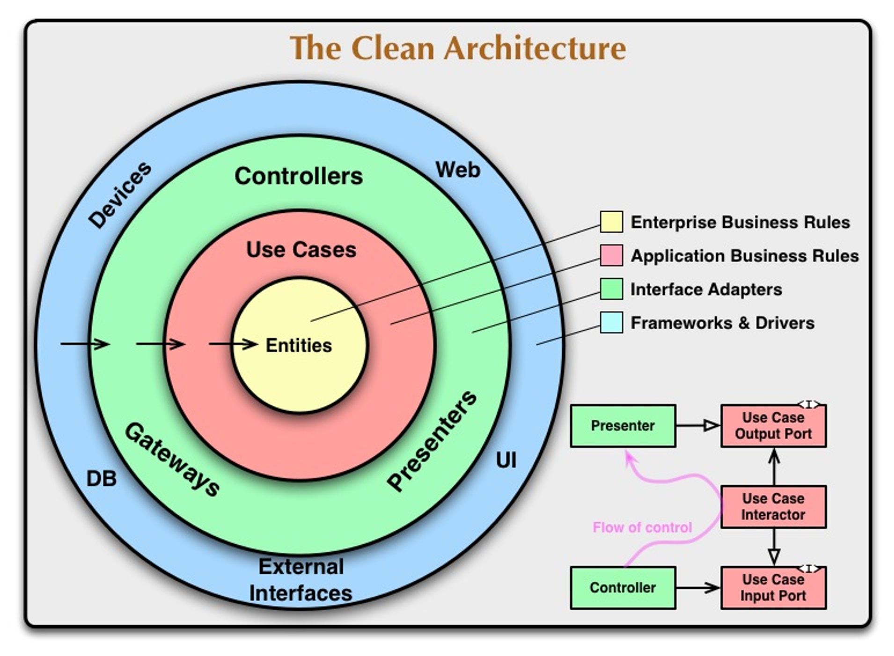

# 클린 아키텍처
흔히 얘기하는 좋은 아키텍처는 다음과 같은 특징이 있다.

- **프레임워크 독립성** - 프레임워크의 제약 사항 안으로 시스템을 욱여 넣지 않는다.
- **테스트 용이성** - UI, DB 등이 없이도 테스트할 수 있다.
- **UI 독립성** - 시스템의 나머지 부분을 변경하지 않고도 UI를 쉽게 변경할 수 있다.
- **데이터베이스 독립성** - 데이터베이스를 쉽게 변경할 수 있어야 한다.
- **모든 외부 에이전시에 대한 독립** - 업무 규칙은 외 인터페이스에 대해 전혀 알지 못한다.

## 클린 아키텍처

> 소스 코드 의존성은 반드시 안쪽으로, 고수준의 정책을 향해야 한다.
>

### 인터페이스 어댑터

- 어댑터는 데이터를 유스케이스와 엔티티에게 가장 편리한 형식에서 데이터베이스나 웹 같은 외부 에이전시에게 가장 편리한 형식으로 변환한다.
    - GUI, MVC 아키텍처
    - Presenter, View, Controller는 모두 인터페이스 어뎁터 계층에 속한다.

### 프레임워크와 드라이브

- 그림의 가장 바깥 계층은 데이터베이스나 웹 프레임워크 같은 도구들로 구성된다.
- 이러한 것들은 세부 사항이기 때문에 모두 외부에 위치시켜서 피해를 최소화한다.

### 경계 횡단하기

- 그림의 우측 하단을 보면 컨트롤러와 프레젠터가 유스케이스와 통신하는 모습을 확인할 수 있다.
- 제어 흐름을 보면 컨트롤러가 유스케이스를 지난 후 프레젠터에서 실행되면서 끝난다.
- 소스 코드 의존성을 보면 유스케이스를 향해 안쪽을 가리킨다.
- 이처럼 제어 흐름과 의존성 방향이 명백히 반대여야 하는 경우 의존성 역전 원칙을 사용하여 해결한다.

### 경계를 횡단하는 데이터

- 경계를 가로지르는 데이터는 흔히 DTO 등으로 구성한다.
- 엔티티나 데이터베이스 row의 형태로 그대로 전달하면 안 된다.
    - 예를 들어 데이터베이스 row를 업무 규칙 쪽으로 그대로 전달한다면 내부의 원에서 외부의 원의 무언가를 알게 되는 것이다.
- 따라서 경계를 가로지를 때는 내부의 원에서 사용하기에 가장 편리한 형태를 가져야만 한다.
