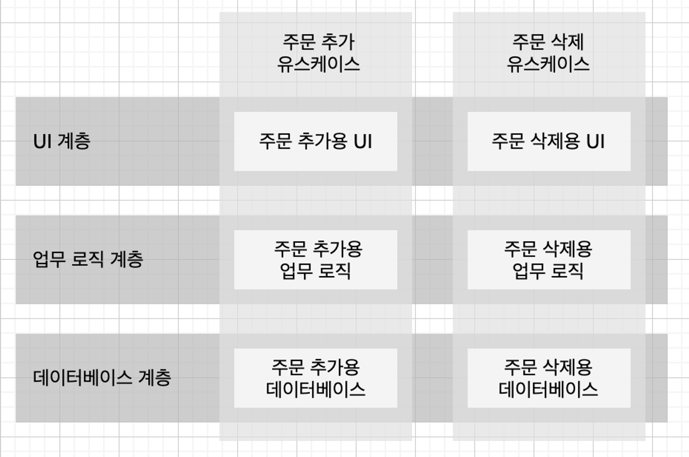

# 아키텍처 독립성
좋은 아키텍처는 다음을 지원해야 한다.

- 시스템의 유스케이스
- 시스템의 운영
- 시스템의 개발
- 시스템의 배포

## 유스 케이스

- 시스템의 아키텍처는 시스템의 의도를 지원해야 한다.
    - 장바구니 애플리케이션이라면 장바구니와 관련된 유스케이스를 지원해야 함
- 아키텍처는 시스템의 행위에 큰 영향을 주진 않는다. (아키텍처가 나빠도 동작은 한다.)
- 하지만 좋은 아키텍처는 시스템의 행위를 명확히 하고 외부로 드러내며, 이를 통해 시스템의 의도를 아키텍처 수준에서 알아볼 수 있게 할 수 있다.

## 운영

- 시스템이 초당 100,000명의 고객을 처리해야 한다고 가정하자.
- 시스템이 단일체(monolith)로 작성되어 있다면 다중 프로세스, 다중 스레드 또는 마이크로서비스 형태로 개선하기 어려울 것이다.
- 각 컴포넌트를 적절히 격리하여 유지하고 컴포넌트 간 통신 방식을 특정 형태로 제한하지 않는다면 트래픽을 처리할 수 있는 구조로 전환하는 일이 훨씬 쉬워진다.

## 개발

잘 격리되어 독립적으로 개발 가능한 컴포넌트 단위로 시스템을 분할할 수 있다면 많은 팀으로 구성되어 일하더라도 각 팀이 독립적으로 개발하기 편할 것이다.

## 배포

- 아키텍처는 배포 용이성을 결정하는 데 중요한 역할을 한다.
- 좋은 아키텍처는 수십 개의 작은 설정 스크립트나 속성 파일을 약간씩 수정하는 방식을 사용하지 않는다.
- 좋은 아키텍처는 시스템이 빌드된 후 즉각 배포할 수 있도록 지원해야 한다.
- 이러한 아키텍처를 만들기 위해선 컴포넌트 단위로 적절히 분할하고 격리시켜야 한다.

## 선택 사항 열어 놓기

- 소프트웨어 시스템은 **정책**과 **세부 사항**으로 분해할 수 있다.
- 정책은 업무 규칙과 업무 절차를 구체화하고, 세부 사항은 사람, 외부 시스템, 개발자가 정책과 소통할 때 필요한 요소지만 정책이 가진 행위에는 조금도 영향을 미치지 않는다.
    - 세부 사항 예) 데이터베이스, 웹 시스템, 프레임워크 등
- 좋은 아키텍처는 시스템에서 정책을 핵심으로 식별하고 동시에 세부 사항은 정책에 무관하게 만들 수 있는 형태의 시스템을 구축하는 데 있다.
- 세부 사항에 대한 선택 사항을 열어 둠으로써 시스템 변경을 용이하게 할 수 있다.

## 결합 분리

- 컴포넌트들은 단일 책임 원칙과 공통 폐쇄 원칙을 적용하여 의도의 맥락에 따라서 다른 이유로 변경되는 것들은 분리하고 동일한 이유로 변경되는 것들은 묶여야 한다.
- 계층 분리의 예로는 UI, 애플리케이션에 특화된 업무 규칙, 애플리케이션과 독립적인 업무 규칙, 데이터베이스 등이 있다.
- 유스케이스 그 자체도 서로 다른 이유로 변경될 수 있다. (주문 추가, 주문 삭제)
    - 각 유스케이스는 UI의 일부, 업무 규칙의 일부, 데이터베이스 기능의 일부를 사용한다.

- 유스케이스 분리의 운영 관점에서의 이점
  - 이렇게 유스케이스로 분리되었다면 높은 처리량을 보장해야 하는 유스케이스와 낮은 처리량으로도 충분한 유스케이스는 이미 분리되었을 가능성이 높다.
  - 높은 처리량을 요구하는 유스케이스 서버만 확장이 가능하다.

## 결합 분리 모드

- 소스 수준 분리 모드
  - 소스 코드 모듈 사이의 의존성을 제어할 수 있다.
  - 한 모듈이 변하더라도 다른 모듈을 변경하거나 재컴파일 하지 않아도 된다.
- 배포 수준 분리 모드
  - jar 파일 같이 배포 가능한 단위들 사이의 의존성을 제어할 수 있다.
  - 한 모듈이 변하더라도 다른 모듈을 변경하거나 재컴파일 하지 않아도 된다.
  - 많은 컴포넌트가 여전히 같은 주소 공간에 상주하기에 함수 호출로 통신할 수도 이싸.
  - 다른 프로세스에 상주한다면 프로세스 간 통신, 소켓, 또는 공유 메모리를 통해 통신할 수 있다.
- 서비스 수준 분리 모드
  - 의존하는 수준을 데이터 구조 단위까지 낮출 수 있고, 순전히 네트워크 패킷을 통해서만 통신하도록 만들 수 있다.
  - 모든 실행 가능한 단위는 소스와 바이너리 변경에 대해 서로 완전히 독립적이게 된다.
  - 예) 마이크로서비스

좋은 아키텍처는 시스템이 모노리틱 구조로 태어나서 단일 파일로 배포되더라도, 이후에는 독립적으로 배포 가능한 단위들의 집합으로 성장하고, 또 독립적인 서비스나 마이크로서비스 수준까지 성장할 수 있도록 만들어져야 한다. 또 다시 모노리틱 구조로 돌릴 수도 있어야 한다.
