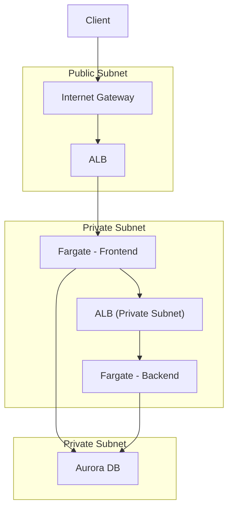

# 3-1 ~ 3-3 설계 대상 개요

## 3-1 이 장을 읽기에 앞서

- 사업을 위해 시스템을 운영한다는 것은 다양한 부분을 고려한 시스템 설계 및 구축이 필요한 일이다.
    - 신뢰성, 운영 방침, 성능, 보안, 비용 등
- 설계에서 고려해야 할 포인트와 모범 사례를 전반적으로 파악하면 단순히 미쳐 고려하지 못한 부분을 없애는 것뿐만 아니라 효율적인 시스템 설계와 구현에 도움이 된다.

## 3-2 Well-Architected 프레임워크 활용

- AWS는 Well-Architected라는 시스템 설계와 관련된 지침 및 도구를 제공한다.
    - 6대 원칙 (운영 우수성, 보안, 안정성, 성능 효율성, 비용 최적화, 지속 가능성)을 바탕으로 모범 사례를 공유
- 이 장에서는 Well-Architected 프레임워크 6대 원칙 중 지속 가능성을 제외한 5대 원칙에 맞춰 ECS/Fargate를 설계해 본다.

## 3-3 설계 대상 아키텍처

- 설계 진행에 앞서 예제에 사용할 웹 애플리케이션 개요를 소개한다.

### 이 장에서 다룰 AWS 서비스

- 설계의 주축이 되는 컨테이너 서비스
    - ECS, Fargate, ECR
- 그 외 서버리스
    - Lambda
- 스토리지
    - Aurora, S3
- 빌드 및 배포
    - CodeBuild, CodeCommit, CodeDeploy, CodePipeline, X-Ray
- 그외 운영
    - ELB, Firehose, VPC, Auto Scaling, Chatbot, CloudWatch, SNS, Systems Manager
- 보안
    - IAM, KMS, Secrets Manager, WAF

### 예제 애플리케이션 개요

- 간단한 아이템 관리 웹 애플리케이션
- 각 프런트엔드와 백엔드를 컨테이너로 구축
    - 프런트 역할 - 회원 가입, 로그인, 백엔드 API 호출 기능, 대시보드 표시
    - 백엔드 역할 - 아이템 생성 API, 아이템 취득 API, 즐겨찾기 추가 API, 알림 API
- SSR을 전제로 하는 웹 애플리케이션과 API를 구축하기 위해 AWS에 컨테이너를 구축하는 사용 사례를 상정

### 설계 요구사항과 기본 아키텍처

- 아키텍처 구축을 위한 대략적인 시스템 요건
    - 다수 사용자의 이용을 고려해 유연한 확장이 가능한 구성
    - 고가용성을 위한 다중 AZ
    - CI/CD 파이프라인을 구성하여 빠른 배포
    - 각 계층별 적절한 보안 대책 (침입 방지, 인증 데이터 관리, 로그 저장, 서버 접근 관리)

