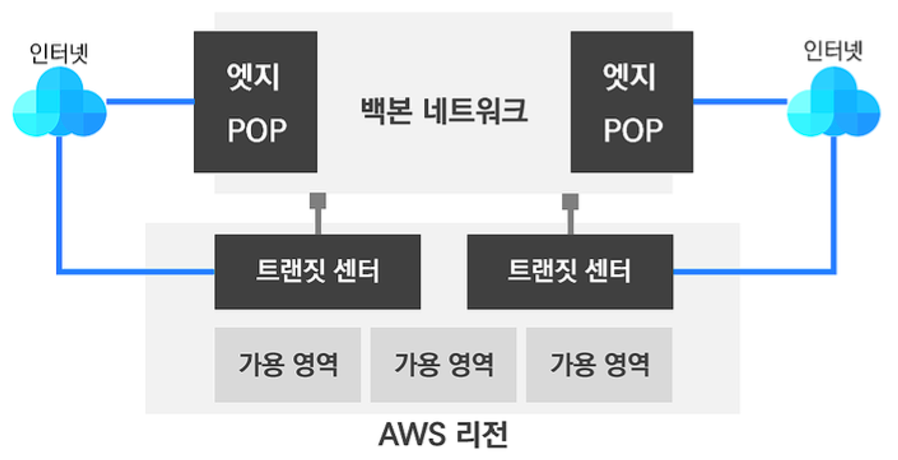

# 01 AWS 소개

## 1.1 클라우드란?

**클라우드란 인터넷을 통해 언제 어디서든 원하는 만큼의 IT 리소스를 손쉽게 사용할 수 있는 서비스**이다.

### 1.1.1 클라우드 서비스 종류

AWS 클라우드 기준 서비스 종류는 크게 4가지이다.

- **IaaS** (Infrastructure as a Service)
    - 가장 기본적인 IT 자원인 ‘**서버, 네트워크, 스토리지 자원**’을 클라우드 사업자가 제공 및 운영 관리
    - 사용자는 가상 서버에 필요한 프로그램을 설치하여 사용 및 운영 관리
    - EC2, VPC, EBS
- **PaaS** (Platform as a Service)
    - 클라우드 사업자가 IT 자원 이외에도 **운영 체제**와 **미들웨어**와 **런타임**을 제공
    - 사용자는 제공받은 미들웨어와 런타임 환경에서 개발에 집중할 수 있다.
    - AWS Elastic Beanstalk
- **Serverless**
    - 애플리케이션 개발에 필요한 대부분을 클라우드 사업자가 제공 및 운영 관리
    - 사용자는 개발(코드)에만 집중
    - Lambda, API Gateway
- **SaaS** (Software as a Service)
    - 클라우드 사어바는 SaaS 서비스 개발을 위한 리소스 및 다양한 자원을 제공
    - SaaS 서비스 제공사는 리소스와 자원을 토대로 SaaS 서비스를 개발 및 제공하여 사용자에게 서비스한다.

### 1.1.2 클라우드 구현 모델

- **퍼블릭 클라우드**
    - 일반적으로 클라우드 서비스 제공 업체가 운영 관리
    - 사용자는 해당 클라우드 리소스를 사용
- **프라이빗 클라우드**
    - 사용자가 자신의 온프레미스 내에 클라우드 플랫폼 구축하여 직접 사용하는 모델
- **하이브리드 클라우드**
    - 퍼블릭 클라우드와 온프레미스 모두에 서비스하는 모델

## 1.2 AWS 클라우드 소개

AWS는 전세계에 분포한 데이터 센터에서 다양한 서비스를 제공한다.

### 1.2.1 AWS 글로벌 인프라

- AWS 전세계 24개 리전과 77개의 가용영역, 216개의 엣지 POP을 운영하고 있다.
- AWS 클라우드는 인프라의 논리적 규모에 따라 다음과 같이 구분할 수 있다.
    - 데이터센터 < 가용 영역 < 리전(엣지) < 글로벌 인프라

### 1.2.2 데이터센터

AWS 데이터센터는 3가지 영역으로 분류한다.

- **물리 영역**
    - 물리적으로 건물을 운영하는 설비와 시스템
    - 보안 요원, 울타리, 출입 통제, 냉난방 등
- **IT 인프라 영역**
    - 일반적인 IT 인프라 디바이스
    - 서버, 네트워크, 스토리지, 로드 밸런서, 라우터 등
- **운영 영역**
    - 데이터센터를 운영 및 유지 관리하는 인원

### 1.2.3 가용 영역 (AZ, Avaliability Zone)

- **한 개 이상의 데이터센터들의 모음**
- 각 데이터센터는 분산되어 있으며 초고속 광통신 전용망으로 연결되어 있다.
- 서울 리전은 현재 4개의 가용 영역이 존재

### 1.2.4 리전

- **지리적인 영역 내에 격리되고 물리적으로 분리된 여러 개의 가용 영역의 모음**
- 물리적인 재난과 재해에 대비해 AWS에 서비스를 구성할 때 가용 영역을 분산하여 구성해야 한다.

### 1.2.5 엣지

- **외부 인터넷과 AWS 글로벌 네트워크망과 연결하는 별도의 센터**
- 엣지 로케이션과 리전별 엣지 캐시로 구성
- CDN, Direct Connect, Route 53(DNS), AWS shield, AWS g=Global Accelerator가 엣지에서 동작
- 백본 네트워크는 AWS 글로벌 네트워크망과 연결하며, 중국 리전을 제외한 모든 AWS 리전과 연결된다.

## 1.3 AWS 제품

### 1.3.1 컴퓨팅 서비스

- **EC2 (Elastic Compute Cloud)**
    - 물리 환경의 서버 컴퓨터와 유사하게 컴퓨팅 리소스를 제공하는 서비스
    - 가상 머신으로 제공되며 **인스턴스**라고 부른다.
    - 목적에 따른 다양한 타입과 스펙으로 구분되며 사용한만큼 비용을 지불한다.
- **오토 스케일링 (Auto Scaling)**
    - EC2 인스턴스의 조건에 따라 자동으로 서버를 추가 혹은 제거해주는 서비스
- **람다 (AWS Lambda) - 서버리스 컴퓨팅**
    - 람다는 프로그램을 실행하는 컴퓨팅 엔진이다.
    - AWS가 컴퓨팅 엔진 전반을 관리하기에 사용자는 코드만으로 서비스를 실행할 수 있다.

### 1.3.3 스토리지 서비스

- **EBS(Elastic Bolck Store)**
    - 가용 영역 내의 EC2에 연결되어 사용될 수 있는 블록 스토리지
    - 필요 시 생성하고 연결할 수 있으며 용량도 늘릴 수 있다.
- **S3 (Simple Storage Service)**
    - 객체 기반의 무제한 파일을 저장할 수 있는 스토리지
    - 사용자는 URL을 통해 손쉽게 파일을 사용 가능
    - 99.999999999%의 뛰어난 내구성 제공

### 1.3.4 데이터베이스 서비스

- **Amazone RDS (Relational Database Service)**
    - 관계형 데이터베이스를 이용할 수 있는 서비스
    - 하드웨어 프로비저닝, DB 설정, 패치 및 백업과 같은 소모적인 관리 작업을 AWS에서 처리
    - 6개의 DB 엔진을 선택 가능
- **Amazon DynamoDB**
    - 어떤 규모에서도 10밀리초 미만의 성능을 제공하는 NoSQL 기반 서비스
    - 대규모 데이터 저장 및 처리 가능
    - 서버리스 서비스로서 사용자는 운영 관리할 필요가 없다.

### 1.3.5 그 외 서비스

- **AWS CloudFormation**
    - 프로그래밍 언어나 텍스트 파일로 AWS 리소스를 자동으로 배포할 수 있다.
- **AWS CloudWatch**
    - AWS 리소스 및 온프레미스 자원을 모니터링할 수 있는 서비스
    - 데이터 수집 및 로그 저장 그리고 특정 조건에 맞춰 알람도 제공한다.
