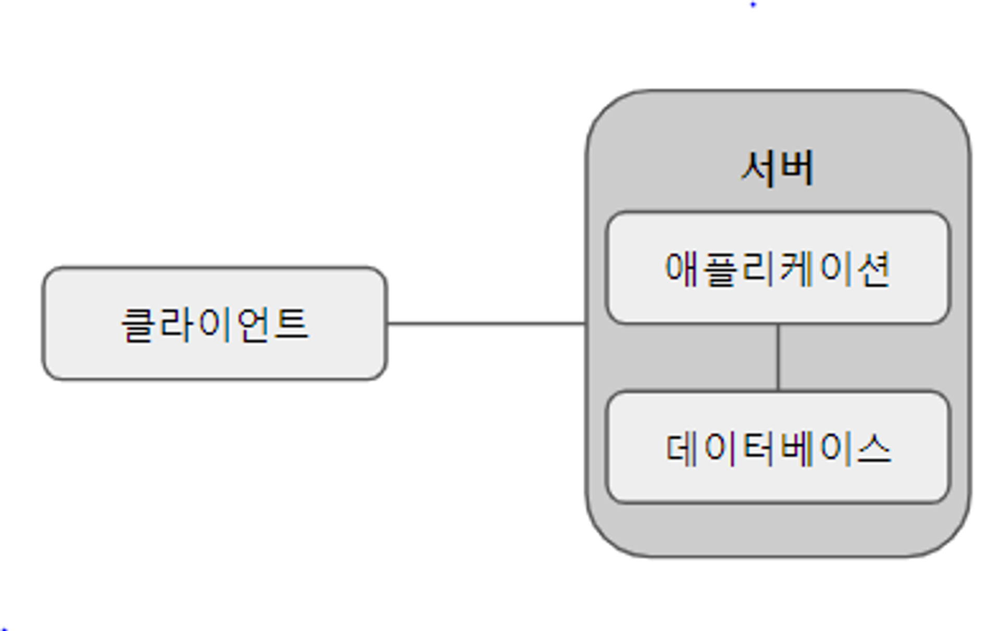
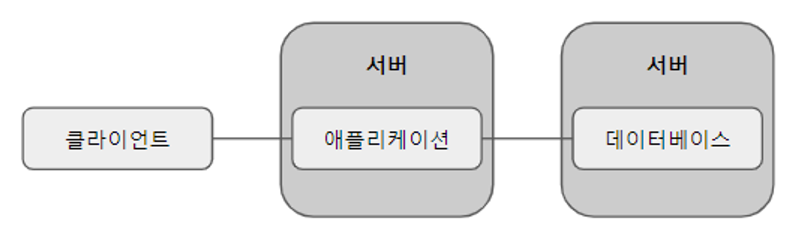
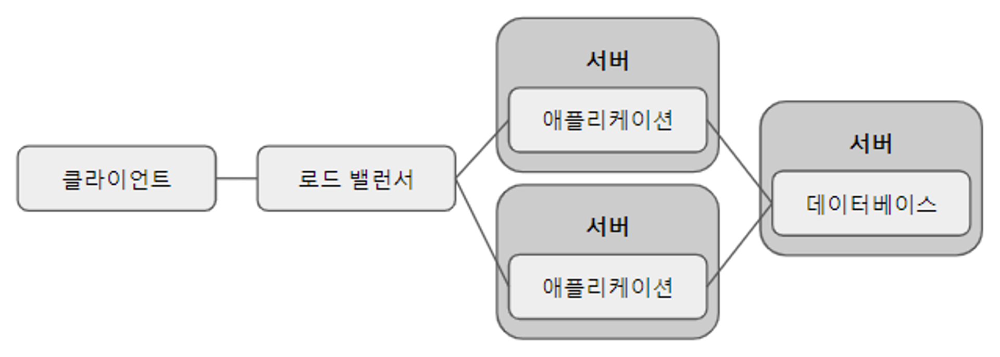

# 서버 아키텍처
## 운영 서버 아키텍처의 이해

### 단일 서버

- 특징
    - 요청을 보내는 클라이언트와 요청을 처리하는 서버 한 대로 구성
    - 단순한 구성이라 구축하기 쉽다.
    - DB와 애플리케이션이 같은 서버에 있기 때문에 네트워크 설정이 필요 없다.
- 단점
    - 애플리케이션이나 DB에서 하나라도 장애가 나면 전체 서비스 장애가 발생한다.
    - 애플리케이션과 DB가 각 속성에 따라 중요한 자원의 종류(CPU, 메모리, 디스크 등)가 다르기 때문에 서버 자원을 효율적으로 사용하기 어렵다.
    - DB는 보안상 IP 등 접속 지점을 최소로 하는 것이 좋으나 애플리케이션은 여러 IP에서 접속을 허용해야 하기 때문에 DB 보안이 떨어진다.
    - 서버를 늘리는 스케일 아웃이 힘들다.

### 애플리케이션/데이터베이스 서버 분리

- 특징
    - 단일 서버에서 DB를 별도의 서버로 분리한 구성
    - 전체 서비스 장애 확률, 효율적 자원 사용, 보안성 같은 단점을 해결한다.
- 단점
    - 다만 두 대의 서버를 관리하기 때문에 구성이 복잡해진다.
    - 서버 사이의 지연 시간, 네트워크 보안을 고려해야 한다.
    - 클라이언트에서는 하나의 서버를 바라보기 때문에 여전히 스케일 아웃이 힘들다.

## 서버 단위의 로드 밸런서

- 특징
    - 클라이언트가 서버와 직접 통신하는 대신 로드 밸런서와 통신하고 로드 밸런서 뒤에 서버를 두는 방식
    - 로드 밸런서가 클라이언트의 요청을 여러 대의 서버에게 나눠준다.
    - 이 구성의 가장 큰 장점은 스케일 아웃이 가능하다는 것이다.
    - 서버 일부에 장애가 발생해도 정상 서버가 있기 때문에 서비스 장애를 최소화할 수 있다.
- 단점
    - 로드 밸런서에 장애가 발생하면 나머지 서버가 정상이어도 전체 서비스 장애로 이어진다.
    - 구성이 매우 복잡하다.

## Auto Scaling

- AWS Auto Scaling 그룹은 AWS에서 제공하는 자동 다중 서버 서비스다.
- Auto Scaling 그룹은 같은 사양, 같은 환경, 같은 코드를 가지고 있는 똑같은 EC2 인스턴스들의 묶음이다.
    - 같은 AMI를 이용해서 만들기 때문에 여러 대 존재 가능
- 이름에서 알 수 있듯이 인스턴스들의 수를 자동으로 늘리고 줄여준다.
    - 사용자가 몰리는 경우 서버 수를 늘리고 없는 경우 자동으로 줄인다.
    - 실시간 트래픽 등의 변수를 반영하기 때문에 안정적이고 비용도 절감할 수 있다.
    - 서버를 늘리는 기준 예
        - 자원 사용량 - CPU 사용량 90% 이상을 넘어가면 인스턴스 추가
        - 시간 기준 - 사용자가 몰릴 거라 예상되는 특정 시간에 인스턴스 추가
