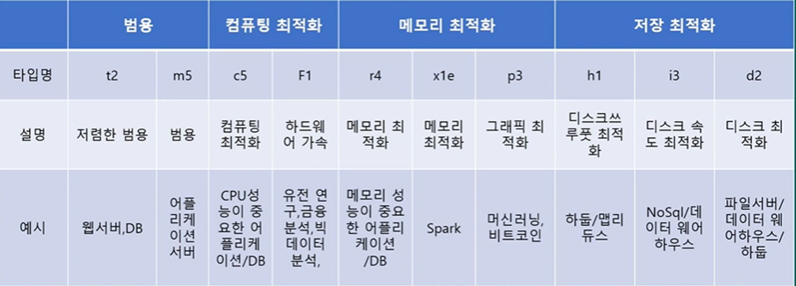

# EC2
## EC2(Elastic Compute Cloud)

- AWS 상에서 안정적이며 크기를 조정 가능한 컴퓨팅 파워를 제공하는 웹 서비스를 의미한다.
- 이러한 가상화 서버를 인스턴스라 부르고 여러 개의 인스턴스로 손쉽게 컴퓨팅 파워를 확장할 수 있다.
- 새로운 서버 인스턴스를 획득하고 부팅하는 데 단 몇 분밖에 걸리지 않아 확장에 용이하다.
- 사용한 만큼만 요금을 지불하면 되므로 컴퓨팅 비용이 절약된다.
- 보안 및 네트워크 구성, 스토리지 관리에 효과적이다.

## 가격 정책

- **On-Demand**: 인스턴스에 따라 시간 또는 초당 컴퓨팅 파워로 측정된 가격을 지불
    - 약정 필요 없음
    - 장기적인 수요 예측이 힘들거나 유연하게 EC2를 사용하고 싶을 때
- **Spot Instance** : 경매 형식으로 시장에 남는 인스턴스를 저렴하게 구매해서 쓰는 방식
    - 최대 90% 저렴
    - 언제 도로 내주어야 할지 모름
    - 시작 종료가 자유롭거나 추가적인 컴퓨팅 파워가 필요한 경우
- **예약 인스턴스(Reserved Instance-RI)** : 미리 일정 기간(1, 3년) 약정해서 쓰는 방식
    - 최대 75% 정도 저렴
    - 수요 예측이 확실할 때
    - 총 비용 절감을 위해 어느 정도 기간의 약정이 가능한 사용자
- **전용 호스트(Dedicated) :** 실제 물리적인 서버를 임대 하는 방식
    - 라이선스 이슈
    - 규정에 따라 필요한 경우

## EC2 타입 종류

- 인스턴스 유형은 크게 범용(M), 컴퓨팅 최적화(C), 스토리지 최적화(I, D), GPU 최적화(G), 메모리 최적화(R)로 나눌 수 있다.
- CPU 코어 수, 메모리 용량, 네트워크 인터페이스의 속도 등을 필요에 따라 선택할 수 있다.

---

[https://www.youtube.com/watch?v=d4a04RDOeqU](https://www.youtube.com/watch?v=d4a04RDOeqU)
