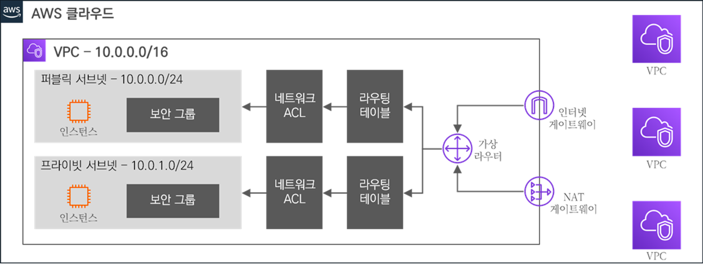

# 01 VPC (Virtual Private Cloud)

## 1.1 VPC란

### 1.1.1 VPC 정의

- **VPC는 독립된 가상의 클라우드 네트워크이다.**
    - 사용자가 사용할 수 있는 AWS 내의 논리적으로 독립된 섹션
    - 사용자 정의 가상 네트워크 상에서 다양한 AWS 리소스를 실행 가능
- VPC 내에 다음의 것들을 생성 및 제어할 수 있다.
    - IP 대역, 인터페이스, 서브넷, 라우팅 테이블, 인턴넷 게이트웨이, 보안 그룹, 네트워크 ACL 등

### 1.1.2 VPC 종류

사용자 관여에 따라 **기본 VPC**(Default VPC)와 **사용자 VPC**(Custom VPC)로 나뉜다.

- 기본 VPC
    - 리전별로 1개씩 생성 되어 있다.
    - AWS 리소스가 미리 정해져 있다.
    - 별도의 작업 없이 기본적인 클라우드 네트워크를 제공한다.
- 사용자 VPC
    - 수동으로 AWS 리소스를 생성하고 제어할 수 있다.
    - 리전별 최대 5개까지 생성할 수 있다.

## 1.2 VPC 특징

- **확장성**
    - 클라우드 기반에 손쉽게 VPC 자원을 생성, 삭제가 가능
    - 설정 및 관리의 편의성
- **보안**
    - 보안 그룹과 네트워크 ACL을 제공
    - 인스턴스 레벨과 서브넷 레벨에서 인바운드 및 아웃바운드 필터링이 가능
- **사용자 중심**
    - 사용자가 원하는 대로 VPC 내 리소스를 손쉽게 제어 가능
    - 네트워크 지표 및 모니터링 툴을 통해 높은 가시성 제공
- **제약 사항**
    - 전통적인 네트워크에 비해 기술적 제약이 따른다.
    - ex) 브로드캐스트, 멀티캐스트 IP 기반 Failover 프로토콜 등
