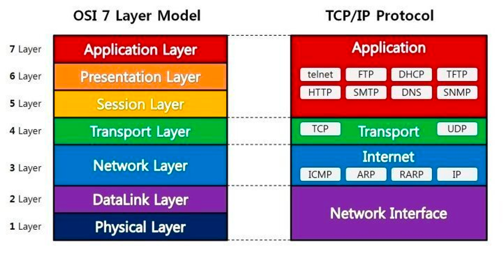
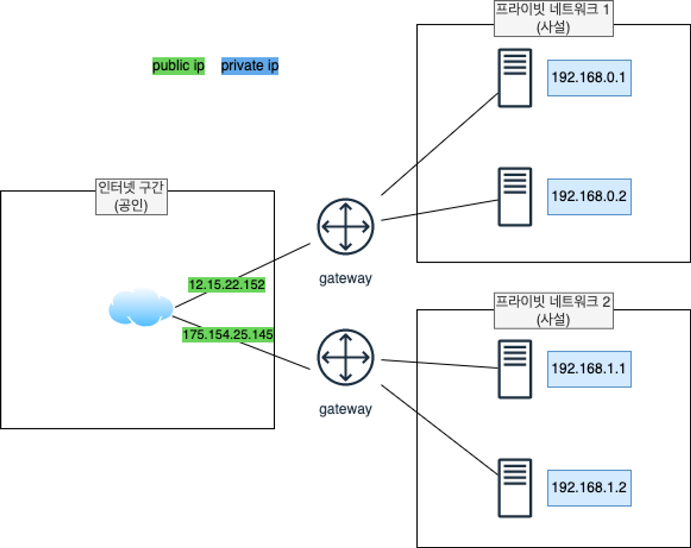

# 02 기본 네트워크 개념 이해

## 2.1 OSI 7 레이어 모델

### 2.1.1 OSI 7 레이어 모델 개념

- 국제표준화기구(ISO, International Organization for Standardization)에서 개발한 모델
- 복잡한 네트워크 동작 과정을 7개 계층으로 나누어 네트워크 흐름을 한 눈에 이해할 수 있게 도와준다.
- 계층별 상위 계층이 하위 계층을 이용하는 상하 관계를 맺고 있다.

### 2.1.2 OSI 7 레이어 계층 설명

- 아래 그림에선 OSI 7 계층과 TCP/IP 프로토콜 간 계층간 비교를 보여 준다.
    - TCP/IP 프로토콜이란 네트워크를 통해 통신하는데 쓰이는 통신 규약 모음이다.

- **1 Layer - Physical 계층**
    - 물리 계층으로 네트워크의 하드웨어 전송 기술을 말한다.
    - 물리적인 링크의 연결, 유지, 해제를 담당한다.
- **2 Layer - Data Link 계층**
    - 물리 계층에서 송수신되는 정보의 오류와 흐름을 관리
    - 1 계층과 2 계층을 TCP/IP 프로토콜 상 Network Interface 게층으로 분류한다.
        - 이 계층에는 Ethernet, Wi-Fi, 물리적 케이블 등이 포함된다.
- **3 Layer - Network 계층**
    - 네트워크 계층의 핵심은 데이터를 목적지까지 빠르고 안전하게 전달(라우팅)하는 것이다.
        - 여러 노드를 거칠 대마다 최적의 경로를 찾아주는 역할
    - TCP/IP 프로토콜 상 Internet 계층으로 분류한다.
        - IP, ARP, ICMP 등의 프로토콜이 포함된다.
- **4 Layer - Transport 계층**
    - 전송 계층으로 종단 사용자 간 데이터 통신을 다루는 최상위 계층이다.
    - 데이터 전달의 유효성과 효율성을 보장받는다.
    - TCP/IP 프로토콜 상에서도 Transport 계층으로 분류된다.
        - TCP, UDP 프로토콜 등이 포함됨
- **5 Layer - Session 계층**
    - 종간 사용자 간 응용 프로세스 통신을 관리하기 위한 방법을 제공한다.
    - 데이터 통신을 위한 논리적인 연결
- **6 Layer - Presentation 계층**
    - 데이터의 형식상 차이에 대해 송수신간 이해할 수 있는 형태로 데이터를 표현하는 기능을 담당한다.
    - 데이터의 암호화 및 압축
- **7 Layer - Application 계층**
    - 실제 응용 프로그램을 사용하는 계층
    - OSI 5~7 계층을 TCP/IP 프로토콜 상 Application 계층으로 분류한다.
        - HTTP, SSH, FTP, DHCP 등이 포함됨

## 2.2 IP와 서브넷 마스크

### 2.2.1 IP 개념

- Internet Protocol의 약자로 **네트워크 자원들을 구분하는 고유한 주소다.**
- IP 주소는 버전에 따라 IPv4와 IPv6로 구분 지을 수 있다.

| 구분 | IPv4 | IPv6 |
| --- | --- | --- |
| 주소 길이 | 32bit | 128bit |
| 표기 방법 | 8비트씩 4개 파트로 10진수 표현 | 16비트씩 8개의 파트로 16진수 표현 |
| 주소 개수 | 약 43억개 | 약 43억 x 43억 x 43억 x 43억 |
- IPv4의 가용 숫자 문제와 효율성 문제가 제기되어 IPv6가 제기되었지만 여전히 IPv4를 많이 쓰고 있다.

### 2.2.2 퍼블릭 IP와 프라이빗 IP

퍼블릭 네트워크와 프라이빗 네트워크가 사용하는 IPv4 주소 대역은 지정되어 있다.

- **퍼블릭 IP** (공인 IP)
    - 실제 인터넷 구간으로 통신하는 공공 네트워크
    - 인터넷 구간의 통신 대상을 식별하기 위해 ISP에서 제공하는 IP 주소이다.
        - ISP: Internet Service Provider, 인터넷 서비스 공급자
    - 전 세계 인터넷에서 유일한 주소를 갖는다.
- **프라이빗 IP** (사설 IP)
    - 내부적으로 통신하는 사설 네트워크
        - 가정이나 회사 등의 독립된 네트워크에서 사용하는 내부 IP 주소다.
    - 프라이빗 네트워크 관리자에 의해 할당된다.
    - 독립된 네트워크상에서 유일한 주소를 갖는다.
    - 외부 인터넷 구간과 통신이 불가능하다.
    - 아래의 3가지 대역으로 고정되어 있다.
        - Class A: `10.0.0.0` ~ `10.255.255.255`
        - Class B: `172.16.0.0` ~ `172.31.255.255`
        - Class C: `192.168.0.0` ~ `192.168.255.255`

### 2.2.3 서브넷과 서브넷 마스크

- **서브넷이란 부분적인 네트워크**를 의미한다.
    - 네트워크망에서 서브넷을 통해 부분적인 네트워크망으로 나눠지고 서로 연결되어 있다..
- 나누어진 서브넷은 **서브넷 마스크**로 구분된다.
    - **서브넷 마스크**: IP 주소에 네트워크 ID와 호스트 ID를 구분하는 기준값
    - **네트워크 ID**: 서브넷을 식별하는 영역, 이진수 값이 1인 영역
    - **호스트 ID**: 서브넷에서 대상을 식별하는 영역, 이진수 값이 0인 영역
    - 즉 동일한 서브넷 내에 네트워크 ID 값은 모두 같고 호스트 ID를 통해 개별 구분된다
    - IPv4와 같이 32bit 구조
    - ex) 2진수: `11111111.11111111.11111111.00000000`, 10진수: `255.255.255.0`
    - `10.0.0.0/8`, `10.1.0.0/16`, `10.1.1.0/24`와 같이 표기하는 방법을 **IP CIDR 표기법**이라 한다.
        - /8의 뜻은 8bit가 네트워크 영역으로 10진수 첫 번째 자리가 네트워크 영역이라는 뜻이다.
        - ex) `10.1.2.3/8`과 `10.1.3.1/8`은 앞 8bit인 `10`이 같기에 같은 서브넷이지만, `10.1.2.3/24`, `10.1.3.1/24`는 앞 24비트 `10.1.2`와 `10.1.3`이 다르기에 다른 서브넷이다.

## 2.3 TCP와 UDP 그리고 포트 번호

### 2.3.1 TCP와 UDP

OSI 7 레이어 중 4계층에 사용되는 대표적인 전송 프로토콜

| 구분 | TCP | UDP |
| --- | --- | --- |
| OSI 모델 | 4계층 | 4계층 |
| 연결 | 연결 지향성 | 비연결 지향성 |
| 신뢰성 | 신뢰성 보장 | 신뢰성 보장X |
| 순서 | 데이터 순서 보장 | 데이터 순서 보장X |
| 제어 | 혼잡 제어, 흐름 제어 | 혼잡 제어, 흐름 제어 제공X |
| 속도 | 상대적으로 느림 | 상대적으로 빠름 |
| 서비스 | HTTP, SSH, FTP | DNS, DHCP |

### 2.3.2 포트 번호

TCP, UDP의 특성에 따라 제공되는 응용 프로그램 서비스를 구분할 때 포트 번호로 구분할 수 있다.

- 범위에 따라 크게 3가지로 구분지을 수 있다.
    - 잘 알려진 포트: 0~1023
    - 등록된 포트: 1024~49151
    - 동적 포트: 49152~65535
- TCP 포트 번호 80은 HTTP 서비스로 예약된 잘 알려진 포트
- UDP 포트 53은 DNS 서비스로 예약된 잘 알려진 포트

## 2.4 DHCP (Dynamic Host Configuration Protocol)

### 2.4.1 DHCP 개념

- DHCP는 **동적으로 IPv4 주소를 일정 기간 임대하는 프로토콜이다.**
- UDP 프로토콜을 사용하며 포트 번호 67과 68을 사용한다.
- 임대 시간이 존재하며 만료되면 반환하거나 갱신을 수행한다.

### 2.4.2 DHCP 절차

DHCP는 **중앙집중형 서버/클라이언트 방식**으로 동작한다.

1. **DHCP Discover** : DHCP 클라이언트가 DHCP 서버를 찾는다.
2. **DHCP Offer** : DHCP 서버가 할당해 줄 IP 주소와 임대 시간을 클라이언트에 알린다.
3. **DHCP Request** : 클라이언트는 DHCP 서버에게 해당 IP 주소 할당을 요청한다.
4. **DHCP Ack** : DHCP 서버가 IP 주소를 임대하겠다는 답변을 보낸다.

## 2.6 라우팅 (Routing)

### 2.6.1 라우팅 개념

- **라우팅이란 네트워크 통신 시 경로를 잡아 주는 OSI 7 레이어의 3계층인 네트워크 계층의 핵심 기능이다.**
    - 네트워크는 여러 서브넷으로 이루어져 있으며 목적지 IP까지 여러 노드를 거쳐 통신되고 있다.

### 2.6.2 라우터와 라우팅 테이블

- **라우터**는 라우팅을 수행하는 장비다.
- **라우팅 테이블**을 통해 경로를 파악하고 목적지로 데이터를 전달한다.
    - ex) 라우터 A의 라우팅 테이블

  | 대상 | 타깃 |
  | --- | --- |
  | 1.1.1.0/24 | 라우터 B |
  | 2.2.2.0/24 | 라우터 C |
  | 3.3.3.0/24 | 라우터 D |
