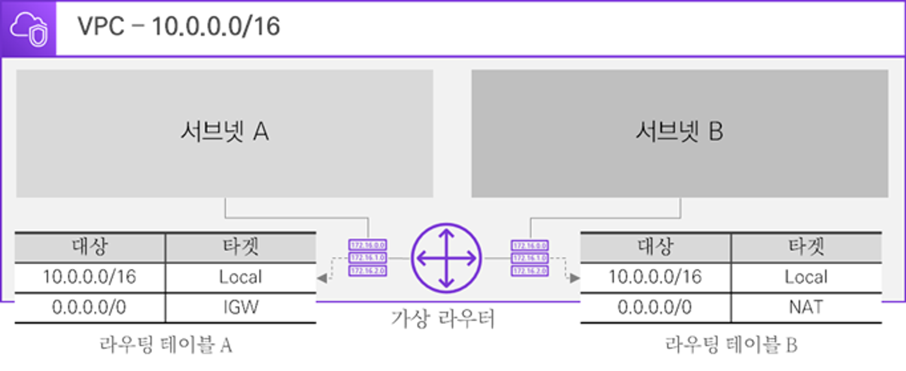
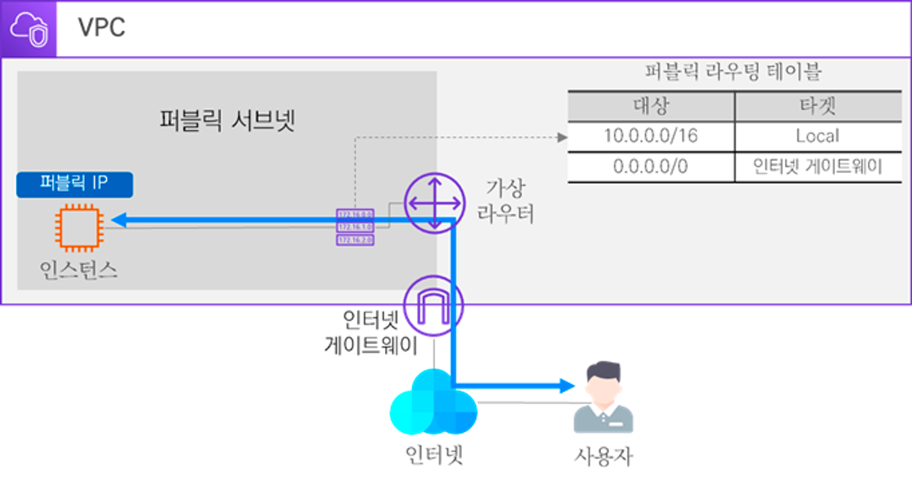

# 03. VPC 리소스 소개

## 3.1 서브넷 (Subnet)

### 3.1.1 서브넷 개념

클라우드 환경의 VPC에서도 서브넷을 통해 네트워크를 분리할 수 있다.

- 서브넷의 IP 대역은 VPC IP 대역에 속해 있어야 한다.
- 서브넷은 1개의 가용 영역에 종속되어야 한다.
- AWS 서브넷에 할당할 수 있는 IP 대역에서 미리 예약된 IP 주소가 있다.
    - 예약된 IP 주소는 AWS 자원에게 할당할 수 없다.
    - ex) VPC - `10.0.0.0/16`의 서브넷 도식화

| IP CIDR: `10.0.0.0/24` 서브넷 A 가용영역: US-EAST-1a | IP CIDR: `10.0.1.0/24` 서브넷 B 가용영역: US-EAST-1a | IP CIDR: `10.0.2.0/24` 서브넷 C 가용영역: US-EAST-1a |
|---------------------------------------------|-----------------------------------------------|-----------------------------------------------|

### 3.1.2 퍼블릭 서브넷과 프라이빗 서브넷

서브넷은 퍼블릭 서브넷과 프라이빗 서브넷으로 나눌 수 있다.

- 퍼블릭 서브넷은 외부 인터넷 구간과 직접 통신할 수 있는 공공 네트워크다.
- 프라이빗 서브넷은 외부 인터넷 구간과 직접 통신을 할 수 없는 사설 네트워크다.
    - 원래는 통신 불가하지만 NAT 게이트웨이가 있으면 통신 가능하다.

## 3.2 가상 라우터와 라우팅 테이블

- VPC를 생성하면 자동으로 **가상 라우터**가 생성된다.
- 가상 라우터는 최초에 기본 라우팅 테이블을 보유하고 있다.
    - 기본 라우팅 테이블은 로컬 네트워크에 대한 라우팅 경로만 잡혀 있다.
    - 로컬 네트워크는 VPC 자체 대역으로 VPC 내에 생성된 서브넷은 로컬 네트워크에 의해 통신이 가능하다.
- 가상 라우터에서 서브넷 별로 라우팅 테이블을 매핑시켜 줄 수 있다.

## 3.3 인터넷 게이트웨이

- 인터넷 게이트웨이는 VPC와 인터넷 간의 논리적인 연결이다.
- 인터넷 게이트웨이는 VPC 당 1개만 연결 가능하다.
- 게이트웨이를 통해 외부 인터넷과 통신할 수 있는 대상은 퍼블릭 IP를 사용하는 퍼블릭 서브넷 내의 자원이다.
    - 퍼블릭 서브넷은 자신의 라우팅 테이블에 외부 인터넷으로 나가는 타깃을 인터넷 게이트웨이로 지정해야 한다.

## 3.4 NAT 게이트웨이

- 게이트웨이와 비슷하지만 **IP 주소를 변환해 주는 기술**이라는 점에서 차이가 있다.
    - Network Address Translation
- NAT 게이트웨이가 프라이빗 IP를 퍼블릭 IP로 변환하여 통신을 도울 수 있다.
    - NAT 게이트웨이는 한쪽 방향으로만 동작하기에 프라이빗 서브넷에서 외부 인터넷으로 통신은 가능하지만 반대는 불가능하다.

## 3.5 보안 그룹과 네트워크 ACL

- **VPC는 인스턴스 레벨, 서브넷 레벨 상에서 대상을 필터링할 수 있는 보안 기술을 사용할 수 있다.**
    - **보안 그룹** - 인스턴스 레벨에서의 보안
    - **네트워크 ACL** - 서브넷 레벨에서의 보안
- 인바운드 규칙과 아웃바운드 규칙을 수립하여 원하는 데이터만 필터링할 수 있다.
