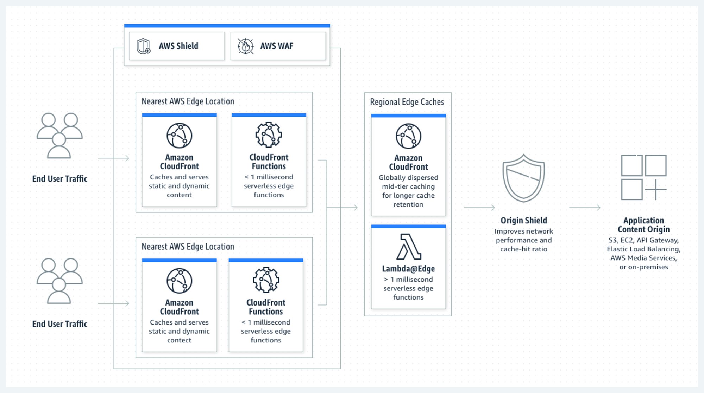

# 05. CloudFront

## 5.1 Contents Delivery Network (CDN)

### 5.1.1 CDN 개요

- **CDN이란 콘텐츠 제공자와 사용자 간 지리적으로 떨어져 있는 환경에서 콘텐츠를 빠르게 제공하기 위한 기술이다.**
    - 오리진 서버에서 모든 사용자 요청을 처리하는 것은 과부하
    - 오리진 서버와 사용자 간 지리적 위치가 멀다면 지연 시간의 증가는 불가피
- CDN 기술의 핵심은 캐시 서버를 통한 지역적인 분산에 있다.
    - 각 지역의 사용자는 인접한 캐시 서버로부터 콘텐츠를 전달 받아 서비스 받을 수 있다.
- CDN을 통해 성능적인 우위와 높은 가용성을 보장받을 수 있다.

### 5.2 CDN 캐싱 방식

> **Cache Hit**: 캐시 서버에서 요청된 콘텐츠를 가지고 있을 때
> 
> **Cahche Miss**: 캐시 서버에 요청된 콘텐츠가 없어 오리진에 콘텐츠를 요청할 때

- **정적 캐싱 (Static Caching)**
    - 이미지, JS, CSS 등의 정적 콘텐츠를 캐싱
    - 웹사이트에서 제공되는 대부분의 콘텐츠들은 시간이 지나도 거의 바뀌지 않는 정적 콘텐츠라 캐싱을 통해 이점을 얻을 수 있다.
- **동적 캐싱 (Dynamic Caching)**
    - 동적 콘텐츠란 사용자 요청이나 데이터 정보를 기반으로 즉석에서 생성되는 콘텐츠이다.
    - Caching Hit가 높진 않지만 CDN을 통해 오리진 서버를 보호하면서 빠르게 콘텐츠를 제공받을 수 있다.

## 5.2 CloudFront 소개

### 5.2.1 CloudFront 개요

- **CludeFront는 AWS에서 제공하는 CDN 기능이다.**
- 오리진 대상의 콘텐츠를 캐싱하여 짧은 지연 시간과 빠른 전송 속도로 콘텐츠를 전송하는 CDN 서비스이다.
- CloudFront 아키텍처
  
    - **오리진**: EC2, ELB, S3, 데이터 센터 내 별도 서버 등
    - **Distribution**: 오리진과 **엣지 로케이션** 중간에서 콘텐츠 배포를 수행하는 CoudFront의 독립적인 단위
    - **엣지 로케이션**: **Distribution**을 통해 배포되는 콘텐츠를 캐싱하는 장치이다. 큰 단위로 **리전 별 엣지 캐시**가 있고 하위에 엣지 로케이션이 구성된다.
    - **보안 장치**: OSI 3/4계층의 DDoS를 완화하는 AWS Shield 및 7계층을 보호하는 AWS WAF와 통합하여 보안을 강화한다.
    - **도메인 구성**: **Distribution**을 생성하면 xxxxx.cloudfront.net이라는 도메인이 생성되어 접근 가능하다. Route53과 연결하여 원하는 도메인 이름으로 별칭을 부여할 수도 있다.

### 5.2.2 CloudFront 주요 기능

- **CloudFront 글로벌 엣지 네트워크**
    - 42개국 84개 도시에서 216(엣지 로케이션 205개, 리전 엣지 캐시 11개)개의 글로벌 네트워크를 사용하고 있다.
- **정적/동적 콘텐츠 딜리버리**
- **오리진 Selection**
    - 단일 배포에서 여러 오리진을 구성하여 콘텐츠를 처리할 수 있다.
    - 경로 패턴 분석을 통해 오리진 대상 콘텐츠를 분산 가능
- **오리진 그룹을 통한 Failover**
    - 오리진 그룹 내에 기본 오리진과 보조 오리진을 구성
    - 기본 오리진 다운 시 보조 오리진으로 변환하여 Failover를 유지할 수 있다.
- **SSL 지원**
    - 콘텐츠에 대해 SSL/TLS를 통해 전송할 수 있다.
    - 고급 SSL 기능을 자동으로 활성화 가능
        - Full/Half 브리지 HTTPS 연결, 필드 레벨 암호화 등)
- **엑세스 제어**
    - 서명된 쿠키와 토큰 인증을 지원하여 엑세스를 제한할 수 있다.
- **보안**
    - DDoS를 비롯한 여러 공격에 유연한 계층형 보안 방어를 구축하기 위해 원활하게 통합 운영한다.
- **비용 효율성**
    - 사용한 만큼 지불하는 일반 요금과 약정 트래픽 개별 요금이 제공된다.
    - AWS 클라우드 서비스와 오리진에서 CloudFont 간의 무료 데이터 전송이 가능하다.
