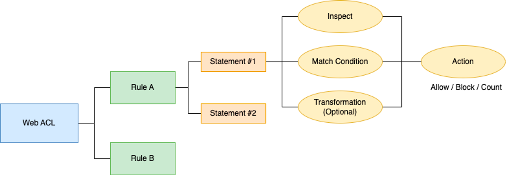

# 05. AWS WAF (Web Application Firewall)

## 5.1 AWS WAF 개요

### 5.1.1 WAF (Web Application Firewall)이란?

- 웹 애플리케이션 보안에 특화된 전용 방화벽
- SQL Injection, XSS, CSRF 공격 등과 같은 웹 서비스 취약점에 대한 공격을 탐지하고 차단하는 기능을 한다.
    - 웹 접근 트래픽에 대한 페이로드 분석 및 패턴 기반 필터링을 통해

### 5.1.2 AWS WAF 소개

- AWS WAF는 AWS에서 관리하는 웹 애플리케이션 전용 방화벽이다.
- SQL Injection, XSS 등과 같은 공격 패턴을 차단하는 보안 규칙 및 트래픽 패턴을 필터링하는 규칙을 생성하여 트래픽 도달을 제어한다.
- CloudFront, ELB, API Gateway 등에 배포할 수 있다.

### 5.1.3 AWS WAF 주요 기능

- 웹 트래픽 필터링
    - 웹 취약점 공격을 차단하는 규칙을 손쉽게 생성하여 웹 트래픽을 필터링할 수 있다.
    - 여러 웹 사이트에 배포할 수 있도록 중앙에서 관리하는 웹 트래픽 필터링 규칙 집합을 생성할 수 있다.
- 자동화 및 유지 관리
    - API를 통해 규칙을 자동으로 생성 및 유지 관리 가능
    - 개발 및 설계 프로세스에 규칙을 통합할 수 있다.
    - AWS CloudFormation 탬플릿을 사용하여 자동 배포 및 프로비저닝 가능
- 가시성 보장
    - CloudWatch와 완전 통합되어 다양한 지표 제공
    - 임계값 초과나 특정 공격 발생하는 경우 손쉽게 가시성을 확보할 수 있다.
- AWS Firewall Manager와 통합
    - AWS Firewall Manager를 사용하여 AWS WAF 배포를 중앙에서 구성 및 관리할 수 있다.
    - 정책 위반 여부를 자동으로 감사, 보고, 즉각 대처 조치를 할 수 있다.

## 5.2 AWS WAF 구성

### 5.2.1 AWS WAF 구성

- 단계별로 Web ACL, Rule, Statement로 구성된다.
- 순서에 따라 상위 컴포넌트와 하위 컴포넌트로 구분지을 수 있다.

> Web ACL
>
- AWS WAF의 최상위 컴포넌트로 하위 컴포넌트인 Rule을 추가하여 AWS 리소스를 보호한다.
- CloudFront 배포, API Gateway REST API 또는 ALB가 응답하는 웹 요청을 세부적으로 제어할 수 있다.
- 한 ACL에 Rule은 최대 100개까지 생성 가능하다.
    - 사전 정의된 규칙 또는 사용자 정의 규칙 선택 가능

> Rule
>
- Web ACL의 하위 컴포넌트로 검사 기준을 정의하고 기준 축족 시 수행 작업을 포함한다.
- 일치 대상에 대해 요청을 차단하거나 허용할 수 있다.
- 하위 컴포넌트로 Statement가 있으며 최대 5개를 설정할 수 있다.
- 각 Statement에 대한 Match Action을 수행할 수 있다.

> Statement
>
- 웹 필터링의 상세 조건을 정의하는 컴포넌트
- 상세 조건은 Inspect, Match Condition, Transformation, Action으로 구분한다.
1. Inspect: Inspection 대상을 정의하는 조건
2. Match Condition: Inspection 대상에 대한 분류 방법을 정의
3. Transformation(Optional): Match Condition의 추가적인 옵션을 부여
4. Action: 필터링 동작 방식 정의 (허용, 거부, 카운트 중 선택)

### 5.2.2 AWS WAF 특장점

- 민첩한 보안
    - 빠른 규칙 전파 및 업데이트 가능
    - 서비스 영향 없이 유연한 구성으로 민첩한 보안 서비스 구성
- 동적 확장
    - 트래픽 급증 시 대역폭 자동 확장
- 효율적인 비용
    - 초기 규척에 대한 투자 비용이 없으며 사용한 만큼 비용을 지불
- 손쉬운 배포 및 유지 관리
    - AWS Firewall Manager를 통해 규칙을 중앙에서 정의 및 관리하여 편의성 제공
- API를 통한 자동화
    - AWS WAF의 모든 기능을 API 또는 AWS Management Console을 사용해 구성할 수 있다.
    - 이를 통해 DevOps에서 웹 보안을 강화하는 애플리케이션 규칙을 정의할 수 있다.
