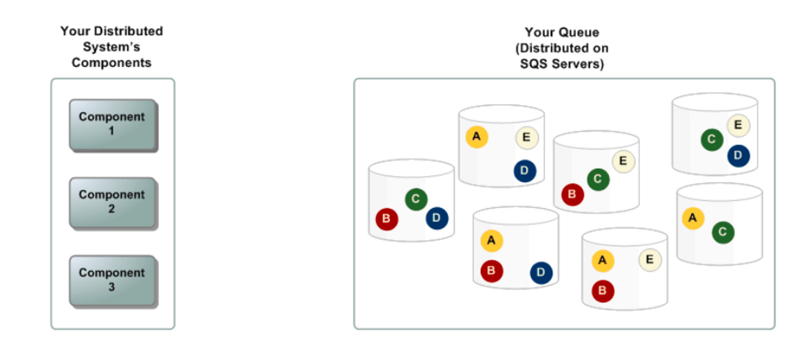
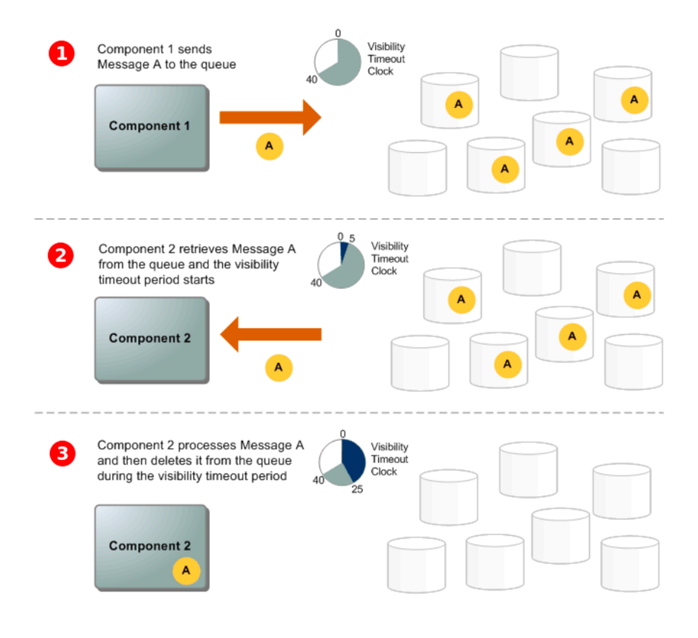

## Amazon SQS (Simple Queue Service)

- 마이크로서비스, 분산 시스템 및 서버리스 애플리케이션을 위한 완전 관리형 메시지 대기열
- 내구력 있고 가용성이 뛰어난 보안 호스팅 큐를 제공
- dead-letter queues 및 비용 할당 태그와 같은 일반적인 구조 제공
- 사용 사례
    - 애플리케이션 신뢰성 및 확장성 향상
    - 마이크로서비스 분리 및 이벤트 기반 애플리케이션 처리
    - 작업을 효율적으로 정시에 완료하도록 보장
    - 메시지 순서 유지 및 중복 제거

## SQS 사용의 이점

- 보안
    - 메시지를 보내고 받을 수 있는 사용자를 제어 가능
    - SQS 관리형 서버 측 암호화(SSE)를 사용하거나 AWS 키 관리 서비스(AWS KMS)에서 관리되는 사용자 지정 SSE 키를 사용하여 메시지 내용을 보호할 수 있다.
- 내구성
    - 메시지를 안전하게 보관하기 위해 SQS 메시지를 여러 서버에 저장
- 가용성
    - 중복 인프라를 사용하여 높은 동시 엑세스 및 메시지 생산과 소비를 위한 고가용성을 제공
- 확장성
    - 버퍼링된 요청을 독립적으로 처리할 수 있다.
    - 프로비저닝 지침 없이 부하 증가 또는 급증을 처리할 수 있도록 확장 가능
- 안정성
    - 처리 중에 메시지를 잠그므로 여러 생산자가 동시에 메시지를 보내겨 여러 소비자가 메시지를 받을 수 있다.
- Customization
    - 큐에 기본 지연 시간을 설정하거나 메시지를 분할하는 등의 설정을 커스텀할 수 있다.

## SQS 기본 아키텍처

### Distributed queues

- 분산 메시징 시스템의 세 가지 주요 부분
    - 분산 시스템 구성 요소
    - 대기열 (Amazon SQS 서버에 분산됨)
    - 메시지
- 아래 시나리오는 여러 생산자와 소비자가 대기열에 메시지 A~E를 보관하고 있다.
    - 여러 SQS 서버에 메시지를 이중 저장

  

### Message lifecycle

1. 생산자(component 1)가 메시지 A를 큐에 전송하고 메시지는 SQS 서버에 중복으로 분산 저장된다.
2. 소비자(component 2)가 메시지를 처리할 준비가 되면 큐에서 메시지를 소비하고 A가 반환된다. A가 처리되는 동안 큐에 남아 있으며 제한 시간 동안 후속 수신 요청에 반환되지 않는다.
3. 소비자(component 2)는 제한 시간이 만료되면 A를 큐에서 삭제하며 메시지가 다시 수신 및 처리되지 않도록 한다.

> Amazon SQS는 최대 메시지 보존 기간보다 오래 큐에 있는 메시지를 자동 삭제한다. 기본 메시지 보존 기간은 4일이다. SetQueueAttributes 작업을 통해 보존 기간을 60초에서 최대 14일까지 설정할 수 있다.
>

## SQS, MQ, SNS 차이

- SQS 및 SNS는 확장성이 뛰어나고 사용이 간쳔하여 메시지 브로커를 설정할 필요가 없는 큐 및 토픽 서비스다.
- SQS는 분산된 소프트웨어 시스템과 구성 요소를 통합하고 분리할 수 있는 호스팅 큐를 제공하는 관리형 서비스다.
- SNS도 관리형 메시지 서비스이지만 게시자가 구독자(생산자 및 소비자)에게 메시지를 전달하는 기능을 제공한다.
    - 퍼블리셔는 토픽에 메시지를 전송하여 구독자와 비동기적으로 통신
    - 클라이언트는 SNS 토픽을 구독하고 Amazon Kinesis, 데이터 파이어호스, SQS, 람다, HTTP, 이메일, 알림, SMS 등 지원되는 엔드포인트 유형을 사용해 게시된 메시지를 수신할 수 있다.
- Amazon MQ는 많은 유명 메시지 브로커와 호환성을 제공하는 관리형 메시지 브로커 서비스다.
    - JMS, AMQP, MQTT, OpenWire, STOMP와 같은 프로토콜과의 호환성에 의존하는 기존 메시지 브로커에서 애플리케이션을 마이그레이션하는 데 MQ를 권장

## SQS 큐 타입

### Standard Queues

- Amazon SQS가 기본 큐 유형으로 제공하는 타입
- API 작업(메시지 송, 수신, 삭제) 당 초당 거의 무제한의 API 호출을 지원
- 최소 한 번 이상의 메시지 전달을 지원
    - 때때로 두 개 이상 중복 메시지가 전달될 수도 있다.
    - 메시지 순서가 보장되지 않는다.
- 메시지가 중복되어도, 순서가 상관 없는 경우 Standard Queue를 사용할 수 있다.
    - 실시간 사용자 요청과 백그라운드 작업 분리
    - 여러 작업자 노드에 작업 할당
    - 항후 처리를 위한 메시지 일괄 처리

### FIFO Queues

- Standard Queue의 모든 기능을 갖추면서 메시지 순서 보장 및 중복 방지 등을 추가로 제공한다.
- 사용 사례
    - 주문이 중요한 이커머스 주문 관리 시스템
    - 이벤트를 순서대로 처리해야 하는 타사 시스템과의 통합
    - 주문에 따라 사용자 입력 처리
    - 통신 및 네트워킹
    - 티켓팅 시스템

> FIFO queue도 최소 1회 처리를 제공하지만 초당 트랜잭션 수 (TPS)가 제한되어 있다. Amazon SQS 고처리량 모드로 TPS 한도를 늘릴 수도 있다.

