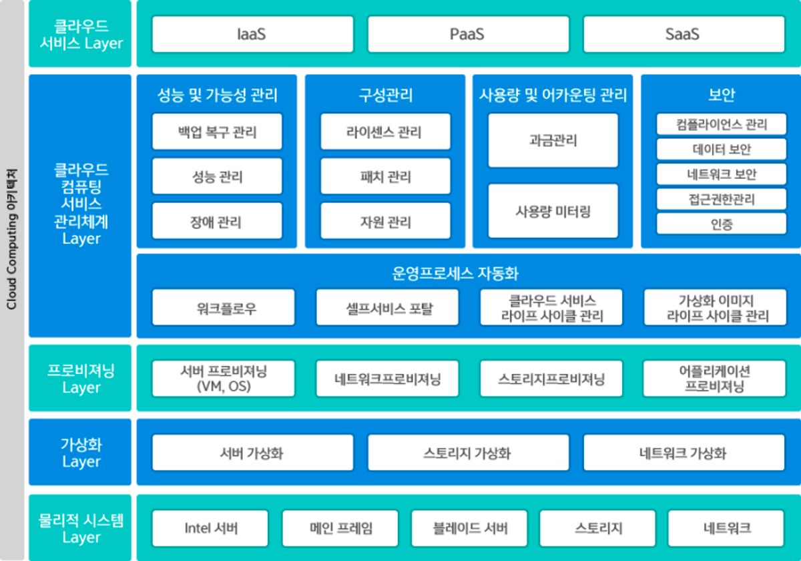

# Chapter 01. 클라우드 컴퓨팅

## 1.1 클라우드 컴퓨팅 개요

- 클라우드는 인프라에 사용되는 컴퓨팅 자원을 사용자가 언제든지 인터넷을 통해 IT 서비스를 제공받을 수 있도록 하는 컴퓨팅 기술이다.
    - ex) 서버, 저장소, DB, 네트워크, 소프트웨어, 데이터 분석 등
- 애자일 방법론을 활용한 민첩한 서비스 도입, 탄력적인 확장과 축소, 자동화된 유지보수를 할 수 있는 환경을 제공한다.

### 1.1.1 클라우드 컴퓨팅이란?

- 클라우드 컴퓨팅의 시작은 **유틸리티 컴퓨팅**이다.
    - 다양한 컴퓨팅 자원 사용량에 따라 요금을 부과하는 종량제 방식의 기술
    - 필요할 때 쓴다는 온-디맨드 컴퓨팅 방식
- 이러한 기술의 특징은 자원 활용 효율성을 높이고 비용을 최소화하는 것인데 주요 기능으로는 다음이 있다.
    - 클러스터
    - 가상화
    - 분할
    - 프로비저닝
    - 자율 컴퓨팅
    - 그리드 컴퓨팅
- 클라우드 컴퓨팅 = 그리드 컴퓨팅 + 유틸리티 컴퓨팅
    - **그리드 컴퓨팅**이란 가상의 네트워크로 분산된 컴퓨팅 자원을 공유하도록 하는 기술 방식이다.
- 클라우드 컴퓨팅의 특징
    - **주문형 셀프 서비스**: 고객이 원하는 시점에 바로 서비스를 사용할 수 있다.
    - **광대역 네트워크 접근**: 각 클라우드 업체가 제공하는 광대역 네트워크로 다양한 클라이언트 플랫폼이 빠르게 접속할 수 있다.
    - **신속한 탄력성과 확장성**: auto-scaling 기능을 통해 신속한 확장과 축소 가능
    - **자원의 공동 관리**: 물리적 및 가상화된 자원을 풀(pool)로 관리, 탄력적으로 사용자 요구에 따라 동적 할당 또는 재할당 가능
    - **측정 가능한 서비스**: 자원 사용량이 실시간으로 수집되어 요금 산정 기능을 통해 비용 발생

### 1.1.2 클라우드 컴퓨팅 구조

- 최하위 계층엔 자원 활용과 관련된 물리적 시스템 계층, 가상화 계층, 프로비저닝 계층이 있다.
    - 클라우드 컴퓨팅의 물리적 시스템 계층은 수평적으로 확장 가능한 스토리지 및 네트워크 등의 물리적 요소를 의미한다.
    - 이를 통해 민첩성을 제공하고 IT 서비스 공급자는 서버 프로비저닝, 프로비저닝 해제를 신속히 수행할 수 있다.
- 클라우드 서비스와 관련된 계층은 클라우드 서비스 관리 계층, 클라우드 서비스 계층으로 구분된다.
    - 클라우드 컴퓨팅 서비스 관리 계층은 물리적 계층에서 제공되는 자원에 대한 전반적인 라이프사이클 관리와 모니터링을 지원한다.
    - 성능 및 고가용성, 소프트웨어 라이선스와 패치 관리, 과금 관리, 보안 관리 요소 등이 있다.
- 그 위로는 사용자와 관련된 클라우드 접근 계층과 사용자 역할에 다른 연결성 구분을 설정할 수 있다.
- 클라우드 서비스에는 IaaS, PaaS, SaaS, DaaS, SecaaS 등이 있다.

### 1.1.3 클라우드 컴퓨팅 제공 방식과 클라우드 서비스 종류

### 클라우드 컴퓨팅 제공 방식

- **온프레미스**
    - 기업이 자체 데이터 센터를 구축하여 IT 서비스를 수행하는 방식
    - 하드웨어부터 모든 자원에 대한 초기 투자 비용과 비탄력적인 용량에 의해 관리 비용이 큰 단점이 있다.
    - 최근엔 많은 기업이 클라우드 서비스로의 전환을 고민하고 있다.
- **퍼블릭 클라우드**
    - 인터넷을 통해 다수의 사용자에게 클라우드 자원을 AWS와 같은 클라우드 서비스 공급자로부터 제공받는 방식이다.
    - 유틸리티 컴퓨팅 방식
    - 사용자 및 그룹 단위로 권한 격리를 통해 사용자 간 간섭이 발생하지 않는다.
- **프라이빗 클라우드**
    - 제한된 네트워크에서 특정 사용자나 기업을 대상으로 하는 클라우드 서비스 방식
    - 인터넷이 아닌 인트라넷 방식으로 보안성이 높다.
- **하이브리드 클라우드**
    - 퍼블릭 클라우드와 프라이빗 클라우드 네트워크를 결합하여 두 장점을 활용할 수 있는 방식
    - 서로 다른 클라우드 간 데이터 공유가 유연하고 용도에 맞는 서비스 구현에 유리하다.

### 클라우드 서비스의 종류

클라우드 서비스란 언제 어디서나 별도 소프트웨어를 설치하지 않고 인터넷 접속을 통해 저장해 놓은 데이터에 접근, 사용할 수 있는 서비스를 말한다.

- **서비스로서의 인프라스트럭처**
    - Infrastructure as a Service, IaaS
    - 서버, 스토리지, 네트워크 등의 하드웨어 자원을 가상화하여 사용자 요구에 따라 제공하는 클라우드 서비스 방식
    - 자동화되고 신속한 확장성을 가지는 것이 특징
    - ex) AWS, GCP, Azure, 오라클 클라우드 등
- **서비스로서의 플랫폼**
    - Platform as a Service, PaaS
    - 서비스 개발자가 애플리케이션 개발, 관리 등을 할 수 있도록 안정적인 환경 또는 프레임워크를 제공하는 클라우드 서비스 방식
    - 개발자가 복잡한 설치나 환경 설정을 하지 않고 개발 소스만 제공하면 바로 서비스를 올릴 수 있게 된다.
    - ex) 네이버 클라우드 플랫폼, AWS, GCP, Azure 등
- **서비스로서의 소프트웨어**
    - 소프트웨어 사용자가 자신의 컴퓨터에 설치 없이 인터넷을 통해 클라우드 기반 소프트웨어를 사용할 수 있게 해주는 클라우드 서비스 방식
    - ex) 이메일, CRM, 구글 앱 서비스 등

