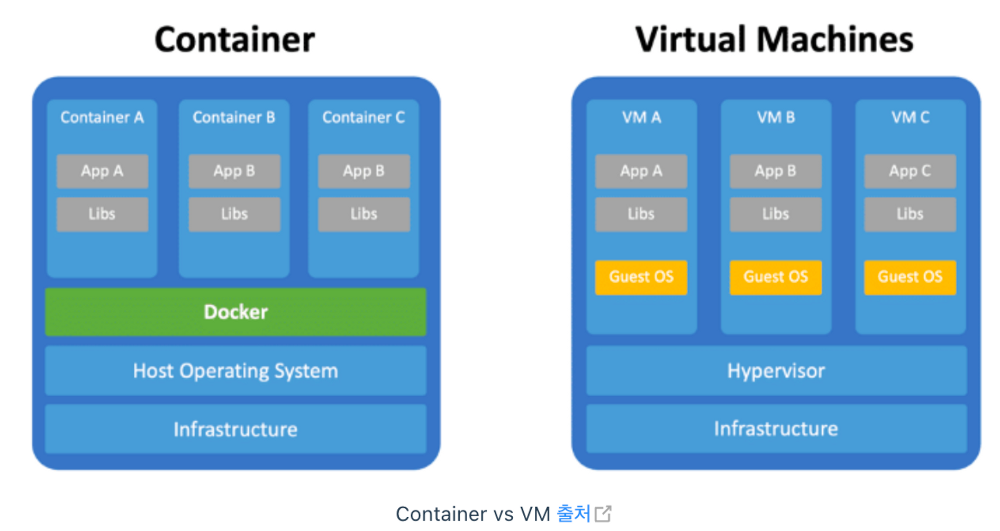

# Chapter 01. 클라우드 컴퓨팅

## 1.1 클라우드 컴퓨팅 개요

- 클라우드는 인프라에 사용되는 컴퓨팅 자원을 사용자가 언제든지 인터넷을 통해 IT 서비스를 제공받을 수 있도록 하는 컴퓨팅 기술이다.
    - ex) 서버, 저장소, DB, 네트워크, 소프트웨어, 데이터 분석 등
- 애자일 방법론을 활용한 민첩한 서비스 도입, 탄력적인 확장과 축소, 자동화된 유지보수를 할 수 있는 환경을 제공한다.

### 1.1.1 클라우드 컴퓨팅이란?

- 클라우드 컴퓨팅의 시작은 **유틸리티 컴퓨팅**이다.
    - 다양한 컴퓨팅 자원 사용량에 따라 요금을 부과하는 종량제 방식의 기술
    - 필요할 때 쓴다는 온-디맨드 컴퓨팅 방식
- 이러한 기술의 특징은 자원 활용 효율성을 높이고 비용을 최소화하는 것인데 주요 기능으로는 다음이 있다.
    - 클러스터
    - 가상화
    - 분할
    - 프로비저닝
    - 자율 컴퓨팅
    - 그리드 컴퓨팅
- 클라우드 컴퓨팅 = 그리드 컴퓨팅 + 유틸리티 컴퓨팅
    - **그리드 컴퓨팅**이란 가상의 네트워크로 분산된 컴퓨팅 자원을 공유하도록 하는 기술 방식이다.
- 클라우드 컴퓨팅의 특징
    - **주문형 셀프 서비스**: 고객이 원하는 시점에 바로 서비스를 사용할 수 있다.
    - **광대역 네트워크 접근**: 각 클라우드 업체가 제공하는 광대역 네트워크로 다양한 클라이언트 플랫폼이 빠르게 접속할 수 있다.
    - **신속한 탄력성과 확장성**: auto-scaling 기능을 통해 신속한 확장과 축소 가능
    - **자원의 공동 관리**: 물리적 및 가상화된 자원을 풀(pool)로 관리, 탄력적으로 사용자 요구에 따라 동적 할당 또는 재할당 가능
    - **측정 가능한 서비스**: 자원 사용량이 실시간으로 수집되어 요금 산정 기능을 통해 비용 발생

### 1.1.2 클라우드 컴퓨팅 구조

- 최하위 계층엔 자원 활용과 관련된 물리적 시스템 계층, 가상화 계층, 프로비저닝 계층이 있다.
    - 클라우드 컴퓨팅의 물리적 시스템 계층은 수평적으로 확장 가능한 스토리지 및 네트워크 등의 물리적 요소를 의미한다.
    - 이를 통해 민첩성을 제공하고 IT 서비스 공급자는 서버 프로비저닝, 프로비저닝 해제를 신속히 수행할 수 있다.
- 클라우드 서비스와 관련된 계층은 클라우드 서비스 관리 계층, 클라우드 서비스 계층으로 구분된다.
    - 클라우드 컴퓨팅 서비스 관리 계층은 물리적 계층에서 제공되는 자원에 대한 전반적인 라이프사이클 관리와 모니터링을 지원한다.
    - 성능 및 고가용성, 소프트웨어 라이선스와 패치 관리, 과금 관리, 보안 관리 요소 등이 있다.
- 그 위로는 사용자와 관련된 클라우드 접근 계층과 사용자 역할에 다른 연결성 구분을 설정할 수 있다.
- 클라우드 서비스에는 IaaS, PaaS, SaaS, DaaS, SecaaS 등이 있다.

### 1.1.3 클라우드 컴퓨팅 제공 방식과 클라우드 서비스 종류

### 클라우드 컴퓨팅 제공 방식

- **온프레미스**
    - 기업이 자체 데이터 센터를 구축하여 IT 서비스를 수행하는 방식
    - 하드웨어부터 모든 자원에 대한 초기 투자 비용과 비탄력적인 용량에 의해 관리 비용이 큰 단점이 있다.
    - 최근엔 많은 기업이 클라우드 서비스로의 전환을 고민하고 있다.
- **퍼블릭 클라우드**
    - 인터넷을 통해 다수의 사용자에게 클라우드 자원을 AWS와 같은 클라우드 서비스 공급자로부터 제공받는 방식이다.
    - 유틸리티 컴퓨팅 방식
    - 사용자 및 그룹 단위로 권한 격리를 통해 사용자 간 간섭이 발생하지 않는다.
- **프라이빗 클라우드**
    - 제한된 네트워크에서 특정 사용자나 기업을 대상으로 하는 클라우드 서비스 방식
    - 인터넷이 아닌 인트라넷 방식으로 보안성이 높다.
- **하이브리드 클라우드**
    - 퍼블릭 클라우드와 프라이빗 클라우드 네트워크를 결합하여 두 장점을 활용할 수 있는 방식
    - 서로 다른 클라우드 간 데이터 공유가 유연하고 용도에 맞는 서비스 구현에 유리하다.

### 클라우드 서비스의 종류

클라우드 서비스란 언제 어디서나 별도 소프트웨어를 설치하지 않고 인터넷 접속을 통해 저장해 놓은 데이터에 접근, 사용할 수 있는 서비스를 말한다.

- **서비스로서의 인프라스트럭처**
    - Infrastructure as a Service, IaaS
    - 서버, 스토리지, 네트워크 등의 하드웨어 자원을 가상화하여 사용자 요구에 따라 제공하는 클라우드 서비스 방식
    - 자동화되고 신속한 확장성을 가지는 것이 특징
    - ex) AWS, GCP, Azure, 오라클 클라우드 등
- **서비스로서의 플랫폼**
    - Platform as a Service, PaaS
    - 서비스 개발자가 애플리케이션 개발, 관리 등을 할 수 있도록 안정적인 환경 또는 프레임워크를 제공하는 클라우드 서비스 방식
    - 개발자가 복잡한 설치나 환경 설정을 하지 않고 개발 소스만 제공하면 바로 서비스를 올릴 수 있게 된다.
    - ex) 네이버 클라우드 플랫폼, AWS, GCP, Azure 등
- **서비스로서의 소프트웨어**
    - 소프트웨어 사용자가 자신의 컴퓨터에 설치 없이 인터넷을 통해 클라우드 기반 소프트웨어를 사용할 수 있게 해주는 클라우드 서비스 방식
    - ex) 이메일, CRM, 구글 앱 서비스 등

## 1.2 컨테이너 기술과 도커

### 1.2.1 가상머신과 컨테이너

- 클라우드 컴퓨팅에서 **가상화**는 하드웨어 기능을 시뮬레이션하여 유용한 IT 서비스를 생성하는 소프트웨어 아키텍처 기술이다.

- 가상 머신은 호스트 OS 위에 가상화 소프트웨어를 이용해 여러 개의 게스트 OS를 구동한다.
- 하이퍼바이저
  - 하이퍼바이저는 가상머신을 생성하고 실행하고 가상화된 하드웨어와 각각의 가상머신을 모니터링하는 중간 관리자다. (물리적 요소에 대한 가상화)
  - 각각의 게스트 OS는 호스트로부터 독립된 자원을 할당 받아 가상화된 서비스를 제공한다.
  - 수 기가바이트 용량을 차지하는 이미지를 만들어 사용
- 도커 (컨테이너)
  - 컨테이너를 이용한 가상화는 물리적 공간 격리가 아닌 프로세스 격리를 통해 경량 이미지를 실행하고 서비스할 수 있다.
- 도커 엔진이 차용하는 컨테이너 기술은 리눅스 컨테이너에서 출발한다.
  - **chroot**: 특정 디렉터리를 최상회 디렉터리 root로 인식하게끔 하는 리눅스 명령
  - **네임 스페이스**: 프로세스 자원을 관리하는 기능으로 mnt, pid, net, ipc, user 등 자원을 그룹화 및 할당하는 기능
  - **cgroup**: CPU, 메모리, 디스크I/O, 네트워크 등 자원 사용량 제어를 통해 특정 애플리케이션의 과도한 자원 사용을 제한하는 기능
- 도커와 쿠버네티스는 호스트 OS 커널을 공유하고 그 위에 실행 파일 및 라이브러리, 기타 구성 파일을 이미지로 빌드하여 패키지로 배포하는 방식이다.
- 컨테이너 기술의 장점
  - 하이퍼바이저와 게스트 OS가 없기에 가볍다.
  - 경량이기에 이미지 복제, 이관, 배포가 쉽다.
  - 게스트 OS를 부팅하지 않기에 애플리케이션 시작 시간이 빠르다.
  - 가상머신보다 경량이므로 더 많은 애플리케이션을 실행할 수 있다.

### 1.2.2 도커

- 컨테이너는 코드와 모든 종속성을 패키지화하는 표준 소프트웨어 단위다.
- 컨테이너는 애플리케이션이 한 컴퓨팅 환경에서 다른 컴퓨팅 환경으로 빠르고 안정적으로 실행되도록 한다.
- 도커 컨테이너 이미지는 애플리케이션 실행에 필요한 모든 것을 포함하는 경량의 독립형 실행 가능한 소프트웨어 패키지라고 정의할 수 있다.
- 도커 엔컨테이너 이미지는 다음을 통해 받아 와서 도커 엔진을 이용해 실행하면 컨테이너 서비스가 된다.
  - 도커 허브에서 내려 받기 (pull)
  - Dockerfile을 통해 생성 (build)

### 도커의 주요 기능

- LXC를 이용한 컨테이너 구동
  - containered는 리눅스 및 윈도우용 데몬으로 호스트 시스템 전체 컨테이너 라이브사이클을 관리한다.
- 통합 Buildkit
  - 도커 파일 설정 정보를 이용해 도커 이미지를 빌드하는 오픈 소스 도구이며 빠르고 정확하게 여러 아키텍처 향상 기능을 제공한다.
- 도커 CLI 기반
  - 도커 명령을 수행하는 기본적인 방법은 CLI로 제공한다.

### 도커  구성 요소

- Docker Engine
  - 도커를 이용한 애플리케이션 실행 환경 제공을 위한 핵심 요소
- Docker Hub
  - 도커 컨테이너 이미지를 공유하는 클라우드 서비스
- Docker-compose
  - 의존성 있는 독립된 컨테이너에 대한 구성 정보를 YAML 코드로 작성하여 애플리케이션 관리를 가능하게 하는 도구
- Docker kitematic
  - 컨테이너 작업을 수행할 수 있는 GUI
- Docker Registry
  - 도커 허브에 공개된 레지스트리
  - 사내에 도커 컨테이너 이미지를 push/pull 할 수 있는 독립된 레지스트리 구축 시 사용
- Docker Machine
  - 가상 머신 프로그램 및 AWS EC2, MS Azure 환경에 도커 실행 환경을 생성하기 위한 도구
- Docker Swarm
  - 여러 도커 호스트를 클러스터로 구축하여 관리할 수 있는 도커 오케스트레이션 도구

### 도커와 PaaS

- 큰 개념의 클라우드 서비스로 생각하면 도커 컨테이너는 PaaS 서비스를 가능하게 하는 소프트웨어 개발 환경을 제공한다.
- 컨테이너 서비스에 대한 관리 자동화, 트래픽 라우팅, 로드 밸런싱 등을 하려면 오케스트레이션 기능이 추가로 요구된다.

## 1.3 쿠버네티스

- 쿠버네티스는 대규모 클러스터 환경의 수많은 컨테이너를 쉽고 빠르게 확장, 배포, 관리하는 작업을 자동화해 주는 오픈소스 플랫폼이다.
  - 지속적으로 수요가 급증하는 컨테이너 관리 및 컨테이너 간 네트워킹 그리고 컨테이너 확장에 대한 지원
- 현재 클라우드 시장은 쿠버네티스 중심으로 진행 중이다.

### 쿠버네티스를 이용하는 이유

- 온프레미스 환경에서 수행하는 서버 업그레이드, 패치, 백업 등을 자동화 → 인프라보다 서비스 관리에 집중 가능
- 컨테이너 장애 발생 시 자가 회복 기능을 통해 복제 컨테이너를 생성하여 서비스를 지속할 수 있다.
- 컨테이너로 소프트웨어를 패키징하면 점진적 업데이트를 통해 다운 타임 없이 빠르게 릴리스 및 업데이트할 수 있다.
- 스토리지 오케스트래이션, 자동화된 반 패킹 등 분산 시스템을 탄력적으로 운영하기 위한 프레임워크를 제공
