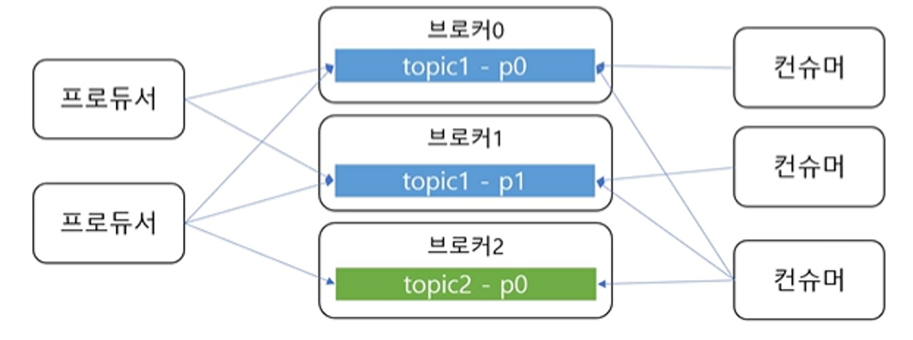

# 카프카 (Kafka)
## 메시지 큐란?

프로세스 간 데이터를 교환할 때 사용되는 통신 방법 중 하나로 메시지를 임시로 저장하는 간단한 버퍼를 생각하면 된다.

생산자(Producer)가 메시지를 메시지 큐에 추가하면 소비자(Consumer)가 메시지를 검색하고 이를  통해 어떤 작업을 수행한다.

### 메시지 큐의 이점

- **비동기** - 생산자는 메시지를 큐에 전송하기만 하고 자신의 작업을 계속 할 수 있다.
- **낮은 결합도** - 생산자와 소비자가 독립적으로 활동한다.
- **확장성** - 생산자가 제공하는 메시지를 소비하는 소비자의 확장이 용이하다
- **탄력성** - 소비자 서비스가 죽고 다시 살아나더라도 메시지 큐에 있는 메시지들로 작업을 나중에라도 다시 수행할 수 있다.
- **보장성** - 큐에 보관되는 모든 메시지가 결국 소비자에게 전달된다는 보장을 제공한다.

## ****Apache Kafka****

> Apache Kafka는 고성능 데이터 파이프라인, 스트리밍 분석, 데이터 통합 및 미션 크리티컬 애플리케이션을 위해 수천 개의 회사에서 사용하는 오픈 소스 분산 이벤트 스트리밍 플랫폼입니다.
[https://kafka.apache.org/](https://kafka.apache.org/)
>
- 아파치 재단이 스칼라로 개발한 오픈 소스 메시지 브로커 프로젝트다.
- 높은 처리량을 요구하는 실시간 데이터 처리를 목표로 하며 TCP 프로토콜을 사용한다.

## Kafka 기본 구조

- **카프카 클러스터**
    - 메시지를 저장하는 저장소
    - 여러 개의 브로커로 구성 (메시지를 나눠서 저장, 이중화, 장애 시 대체)
- **주키퍼 클러스터**
    - 카프카 클러스터의 정보를 관리
- **프로듀서**
    - 메시지를 카프카에 넣는 역할
- **컨슈머**
    - 메시지를 읽어오는 역할

### 토픽과 파티션

- **토픽** - 메시지를 구분하는 단위 (파일 시스템의 폴더와 유사)
- 한 개의 토픽은 한 개 이상의 **파티션**으로 ****구성
    - 파티션은 메시지를 저장하는 물리적인 파일
- 프로듀서는 어떤 토픽에 메시지를 저장할지 결정할 수 있고, 컨슈머는 어떤 토픽에서 읽어올지 결정할 수 있다.

### 파티션과 오프셋, 메시지 순서

- 파티션은 추가만 가능한 파일
    - 각 메시지 저장 위치를 오프셋(offset)이라고 함
    - 프로듀서가 넣은 메시지는 파티션 맨 뒤에 추가 (Queue 자료구조)
    - 컨슈머는 오프셋 기준으로 메시지를 순서대로 읽으
    - 메시지는 삭제되지 않으나 일정 시간이 지난 뒤 삭제하도록 설정할 수 있음
### 여러 파티션과 프로듀서

- 한 토픽에는 여러 파티션이 있다고 했다.
- 프로듀서가 한 토픽에 대한 메시지를 저장하려고 어떤 파티션에 저장할 지 다음으로 결정
    - 라운드로빈 방식으로 저장
    - 키의 해시를 이용해 같은 키는 같은 파티션에 저장되도록
        - 같은 키에 대해서 순서 유지

### 여러 파티션과 컨슈머

- 컨슈머는 컨슈머 그룹에 속함
- 컨슈머 그룹에 속한 컨슈머들은 각각 한 개의 파티션에만 연결 가능
    - 즉 컨슈머 그룹에 속한 컨슈머들은 한 파티션을 공유할 수 없다
    - 한 컨슈머 그룹 기준으로 파티션 메시지는 순서대로 처리
- 서로 다른 컨슈머 그룹에서는 한 파티션을 공유할 수 있다.

### 성능

- **파티션 파일은 OS 페이지 캐시 사용**
    - 파티션에 대한 파일 IO를 메모리에서 처리
    - 서버에서 페이지 캐시를 카프카만 사용해야 성능에 유리
- **Zero Copy**
    - 디스크 버퍼에서 네트워크 버퍼로 직접 데이터 복사
- **컨슈머 추적을 위해 브로커가 하는 일이 비교적 단순**
    - 메시지 필터, 메시지 재전송 같은 일은 브로커가 하지 않음
        - 프로듀서, 컨슈머가 직접 함
    - 브로커는 컨슈머와 파티션간 매핑만 담당
- **배치 처리**
    - 프로듀서: 일정 크기만큼 한 번에 전송 가능
    - 컨슈머: 최소 크기만큼 메시지를 모아서 조회 가능
    - 낱개 처리보다 처리량 증가
- **처리량 확장 용이**
    - 1개 장비의 용량 한계 → 브로커 추가, 파티션 추가
    - 컨슈머 느림 → 컨슈머 추가 (+파티션 추가)

### 리플리카 - 복제

- **리플리카** - 파티션의 복제본
    - 복제 수(replication factor)만큼 파티션의 복제본이 각 브로커에 생김
- **리더**와 **팔로워**로 구성
    - 리더를 통해서만 메시지 처리
    - 팔로워는 리더로부터 복제
- **장애 대응**
    - 리더 브로커 장애 시 다른 팔로워가 리더가 됨

## 프로듀서(Producer)
- 토픽에 메시지 전송 (key, value)
```java
Properties prop = new Properties();
prop.put("bootstrap.servers", "kafka01:9092,kafka01:9902,kafka01:9902");
prop.put("key.serializer", "org.apache.kafka.common.serialization.StringSerializer");
prop.put("value.serializer", "org.apache.kafka.common.serialization.StringSerializer");

KafkaProxucer<Integer, String> producer = new KafkaProxucerM<>(prop);

producer.send(new ProducerRecord<>("topicname", "key", "value"));
producer.send(new ProducerRecord<>("topicname", "value"));

producer.close();
```
- `Properties` - 프로듀서가 사용할 속성을 지정할 수 있다.
  - 브로커 목록이나 key나 value를 직렬화할 때 사용할 Serializer 등을 지정할 수 있다.
  - ack, batchSize 등도 지정할 수 있다.
- `KafkaProducer` - `send()` 제공
  - `ProducerRecord`를 통해 메시지 전달
    - (토픽 이름, 키, 값)
    - (토픽 이름, 값)

### 프로듀서 기본 흐름

1. `send()` 호출
2. `Serializer`로 byte 배열로 변환
3. `Partitioner`로 어떤 토픽의 파티션에 전할지 결정
4. 보낼 메시지를 배치로 묶어서 저장한다.
5. `Sender`가 배치를 차례대로 가져와 브로커에 전달한다.

### Sender의 기본 동작

- `Sender`는 별도 스레드로 동작한다.
  - `Sender`가 메시지를 보내는 동안 `send()`로 들어오는 레코드들은 배치에 누적된다.
  - 배치가 쌓이는 동안에 브로커에 메시지를 못 보낸다거나, 브로커에 메시지를 보내는 동안 배치가 쌓이지 않는 일은 발생하지 않는다.
- 배치가 찼는지 여부에 상관없이 차례대로 브로커에 전송한다.
  - 배치에 메시지가 1개가 있더라도 보낼 수 있으면 보낸다.

### 처리량 관련 주요 속성

- `batchSize` - 배치 최대 크기를 설정, 크기만큼 차면 바로 전송
  - 사이즈가 너무 작으면 전송 횟수가 많아져 처리량이 떨어진다.
- `liners.ms` - 전송 대기 시간
  - 대기 시간이 없으면 배치를 바로 전송
  - 대기 시간이 있으면 시간만큼 기다렸다가 배치를 전송

    → 한 번에 많은 메시지를 보낼 수 있게 되고 처리량이 높이지게 된다.


### 전송 결과를 확인X

```java
producer.send(new ProducerRecord>("topic", "value"));
```

- 전송 실패를 알 수 없음
- 실패에 대한 별도 처리가 필요 없는 메시지 전송에 사용

### 전송 결과 확인 - Future

```java
Futre<RecordMetadata> future = producer.send(new ProducerRecord<>("topic", "value"));
try {
    RecordMetadata meta = future.get(); // 블로킹
} catch (ExecutionException e) {
}
```

- 처리량 저하
- 처리량이 낮아도 되는 경우에만 사용

### 전송 결과 확인 - Callback

```java
producer.send(new ProducerRecord<>("topic", "value"),
		new Callback() {
				@Override
				public void onCompletion(RecordMetadata medatada, Exception ex) {
				}
		});
```

- 처리량 저하 없음

### 전송 보장과 ack

- ack = 0
  - 응답을 기다리지 않음
  - 전송 보장도 zero
- ack = 1
  - 파티션의 리더에 저장되면 응답 받음
  - 리더 장애 시 메시지 유실 가능
- ack = all (or -1)
  - 모든 리플리카에 저장되면 응답 받음
  - 브로커 `min.insync.replicas` 설정에 따라 달라짐

### ack + min.insync.replicas

- `min.insync.replicas`
  - ack 옵션이 all일 때 저장에 성공했다고 응답할 수 있는 동기화된 리플리카 최소 개수
- 예) 리플리카 개수 = 3, ack = all
  - `min.insync.replicas` = 2
    - 리더에 저장하고 팔로워 중 한 개에 저장하면 성공 응답
  - `min.insync.replicas` = 1
    - ack = 1과 동일
  - `min.insync.replicas` = 3
    - 팔로워 중 하나라도 장애가 나면 저장에 실패

### 에러 유형

- 전송 과정에서의 실패
  - 네트워크 문제로 타임 아웃
  - 리더 다운에 의한 새 리더 선출 진행 중
  - 브로커 설정 메시지 크기 한도 초과
- 전송 전에 실패
  - 직렬화 실패
  - 프로듀서 자체 요청 크게 제한 초과
  - 프로듀서 버퍼가 차서 기다린 최대 대기 시간 초과

### 실패 대응 1 - 재시도

- 프로듀서는 기본적으로 재시도 가능한 에러는 재시도 처리
  - 타임 아웃, 일시적 리더 부재
- 재시도 위치
  - 프로듀서 자체적으로 재시도 처리
  - 예외 타입에 따라 `send()` 재호출 (catch)
  - 콜백 메서드에서 예외 타입에 따라 `send()` 재호출
- 아주 특별한 이유가 없다면 무한 재시도 X

### 실패 대응 2 - 기록

- 추후 처리 위해 기록
  - 별도 파일, DB 등에 실패 메시지 기록
  - 추후 수동(또는 자동) 보정 작업 진행
- 기록 위치
  - `Future.get()`이나 콜백에서의 예외를 받아서 기록

### 재시도와 메시지 중복 전송 가능성

- 브로커 응답이 늦게 와서 재시도할 경우 중복 발송 가능
- `enable.idempotence` 속성으로 중복 전송 가능성을 줄일 수 있음

### 재시도와 순서

- `max.in.flight.requests.per.connection`
  - 블록킹 없이 한 커넥션에서 전송할 수 있는 최대 전송 중인 요청 개수
  - 값이 1보다 크면 재시도 시점에 따라 메시지 순서가 바뀔 수 있음
    - 전송 순서가 중요하면 값을 1로 지정


## 컨슈머
- 토픽 파티션에서 레코드 조회
```java
Properties prop = new Properties();
prop.put("bootstrap.servers", "localhost9902");
prop.put("group.id", "group1");
prop.put("key.deserializer", "org.apache.kafka.common.serialization.StringSerializer");
porp.put("value.deserializer", "org.apache.kafka.common.serialization.StringSerializer");

KafkaConsumer<String, String> consumer = new KafkaConsumer<String, String>(prop);
consumer.subscibe(Collections.singleton("simple")); //토픽 구독
while(조건) {
    ConsumerRecores<String, String> recores = consumer.poll(Duration.ofMills(100));
    for (ConsumerRecoreM<String, String> record : records) {
        // ...
    }
}

consumer.close();
```
- `Properties`
  - group id 지정
  - 역직렬화를 위햔 `Deserializer` 등록
- `KafkaConsumer`
  - `subscribe()` 메서드로 토픽 구독
- 메시지 consume
  - 특정 조건 동안 반복하면서 `poll()` 메서드로 `ConsumerRecords` 받아옴 (100ms 동안 대기)

### 토픽 파티션은 그룹 단위 할당

- 한 토픽에 2개의 파티션이 있다고 했을 때
  - 그룹에 컨슈머가 하나라면 두 파티션에 연결된다.
  - 그룹에 컨슈머가 2개라면 파티션을 공유하지 않도록 각각 하나의 파티션과 연결된다.
  - 그룹에 컨슈머가 3개라면 한 컨슈머는 놀게 된다.
- 즉 컨슈머 개수는 파티션 개수보다 많아지면 안 된다.
- 처리량 때문에 컨슈머를 늘려야한다면 파티션도 늘려야 한다.

### 커밋과 오프셋

- 이전 커밋 오프셋을 기준으로 오프셋 만큼 `poll()`을 반복하여 순서대로 읽어나간다.
- 처음 접근이거나 커밋한 오프셋이 없는 경우
  - `auto.offset.reset` 설정 사용
    - earliest - 맨 처음 오프셋 사용
    - latest - 가장 마지막 오프셋 사용 (기본값)
    - none - 이전 커밋이 없으면 예외 발생

### 컨슈머 설정

- `fetch.min.bytes` - 조회 시 브로커가 전송할 최소 데이터 크기
  - 기본값: 1
  - 이 값이 크면 대기 시간은 늘지만 처리량이 증가
- `fetch.max.wait.ms` - 데이터가 최소 크기가 될 때까지 기다릴 시간
  - 기본값:500
  - 브로커가 리턴할 때까지 대기하는 시간으로 `poll()` 메서드의 대기 시간과 다름
- `max.partition.fetch.bytes` - 파티션 당 브로커가 리턴할 수 있는 최대 크기
  - 크기를 넘어가면 전송한다.
  - 기본값: 10485576 (1MB)

### 자동 커밋/수동 커밋

- `enable.auto.commit`
  - true - 일정 주기로 컨슈머가 읽은 오프셋을 커밋 (기본값)
  - false - 수동으로 커밋 실행
- `auto.commit.interval.ms` - 자동 커밋 주기
  - 기본값 5000 (5초)
- `poll()`, `close()` 메서드 호출 시 자동 커밋 실행

### 수동 커밋 - 동기/비동기 커밋

- `consumer.commitSync();`
  - 커밋 실패 시 예외가 발생하기에 적절히 처리해줘야 한다.
- `consumer.commitAsync();`
  - 커밋 결과를 알고 싶다면 `Callback` 사용

### 재처리와 순서

- 동일 메시지 조회 가능성
  - 일시적 커밋 실패, 리밸런스 등에 의해 발생
- 컨슈머는 멱등성을 고려해야 함

### 주의 - 스레드 안전하지 않음

- 여러 스레드에서 동시에 사용하지 말 것

### 참고

[https://www.youtube.com/watch?v=0Ssx7jJJADI](https://www.youtube.com/watch?v=0Ssx7jJJADI)

[https://www.youtube.com/watch?v=geMtm17ofPY](https://www.youtube.com/watch?v=geMtm17ofPY)
