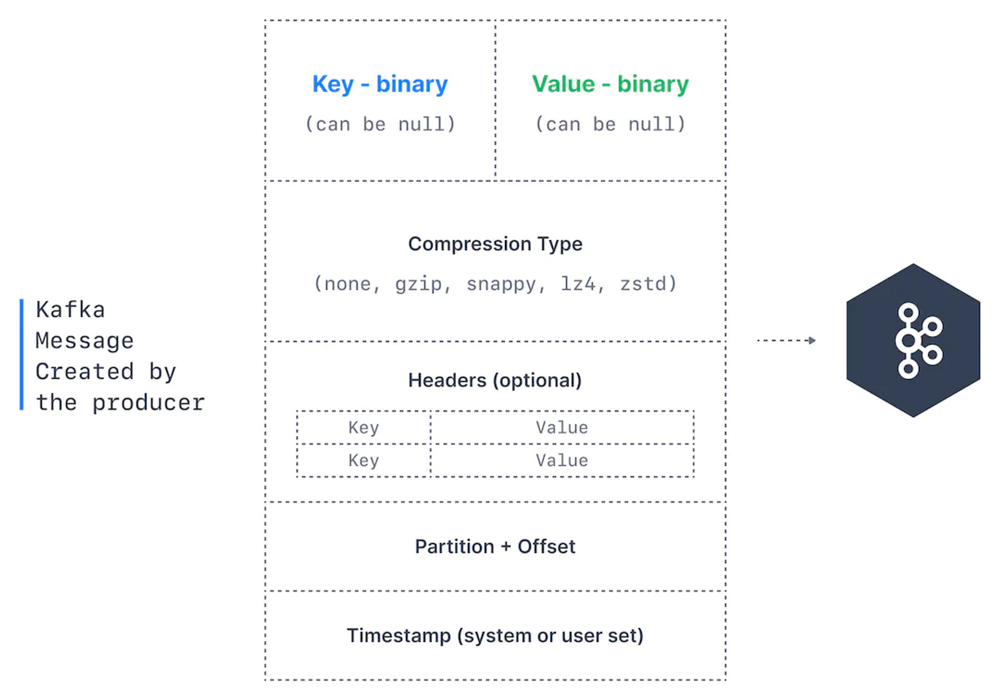

# Kafka Producer, Consumer
## Producer

- 애플리케이션에서 토픽에 데이터를 보내는 것을 Kafka producer라고 한다.
    - Apache Kafka에 데이터를 쓰기 위해 Kafka client library를 사용해야 함
- 카프카 프로듀서가 메세지를 토픽에 보내면 key hashing 같은 메커니즘에 따라 각 파티션으로 분배된다.
- 카프카 토픽에 메세지를 성공적으로 쓰기 위해서는 프로듀서가 acknowledgment(acks) 수준을 지정해야 한다.

## Message Key

- 각 이벤트 메세지는 optional key와 value를 가지고 있다.
- 프로듀서가 `key=null`로 설정하면 토픽의 파티션들에게 균등하게 분배 된다.(라운드 로빈)
- 프로듀서가 key를 지정하면 같은 key를 가진 메세지들이 특정 파티션에 모이게 된다.
    - key는 문자열, 숫자, binary 값이 될 수도 있다.
- message key는 보통 같은 필드를 공유하는 모든 메세지들을 정렬하기 위해 사용한다.
    - 예를 들어 사람들이 회원 가입을 하는 메세지를 보낸다고 할 때 학생들에 대해서는 순서를 보장하고 싶다고 하자. 그럼 key를 ‘student’라고 지정하여 회원 가입 메세지를 보낸다고 하면 한 파티션에 학생들만 쌓이기 때문에 학생들에 한정해서는 순서를 보장할 수 있다.
    - 하지만 특정 파티션에 데이터가 너무 몰릴 수도 있다.

## Kafka Message Anatomy

- **Key** - 문자열, 숫자, 객체일 수 있다. (null일 수도 있음)
- **value** - 메세지의 내용이며 null일 수 있다. 형식은 binary이며 포맷은 임의적이다.
- **Compression Type** - 메세지는 압축될 수 있다. 타입은 메세지 타입에 의해 지정 된다. (`none`, `gzip`, `lz4`, `smappy`, `zstd`)
- **Headers** - key-value 형태로 메세지의 메타 데이터를 표시해 주기 위해 추가할 수 있다. (메세지 추적에 쓰인다)
- **Partition +Offset** - 메세지가 토픽에 전송되면 파티션 번호와 오프셋 id를 받는다. topic + partition + offset은 unique라 메세지를 식별할 수 있다.
- **Timestamp** -  사용자 또는 시스템이 메세지에 추가할 수 있다.

## Kafka Consumer

- 카프카 토픽에서 데이터를 읽는 애플리케이션을 컨슈머라고 한다.
- 컨슈머는 한 번에 하나 이상의 파티션으로부터 데이터를 읽을 수 있다.
    - 각 파티션 내의 메세지는 순서대로 컨슈머에게 읽힌다.
- 컨슈머는 데이터를 낮은 오프셋부터 읽을 수 있으며 반대로 읽을 수는 없다.
- 만약 컨슈머가 2개 이상의 파티션으로부터 데이터를 읽으면 데이터 간 순서는 보장할 수 없다.
    - 한 개에서만 읽으면 보장된다.
- 컨슈머는 기본적으로 카프카에 연결된 이후 생성된 데이터부터 읽을 수 있다.
    - 이전 데이터들을 읽기 위해서는 설정을 해줘야 한다.
- 카프카 컨슈머는 “pull model”이다. 즉 컨슈머는 카프카 브로커에게 데이터를 요청해야 한다.
    - 이렇게 함으로써 컨슈머는 데이터를 pull하는 속도를 제어할 수 있다.

---

[https://www.conduktor.io/kafka/kafka-producers](https://www.conduktor.io/kafka/kafka-producers)

[https://www.conduktor.io/kafka/kafka-consumers](https://www.conduktor.io/kafka/kafka-consumers)
