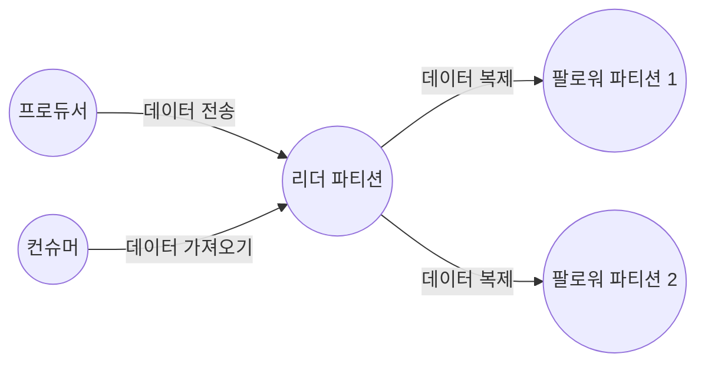

# 4.1 카프카 리플리케이션

## 4.1.1 리플리케이션 동작 개요

- 카프카 리플리케이션 동작을 위해선 토픽 생성 시 필수로 replication factor 옵션을 설정해야 한다.
- 아래 명령어로 하나의 토픽 파티션에 3개의 브로커에 복사할 수 있다.

```bash
kafka-topics.sh --bootstrap-server [브로커주소] --create --topic [토픽명] 
--partitions 1 --replication-factor 3
```

- 이제 해당 토픽으로 메시지를 보내면 모든 브로커가 동일한 메시지를 갖고 있음을 확인할 수 있다.
- 즉 N개의 리플리케이션이 있는 경우 N - 1까지의 브로커 장애가 발생해도 메시지 손실 없이 안정적으로 메시지를 주고 받을 수 있다.

## 4.1.2 리더와 팔로워

- 파티션에는 리더와 팔로워가 존재한다.
    - 리더로 선정되면 모든 읽기와 쓰기는 그 리더를 통해서만 가능하다.
    - 컨슈머도 오직 리더로부터 메시지를 가져온다.



- 팔로워는 리더에 문제 발생 시 리더가 될 수 있다.

## 4.1.3 복제 유지와 커밋

- 리더와 팔로워는 ISR(InSyncReplica)라는 논리 그룹으로 묶여있다.
  - 해당 그룹 내 팔로워들만 새 리더 자격을 가질 수 있다.
  - 리더에 뒤쳐지지 않고 잘 다라 잡고 있는 팔로워만 ISR에 속할 수 있다.
- 리더는 팔로워가 리플리케이션을 잘 수해앟고 있는지도 판단한다.
  - 팔로워가 특정 시간 동안 복제 요청을 하지 않는다면 리더에 의해 ISR에서 추방당한다.
- ISR 내의 모든 팔로워가 메시지를 가져가면 ‘커밋’되었다는 표시를 한다.
  - 커밋된 메시지만 컨슈머가 읽어갈 수 있다.
  - 커밋되지 않은 메시지 읽기를 허용한다면 동일 토픽의 파티션에서 컨슘했음에도 메시지가 일치하지 않을 수 있다.
- 브로커는 커밋된 메시지를 유지하기 위해 로컬 디스크의 replication-offset-checkpoint라는 파일에 마지막 커밋 오프셋 위치를 저장한다.
