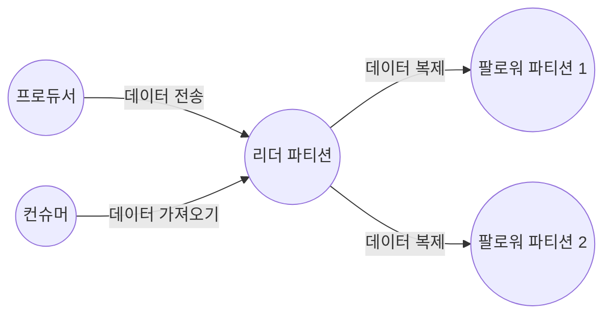

# 4.1 카프카 리플리케이션

## 4.1.1 리플리케이션 동작 개요

- 카프카 리플리케이션 동작을 위해선 토픽 생성 시 필수로 replication factor 옵션을 설정해야 한다.
- 아래 명령어로 하나의 토픽 파티션에 3개의 브로커에 복사할 수 있다.

```bash
kafka-topics.sh --bootstrap-server [브로커주소] --create --topic [토픽명] 
--partitions 1 --replication-factor 3
```

- 이제 해당 토픽으로 메시지를 보내면 모든 브로커가 동일한 메시지를 갖고 있음을 확인할 수 있다.
- 즉 N개의 리플리케이션이 있는 경우 N - 1까지의 브로커 장애가 발생해도 메시지 손실 없이 안정적으로 메시지를 주고 받을 수 있다.

## 4.1.2 리더와 팔로워

- 파티션에는 리더와 팔로워가 존재한다.
    - 리더로 선정되면 모든 읽기와 쓰기는 그 리더를 통해서만 가능하다.
    - 컨슈머도 오직 리더로부터 메시지를 가져온다.



- 팔로워는 리더에 문제 발생 시 리더가 될 수 있다.

## 4.1.3 복제 유지와 커밋

- 리더와 팔로워는 ISR(InSyncReplica)라는 논리 그룹으로 묶여있다.
  - 해당 그룹 내 팔로워들만 새 리더 자격을 가질 수 있다.
  - 리더에 뒤쳐지지 않고 잘 다라 잡고 있는 팔로워만 ISR에 속할 수 있다.
- 리더는 팔로워가 리플리케이션을 잘 수해앟고 있는지도 판단한다.
  - 팔로워가 특정 시간 동안 복제 요청을 하지 않는다면 리더에 의해 ISR에서 추방당한다.
- ISR 내의 모든 팔로워가 메시지를 가져가면 ‘커밋’되었다는 표시를 한다.
  - 커밋된 메시지만 컨슈머가 읽어갈 수 있다.
  - 커밋되지 않은 메시지 읽기를 허용한다면 동일 토픽의 파티션에서 컨슘했음에도 메시지가 일치하지 않을 수 있다.
- 브로커는 커밋된 메시지를 유지하기 위해 로컬 디스크의 replication-offset-checkpoint라는 파일에 마지막 커밋 오프셋 위치를 저장한다.

## 4.1.4 리더와 팔로워의 단계별 리플리케이션 동작

- 카프카는 리더 성능을 높이기 위해 통신을 최소화할 수 있도록 설계했는데 그 중 하나가 팔로워의 ACK를 받지 않도록 한 것이다.
  - 래빗 MQ의 트랜잭션 모드에선 모든 미러(팔로워)가 메시지를 받았는지 리더에게 ACK를 리턴한다.
- 카프카는 ACK 없이도 안정적으로 리플리케이션할 수 있도록 설계되었다.
  - 팔로워들이 n번 오프셋에 대한 메시지를을 요청하면 리더는 (n - 1)번 메시지는 리플리케이션 되었다 인지하고 해당 위치에 커밋 표시를 한다.
  - 팔로워가 n번 오프셋 메시지를 받지 못했다면 n번을 다시 요청할 것이기에 리더는 리플리케이션 성공 여부를 알 수 있는 것이다.
  - n번 오프셋 메시지에 대한 리플리케이션 요청을 받은 리더는 (n - 1)번 오프셋 메시지가 커밋되었다는 응답을 팔로워에게 전달한다.
  - 해당 응답을 받은 팔로워는 리더와 동일하게 커밋을 표시한다.
- 리더와 팔로워 사이의 ACK 통신이 가볍다고는 하나 대량의 메시지를 처리하는 카프카에선 이런 차이도 크게 부각된다.
  - 1만 개 메시지를 주고 받을 때 ACK가 추가되면 2만 회의 통신이 되어버린다.
- 카프카에선 팔로워들이 메시지를 풀하는 방식으로 동작하는데 이 또한 리더의 부담을 줄여준다.

## 4.1.5 리더에포크와 복구

- 리더에포크(Leader Epoch)
  - 파티션들이 복구 동작을 할 때 메시지 일관성을 유지하기 위해 사용한다.
  - 컨트롤러에 의해 관리되는 32비트 숫자로 표현
- 하이워터마크
  - 커밋되면 증가하는 값으로 팔로워가 복제를 완료한 마지막 커밋 오프셋 위치를 의미
  - 컨슈머가 읽을 수 있는 메시지의 최대 오프셋을 나타낸다.

### 팔로워 장애 후 리더 장애 시 메시지 손실 복구 예제

- 리더에포크가 없는 경우 메시지 손실 과정 (파티션 수: 1, 리플리케이션 팩터: 2, min.insync.replicas: 1)
  - 리더엔 메시지1(오프셋0), 메시지2(오프셋1)이 있고 오프셋 1까지 커밋된 상태 (하이워터마크: 2)
  - 팔로워에도 메시지1(오프셋0), 메시지2(오프셋1)가 있지만 아직 오프셋 0까지 커밋된 상태 (하이워터마크: 1)
    - 아직 리더로부터 하이워터마크를 2로 올리는 내용을 전달 받지 못함
  - 예상치 못한 장애로 팔로워가 다운된다.
  - 복구된 팔로워는 자신의 메시지들 중 워터마크보다 높은 메시지를 신뢰할 수 없어 메시지 2를 삭제한다.
  - 팔로워는 리더에게 1번 오프셋의 새로운 메시지 가져오기 요청을 보낸다. (메시지2를 요청)
  - 리더였던 브로커도 예상치 못하게 다운되어 파티션에 유일하게 남아 있던 팔로워가 새 리더가 된다.
  - 새 리더가 된 브로커는 메시지 2를 갖고 있지 않기에 커밋된 메시지를 유실하게 되었다.
- 리더에포크를 활용한 복구 과정 (위 과정에서 팔로워 장애부터 다시 시작)
  - 팔로워가 복구되는데 워터마크 이후 메시지도 삭제하지 않는다.
  - 팔로워는 복구되면서 리더에게 리더에포크 요청을 보낸다.
  - 리더는 ‘1번 오프셋의 메시지2까지’라고 응답한다.
  - 팔로워는 응답을 보고 메시지2까지 자신의 하이워터마크를 상향조정한다.
  - 이후 리더가 장애로 다운되고 팔로워가 리더가 되어도 메시지 손실이 발생하지 않는다.
