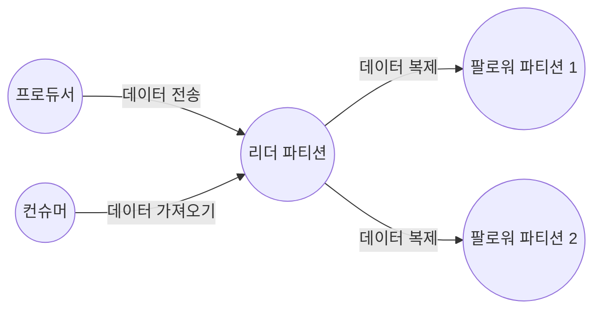

# 4.1 카프카 리플리케이션

## 4.1.1 리플리케이션 동작 개요

- 카프카 리플리케이션 동작을 위해선 토픽 생성 시 필수로 replication factor 옵션을 설정해야 한다.
- 아래 명령어로 하나의 토픽 파티션에 3개의 브로커에 복사할 수 있다.

```bash
kafka-topics.sh --bootstrap-server [브로커주소] --create --topic [토픽명] 
--partitions 1 --replication-factor 3
```

- 이제 해당 토픽으로 메시지를 보내면 모든 브로커가 동일한 메시지를 갖고 있음을 확인할 수 있다.
- 즉 N개의 리플리케이션이 있는 경우 N - 1까지의 브로커 장애가 발생해도 메시지 손실 없이 안정적으로 메시지를 주고 받을 수 있다.

## 4.1.2 리더와 팔로워

- 파티션에는 리더와 팔로워가 존재한다.
    - 리더로 선정되면 모든 읽기와 쓰기는 그 리더를 통해서만 가능하다.
    - 컨슈머도 오직 리더로부터 메시지를 가져온다.



- 팔로워는 리더에 문제 발생 시 리더가 될 수 있다.
