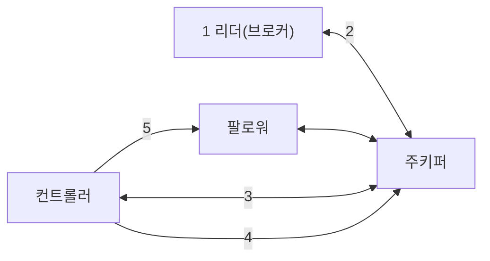

# 4.2 컨트롤러

- 컨트롤러
    - 파티션의 ISR 리스트 중에서 리더를 선출한다.
    - 가용성 보장을 위해 주키퍼에 저장되어 있다.
- 컨트롤러는 브로커 실패를 예의주시하고 있다.
    - 브로커 실패가 감지되면 즉시 ISR 리스트 중 하나를 새로운 파티션 리더로 선출한다.
    - 만약 리더가 다운되면 프로듀서나 컨슈머가 해당 파티션으로부터 읽기나 쓰기를 하지 못한다.
- 리더 선출 과정을 아래 예제를 통해 이해해보자.

### 예기치 못한 브로커 장애 시 리더 선출

| 토픽 | peter-test02 |
| --- | --- |
| 리플리케이션 팩터 수 | 2 |
| 브로커 배치 | 1, 3번 브로커 |
| 현재 리더 위치 | 1번 브로커 |

1. 파티션 0번 리더가 있는 브로커 1번이 예기치 않게 다운
2. 주키퍼는 1번 브로커와 연결이 끊어진 후 0번 파티션의 ISR의 변화를 감지
3. 컨트롤러는 주키퍼 워치를 통해 0번 파티션에 변화를 감지하고 ISR 중 3번을 새로운 리더로 선출
4. 컨트롤러는 0번 파티션의 리더가 3이라는 정보를 주키퍼에 기록
5. 이렇게 갱신된 정보는 현재 활성화된 모든 브로커에 전파

- 컨트롤러가 새 리더를 선출하고 리더 정보를 주키퍼에 기록하면 다른 브로커에게 전파해야 한다.
    - 엄청 많은 파티션에 이 작업을 수행하려면 엄청난 시간이 걸리게 된다.
    - ex) 한 파티션의 리더 선출이 약 0.2초 걸린다면 1만 개 파티션의 리더 선출은 약 30분이 넘게 걸린다.
- https://www.confluent.io/blog/apache-kafka-supports-200k-partitions-per-cluster/
    - 아파치 카프카(Apache Kafka) 1.1.0 버전부터 **클러스터당 최대 20만 개 파티션**을 공식적으로 지원하게 되었다는 소식을 다루는 글
    - **파티션 확장성**: 카프카는 토픽을 여러 파티션으로 분할해 병렬 처리 성능을 높인다. 파티션 수가 많아질수록 처리량도 증가하지만, 관리 및 가용성 측면에서 한계가 있었지만 1.1.0 버전에서 이 한계가 크게 완화됨
    - **컨트롤러와 파티션 리더**: 각 파티션은 여러 복제본(리플리카)을 가질 수 있으며, 이 중 하나가 리더가 되어 모든 클라이언트 요청을 처리, 클러스터 내 한 브로커가 컨트롤러 역할을 맡아 전체 클러스터를 관리
    - **컨트롤드 셧다운(Controlled Shutdown) 개선**: 브로커를 안전하게 종료할 때, 기존에는 파티션 리더를 하나씩 동기적으로 주키퍼에 기록하고, 각 브로커에 개별적으로 알렸기 때문에 느렸지만 1.1.0에서는 주키퍼에 비동기적으로 여러 파티션 리더 정보를 한 번에 기록하고, 여러 파티션의 리더 정보를 배치로 브로커에 전달해 속도를 대폭 개선
    - **실제 성능 개선**:
        - 5개 브로커, 5만 파티션 환경에서 컨트롤드 셧다운 시간이 6.5분 → 3초로 단축됨
        - 컨트롤러 장애 시 상태 재로딩 시간도 28초 → 14초로 절반으로 줄어듦
    - **권장 파티션 수**: 브로커당 최대 4,000개, 클러스터당 최대 20만 개 파티션을 권장
        - 이는 컨트롤러 장애 등 극단적 상황에서도 가용성을 보장하기 위한 기준
