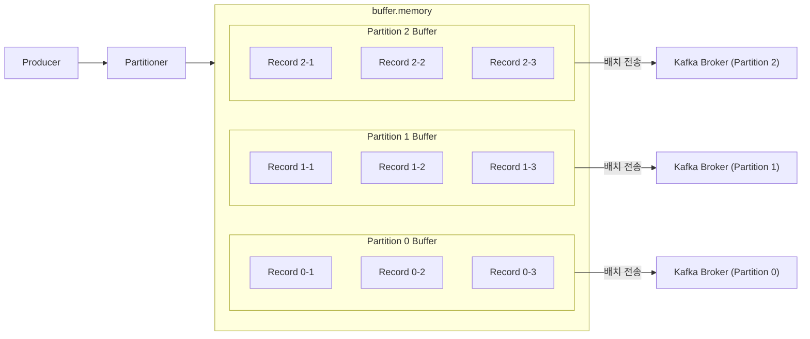

# 5.2 프로듀서의 배치
- 카프카에선 처리량을 높이기 위해 다음 처리를 수행한다.
    - 토픽은 파티션으로 나눠 처리
    - 프로듀서는 배치 전송을 권장
- 프로듀서는 카프카로 전송하기 전 배치 전송을 위해 토픽 파티션별로 레코드들을 잠시 보관한다.

- 프로듀서는 배치 전송을 위해 다음 옵션을 제공한다.
    - `buffer.memory`
        - 메시지들을 담아두는 버퍼 메모리 옵션
        - 기본값은 32MB이며 조절 가능하다.
        - 위 그림에서 각 버퍼 파티션을 묶는 큰 영역
    - `batch.size`
        - 배치 전송을 위해 메시지(레코드)들을 묶는 단위 설정 옵션
        - 기본값은 16KB로 조절 가능하다.
        - 위 그림에서 각 파티션 버퍼 영역
    - `linger.ms`
        - 버퍼 메모리에서 대기하는 메시지들의 최대 대기 시간
        - 단위는 ms이며 기본값은 0 (즉 기다리지 않고 전송됨)
- 하지만 무조건 배치 처리를 해야만 하는 것은 아니다.
    - 처리량과 지연 없는 전송 중 트레이드 오프를 해야 한다.
    - 처리량을 높이려면 `batch.size`와 `linger.ms`를 크게 설정하면 된다.
    - 지연 없는 전송을 하려면 `batch.size`와 `linger.ms`를 작게 설정해야 한다.
- 높은 처리량을 목표로 한다면 버퍼 메모리 크기가 충분히 커야 한다.
    - `buffer.memory` 크기는 {파티션 수 X `bath.size`}보다 반드시 커야 한다.
- 배치와 더불어 압축을 사용하면 더 효율적인 전송이 가능하다.
    - 높은 압축률을 선호한다면 gzip, zstd
    - 낮은 지연시간을 선호한다면 lz4, snappy
