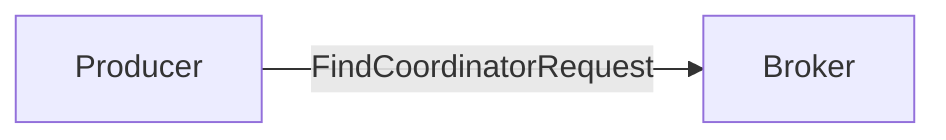
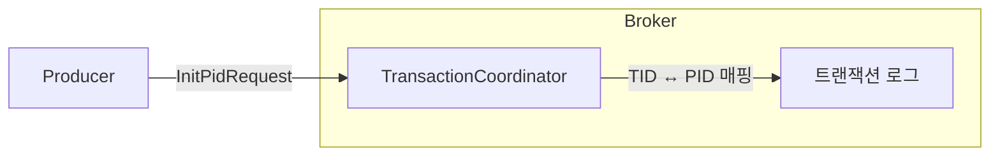
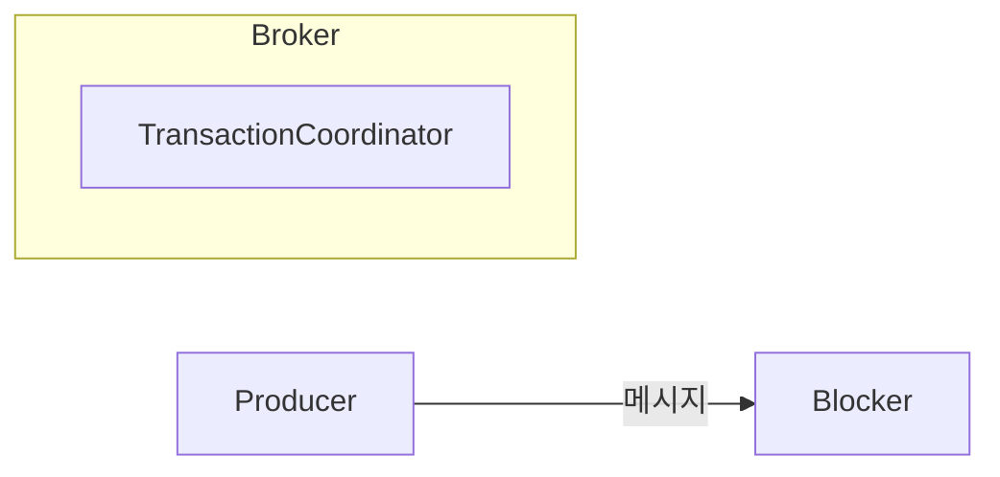
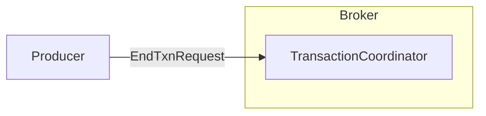
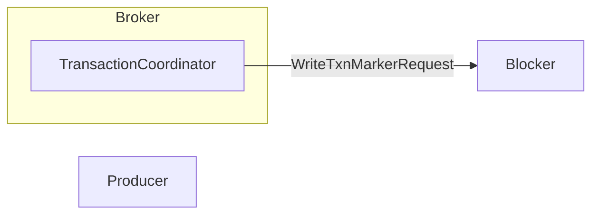

# 5.4 정확히 한 번 전송

- 카프카에선 멱등성 옵션을 통해 중복 없는 전송을 할 수 있지만 이는 정확히 한 번 전송한다는 의미는 아니다.
    - 중복 없는 전송은 정확히 한 번 전송의 일부 기능일 뿐이다.
    - 카프카에서 정확히 한 번 전송은 트랜잭션과 같은 전체적인 프로세스 처리를 의미한다.
- 트랜잭션 API - 카프카에서 전체적인 프로세스를 관리하기 위해 정확히 한 번 처리를 담당하는 별도의 프로세스

## 5.4.1 디자인

- 카프카로 정확히 한 번 방식으로 메시지를 전송하면 메시지들은 원자적으로 처리되어 전송에 성공하거나 실패하게 된다.
- 트랜잭션 코디네이터가 이러한 트랜잭션을 관리한다.
    - 프로듀서가 보내는 메시지를 관리하여 커밋 또는 중단 등을 표시한다.
    - 트랜잭션 로그를 카프카 내부 투픽인 __transaction_state에 저장한다.
        - 이 토픽 또한 브로커 설정을 통해 관리 가능하다.
- 컨트롤 메시지
    - 카프카가 정상적으로 커밋된 메시지인지 싫패한 것인지 식별하기 위한 특별한 타입의 메시지
    - 페이로드에 애플리케이션 데이터(벨류)를 포함하지 않는다.
    - 애플리케이션에 노출되지 않고 오직 브로커와 클라이언트 통신에서만 사용된다.

## 5.4.2 프로듀서 예제 코드

```java
import org.apache.kafka.clients.producer.KafkaProducer;
import org.apache.kafka.clients.producer.ProducerConfig;
import org.apache.kafka.clients.producer.ProducerRecord;
import org.apache.kafka.clients.producer.Producer;
import org.apache.kafka.common.serialization.StringSerializer;
import java.util.Properties;

public class ExactlyOnceProducer {
    public static void main(String[] args) {
        Properties props = new Properties();
        
        // 정확히 한 번 전송을 위한 설정
        props.put(ProducerConfig.BOOTSTRAP_SERVERS_CONFIG, "localhost:9092");
        props.put(ProducerConfig.KEY_SERIALIZER_CLASS_CONFIG, StringSerializer.class.getName());
        props.put(ProducerConfig.VALUE_SERIALIZER_CLASS_CONFIG, StringSerializer.class.getName());
        props.put(ProducerConfig.ACKS_CONFIG, "all");
        props.put(ProducerConfig.ENABLE_IDEMPOTENCE_CONFIG, "true");
        props.put(ProducerConfig.TRANSACTIONAL_ID_CONFIG, "my-transactional-id-001");
        props.put(ProducerConfig.MAX_IN_FLIGHT_REQUESTS_PER_CONNECTION, "5"); 
        props.put(ProducerConfig.RETRIES_CONFIG, "5");

        Producer<String, String> producer = new KafkaProducer<>(props);

        producer.initTransactions(); // 프로듀서 트랜잭션 초기화

        try {
            producer.beginTransaction(); // 프로듀서 트랜잭션 시작
            producer.send(new ProducerRecord<>("test-topic", "key1", "value1"));
            producer.send(new ProducerRecord<>("test-topic", "key2", "value2"));
            producer.flush();
            producer.commitTransaction(); // 프로듀서 트랜잭션 커밋
        } catch (Exception e) {
            producer.abortTransaction(); // 프로듀서 트랜잭션 중단
            e.printStackTrace();
        } finally {
            producer.close();
        }
    }
}

```

- 위 예제 코드에서 주의할 점은 `TRANSACTION_ID_CONFIG`를 프로듀서마다 고유하게 설정해야 한다는 것이다.

## 5.4.3 단계별 동작

### 트랜잭션 코디네이터 찾기



- 정확히 한 번 전송을 위해선 트랜잭션 API를 이용해야 하기에 먼저 트랜잭션 코디네이터를 찾아야 한다.
- 프로듀서는 브로커에게 FindCoordinatorRequest를 보내 코디네이터 위치를 찾는다.
  - 트랜잭션 코디네이터는 브로커에 위치한다.
- `__transaction_state` 토픽의 파티션 번호는 `transactional.id` 기반으로 해시되어 결정된다.
  - 이 파티션 리더가 있는 브로커가 트랜잭션 코디네이터의 브로커로 최종 선정 된다.

### 프로듀서 초기화



- 프로듀서는 `initTransactions` 메서드를 이용해 `IninPidRequest`를 코디네이터로 전송한다.
- TID(transaction id)가 설정된 경우 전송되어 코디네이터는 TID, PID를 매핑하고 트랜잭션 로그에 기록한다.
- 그 후 PID 에포크를 한 단계 올리고 이전의 동일한 PID와 이전 에포크에 대한 쓰기는 무시된다.

### 트랜잭션 시작

- 프로듀서는 `beginTransaction` 메서드로 새 트랜잭션을 시작한다.
  - 프로듀서 내부적으론 시작되었지만 코디네이터 관점에선 첫 레코드가 도착하기까지 시작된건 아니다.

### 트랜잭션 상태 추가

- 프로듀서는 토픽 파티션 정보를 코디네이터에 전달하고 코디네이터는 이를 트랜잭션 로그에 기록한다.
  - TID와 P0(파티션0)의 정보가 트랜잭션 로그에 기록되며 현재 상태를 `Ongoing`으로 표시한다.
- 로그에 추가되는 첫 파티션이라면 코디네이터는 1분 타이머를 시작해 1분 넘게 트랜잭션 업데이트가 없다면 실패로 처리한다.

### 메시지 전송

- 프로듀서는 대상 토픽 파티션으로 메시지를 전송한다.
  - 메시지에는 PID, 에포크, 시퀸스 번호가 함께 포함된다.
- 트랜잭션 코디네이터가 있는 브로커와 메시지를 받는 브로커는 서로 다르다.



### 트랜잭션 종료

- 메시지 전송을 완료한 프로듀서는 `commitTrasaction` 또는 `abortTransaction` 메서드 중 하나를 반드시 호출해서 코디네이터에게 알려야 한다.
- 코디네이터는 두 단계의 커밋 과정을 시작하게 된다.
  - 첫 단계로 트랜잭션 로그에 해당 트랜잭션에 대한 `PrepareCommit` 또는 `PrepareAbort`를 기록한다.



- 두 번째 단계로 트랜잭션 로그에 기록된 토픽 파티션에 트랜잭션 커밋 표시를 기록한다.
  - 이 기록 메시지가 바로 컨트롤 메시지이다.
  - 이 과정을 통해 토픽 파티션은 커밋 메시지가 기록되고 파티션의 마지막 오프셋이 증가한다.
  - 커밋이 되고 나서야 메시지는 컨슈머에게 반환된다.



### 트랜잭션 완료

- 코디네이터는 트랜잭션이 완료되면 트랜잭션 로그에 기록하고 프로듀서에 알린다.
