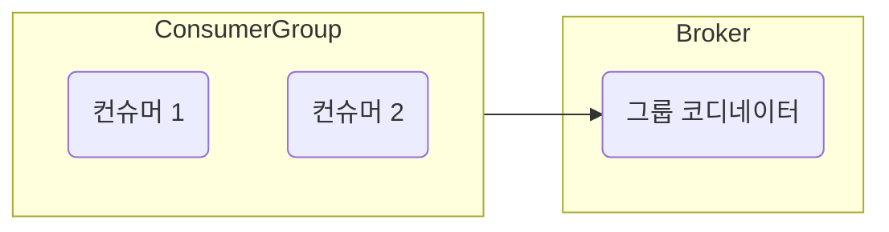

# 6.2 그룹 코디네이터
- 컨슈머 그룹 내 각 컨슈머는 하나의 공동체로 동작한다.
    - 컨슈머는 언제든 그룹에서 떠나거나 합류할 수도 있다.
    - 컨슈머 그룹은 이 컨슈머들에게 작업을 균등히 분해하는데 이를 컨슈머 리밸런싱이라 한다.
- 그룹 코디네이터
    - 컨슈머 그룹이 구독한 토픽의 파티션들과 그룹의 멤버들을 트래킹하는 게 목적
    - 그룹별로 존재하며 카프카 클러스터 내 브로커 중 하나에 위치한다.
    - 컨슈머 그룹의 멤버 변경, 구독하는 토픽 파티션 변경 등의 감지를 한다.

### 컨슈머 그룹 등록 과정

1. 컨슈머는 컨슈머 설정 값 중 `bootstrap.brokers` 리스트에 있는 브로커에게 컨슈머 클라이언트와 초기 커넥션 연결을 위한 요청을 전송
2. 요청을 받은 브로커는 그룹 코디네이터를 생성하고 컨슈머에게 응답을 보낸다.
3. 그룹 코디네이터는 `group.initial.rebalance.delay.ms` 시간 동안 컨슈머 요청을 기다린다.
4. 컨슈머는 컨슈머 그룹 등록 요청을 그룹 코디네이터에게 전송하는데 가장 먼저 요청 보낸 컨슈머가 그룹의 리더가 된다.
5. 컨슈머 등록 요청을 받은 그룹 코디네이터는 해당 컨슈머 그룹이 구독하는 토픽 파티션 리스트 등 리더 컨슈머의 요청에 응답을 보낸다.
6. 리더 컨슈머는 컨슈머 파티션 할당 전략에 따라 그룹 내 컨슈머들에게 파티션을 할당 한 뒤 그룹 코디네이터에 전달
7. 그룹 코디네이터는 해당 정보를 캐시하고 각 그룹 내 컨슈머들에게 성공을 알린다.
8. 각 컨슈머들은 지정된 토픽 파티션으로부터 메시지를 가져온다

### 컨슈머 변경 감지

- 컨슈머 그룹의 변화들은 컨슈머 코디네이터에게 join 또는 leave 요청을 보냄으로써 처리된다.
- 컨슈머 장애로 leave 요청을 보내지 못할 수도 있지만 하트비트를 주고 받기에 적절히 처리될 수 있다.
- 다음은 하트비트와 관련된 컨슈머 설정이다.
    - `hartbeat.interval.ms` - 그룹 코디네이터와 하트비트 인터벌 시간 (기본값 3000)
    - `session.timeout.ms` - 컨슈머로부터 하트비트를 받지 못하면 문제가 발생했다고 판단하는 시간, 리밸런싱이 시작된다. (기본값 10000)
    - `max.poll.interval.ms` - 컨슈머의 메시지를 가져오기 위한 poll 요청 호출 후 그 다음 poll 까지의 요청이 없다면 컨슈머에 문제가 발생했다고 판단하는 시간 (기본값 300000)
- 컨슈머 리밸런싱 비용이 매우 높기 때문에 적절한 설정이 중요하다.
    - 옵션값 조정으로 컨슈머 다운을 빠르게 감지하도록 설정한다면 원하지 않는 리밸런싱이 빈번하게 발생할 수 있다.
    - 반대로 다운을 늦게 감지하도록 하면 그 시간만큼 해당 파티션 메시지를 읽지 못하는 현상이 발생할 수도 있다.
- 가능하면 기본 설정을 유지하는 것을 권장한다.
