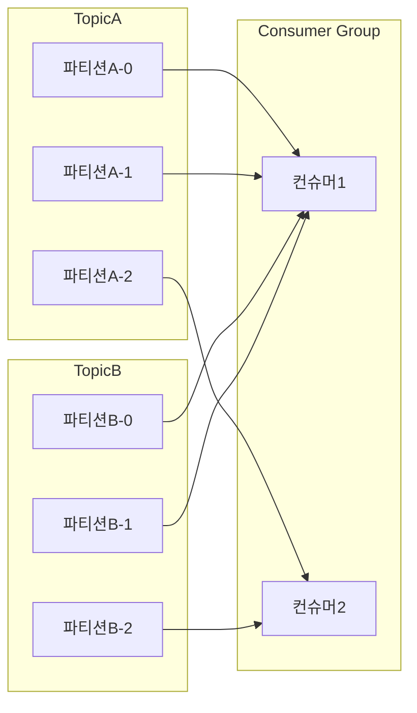

# 6.4 컨슈머 파티션 할당 전략

- 파티셔너가 레코드를 어떤 토픽 파티션에게 전달할지 결정했던 것처럼 컨슈머도 어떤 토픽 파티션으로부터 레코드를 읽어올지 결정한다.
- 컨슈머 그룹의 리더 컨슈머가 파티션 할당 전략에 따라 각 컨슈머와 파티션을 매칭시킨다.

| 파티션 할당 전략 | 설명 |
| --- | --- |
| 레인지 파티션 할당 전략 | 파티션 할당 전략의 기본값, 토픽별로 할당 전략을 사용함. 동일 키를 이용하는 2개 이상 토픽을 컨슘할 때 유용 |
| 라운드 로빈 파티션 할당 전략 | 사용 가능한 파티션과 컨슈머들을 균등 분배 |
| 스티키 파티션 할당 전략 | 컨슈머가 컨슘하고 있는 파티션을 계속 유지 |
| 협력적 스티키 파티션 할당 전략 | 스티키와 유사하지만 전체 일시 정지가 아닌 연속적인 재조정 방식 |

## 6.4.1 레인지 파티션 할당 전략

- 레인지 파티션 할당 전략
    - 먼저 구독하는 토픽에 대한 파티션을 순서대로 나열한 후 컨슈머를 순서대로 정렬
    - 그 다음 각 컨슈머가 몇 개 파티션을 할당해야 하는지 전체 파티션 수를 컨슈머 수로 나눈다.
    - 컨슈머와 파티션 수가 일치하면 균등하게 할당되지만 그렇지 않으면 앞쪽 컨슈머들이 추가 파티션을 할당 받는다.

- 위 그림처럼 수가 맞지 않으면 한 컨슈머에 파티션 할당이 몰린다.
- 레인지 할당 전략이 유용한 경우
    - 동일한 레코드 키를 사용
    - 그리고 하나의 컨슈머 그룹이 동일한 파티션 수를 가진 2개 이상 토픽을 컨슘할 때
    - 같은 인덱스의 파티션들이 한 컨슈머에 모여 데이터 순서와 처리 일관성이 보장된다.
        - 위 그림에서도 파티션 0번들은 컨슈머 1에 몰린다
