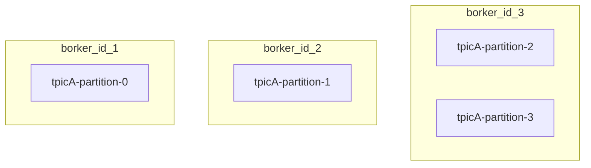
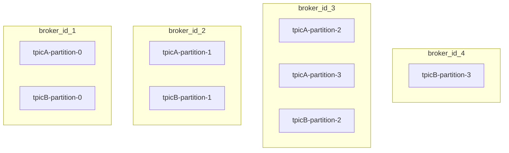
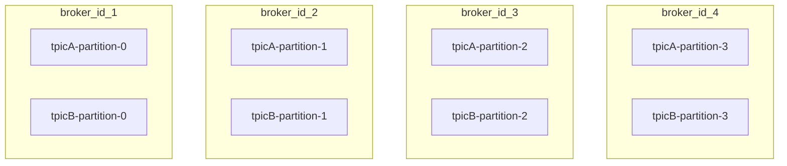

# 8.3 카프카의 확장

- 카프카는 폭발적인 사용량 증가를 고려해 안전하고 손쉽게 확장할 수 있도록 디자인되었다.
- 아래 그림은 한 토픽의 브로커, 파티션 배치를 예제를 나타내고 있다.
  - 토픽은 총 4개 파티션으로 구성되어 있다.
  - 브로커는 id가 1, 2, 3 총 3대로 구성되어 있다.
  - 각 브로커마다 하나의 파티션이지만 id=3 브로커에만 2개의 파티션이 배치되었다.



- 여기서 단순히 브로커만 추가한다고 해서 부하가 분산되지는 않고 파티션을 고르게 분산시켜야 한다.
- 부하 분산이 목적이라면 브로커만 추가했다고 끝인게 아니라 새 브로커에 기존 파티션들을 할당해야 한다.
  - 만약 단순히 브로커만 추가한다면 아래와 같이 부하가 특정 브로커(id=3)에 몰리게 된다.
  - 브로커 id=4와 새로운 토픽을 추가한 경우



## 8.3.1 브로커 부하 분산

- kafka-reassign-partitions.sh 도구를 이용해 파티션을 이동시킬 수 있다.
  - 분산시킬 토픽을 정하고 어느 브로커로 이동시킬지 JSON 포멧으로 지정할 수 있다.

- 먼저 분산시킬 토픽을 reassign-partitions-topic.json 파일로 저장한다.

```json
{
	"topics": [{"topic": "topicA"}],
	"version": 1
}
```

- 그리고 위 파일을 이용해 분산시킬 브로커 리스트를 지정한다.
  - 여기선 1, 2, 3, 4 브로커 모두를 지정

```shell
/usr/local/kafka/bin/kafka-reassign-partitions.sh 
	--bootstrap-server topicA.foo.bar:9092 --generate 
	--topics-to-move-json-file reassign-partitions-topic.json --broker-list "1, 2, 3, 4"
```

- 위 명령어를 통해 move.json 파일이 생성된다.
  - 제안된 파티션 배치 설정을 담고 있는 파일이다.
  - move.json 파일을 통해 토픽에 대한 파티션 배치를 실행한다.

```shell
/usr/local/kafka/bin/kafka-reassign-partitions.sh 
	--bootstrap-server topicA.foo.bar:9092 
	--reassignment-json-file move.json --execute
```

- 이로써 모든 분산 작업이 완료되었다.



- 이처럼 카프카 클러스터에 브로커 추가 시 로드가 자동 분산되지 않기에 수동으로 파티션들을 브로커에 분산 배치해야 한다.

## 8.3.2 분산 배치 작업 시 주의사항

- 버전 업그레이드와 마찬가지로 사용량이 낮은 시간대에 진행해야 한다.
  - 파티션 분산 시 내부적으로 파티션이 리플리케이션되고 완료 후에 기존 파티션이 삭제된다.
  - 토픽의 파티션 수가 많을수록 그만큼의 리플리케이션이 일어나는 것
- 토픽 파티션 재배치 팁 1
  - 예를 들어 용량이 700G라고 가정하면 이 파티션의 재배치는 상당히 비용이 들어간다.
  - 만약 해당 토픽 메시지들을 거의 다 컨슘했고 앞으로 재처리할 일이 없다면 삭제해도 무방할 것이다.
  - 토픽의 보관주기를 기본값 1주일에서 1일로 변경한다면 파티션 크기는 한참 줄어들 것이다.
  - 그 후 재배치를 수행하면 효율적으로 재배치를 수행할 수 있다.
- 토픽 파티션 재배치 팁 2
  - 다소 시간이 걸리더라도 여러 토픽을 동시에 진행하지 않고 하나의 토픽만 진행하기를 권장한다.
  - 여러 토픽이 동시다발적으로 재배치가 진행되면 그만큼의 부하가 브로커에 전달된다.
