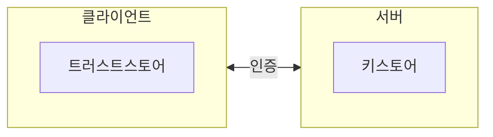

# 9.2 SSL을 이용한 카프카 암호화

- `KeyStore`
    - 자바 기반 애플리케이션에서 사용하는 인증 추상화를 제공하는 인터페이스
    - 퍼블릭 키, 프라이빗 키, 인증서를 추상화해 제공한다.
- 카프카 또한 자바 기반이기에 자바의 keytool 명령어로 SSL 적용 작업을 진행하게 된다.
- 클러스터 환경 기준 SSL 구성도엔 다음 요소들이 포함된다.
    - 클라이언트
    - 트러스트스토어
    - CA 인증서
    - 키스토어
    - 각 토픽들

## 9.2.1 브로커 키스토어 생성

- 클러스터 내 각 브로커마다 키스토어를 먼저 생성해야 한다.
    - 각 브로커마다 프라이빗 키와 인증서가 필요하기 때문

- 키스토어와 트러소트스토어는 모두 클라이언트, 서버 사이 SSL 연결 시 사용한다.
    - 모두 keytool을 이용해관리된다.
- 키스토어
    - 서버 측면의 프라이빗 키와 인증서를 저장하며 자격 증명을 제공
    - 그 외 민감 정보도 저장한다.
- 트러스트스토어
    - 클라이언트 측에서 서버가 제공하는 인증서를 검증
    - 검증을 위한 퍼블릭 키와 서명된 인증서를 저장
    - 민감 정보는 저장하지 않는다.
