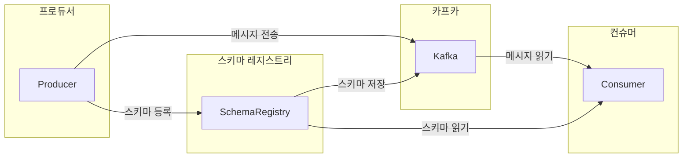

# 10.2 카프카와 스키마 레지스트리

## 10.2.1 스키마 레지스트리 개요

- 스키마 레지스트리란
    - 카프카에서 스키마를 활용하기 위해 사용하는 별도의 애플리케이션
    - 스키마를 등록하고 관리할 수 있다.
    - 카프카와 별도로 구성된 독립된 요소

- 카프카 레지스트리는 프로듀서/컨슈머와 직접 통신한다.
    - 프로듀서는 스키마를 레지스트리에 등록하고 등록된 스키마 정보를 통해 메시지를 전송한다.
    - 컨슈머는 스키마 ID를 레지스트로부터 읽어온 후 프로듀서가 전송한 스키마 ID와 조합해 읽는다.
- 스키마 레지스트리가 지원하는 데이터 포멧 중 대표적으로 에이브로가 사용된다.

