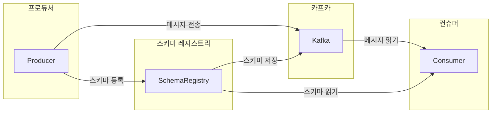

# 10.2 카프카와 스키마 레지스트리

## 10.2.1 스키마 레지스트리 개요

- 스키마 레지스트리란
    - 카프카에서 스키마를 활용하기 위해 사용하는 별도의 애플리케이션
    - 스키마를 등록하고 관리할 수 있다.
    - 카프카와 별도로 구성된 독립된 요소



- 카프카 레지스트리는 프로듀서/컨슈머와 직접 통신한다.
    - 프로듀서는 스키마를 레지스트리에 등록하고 등록된 스키마 정보를 통해 메시지를 전송한다.
    - 컨슈머는 스키마 ID를 레지스트로부터 읽어온 후 프로듀서가 전송한 스키마 ID와 조합해 읽는다.
- 스키마 레지스트리가 지원하는 데이터 포멧 중 대표적으로 에이브로가 사용된다.

## 10.2.2 스키마 레지스트리의 에이브로 지원

- 에이브로(Avro)
  - 시스템, 프로그래밍 언어, 프로세싱 프레임워크 사이에서 데이터 교환을 도와주는 오픈소스 직렬화 시스템
  - 빠른 바이너리 데이터 포멧을 지원
  - JSON 형태의 스키마를 정의할 수 있는 간결한 데이터 포멧이다.
- 스키마 레지스트리는 다음 세 가지 데이터 포멧을 지원한다.
  - 에이브로 (가장 먼저 지원)
  - JSON
  - 프로토콜 버퍼 포맷도 지원한다.
- 대중적으로는 JSON 포맷이 선호되지만 컨플루언트는 다음 이유로 에이브로 포맷을 권장한다.
  - 에이브로는 JSON과 매핑된다.
  - 에이브로는 매우 간결한 데이터 포맷이다.
  - JSON은 메시지마다 필드 네임들이 포함되어 전송되므로 효율이 떨어진다.
  - 에이브로는 바이너리 형태이므로 매우 빠르다.
- 아래는 에이브로를 활용한 스키마 정의 파일의 예시이다.
  - `namespace`: 이름을 식별
  - `type`: 에이브로의 타입
    - `record`, `enums`, `arrays`, `maps` 등을 지원
  - `doc`: 스키마 설명 제공 (주석)
  - `name`: 레코드 이름을 나타내는 문자열 (필수값)
  - `fields`: JSON 배열로 필드들의 리스트
    - `name`: 필드의 이름
    - `type`: 필드의 데이터 타입 정의
    - `doc`: 필드의 설명 (주석)

```json
{ 
  "namespace": "student.avro",
  "type": "record",
  "doc": "This is example of Avro."
  "name": "Student",
  "fields": [
    {
      "name": "student_id",
      "type": "string"
    },
    {
      "name": "name",
      "type": "string"
    },
    {
      "name": "age",
      "type": "int"
    },
    {
      "name": "email",
      "type": ["null", "string"],
      "default": null
    }
  ]
}

```

- 에이브로 특징
  - JSON과 달리 데이터 필드마다 데이터 타입을 정의
  - 각 필드마아 doc을 통해 설명 가능
