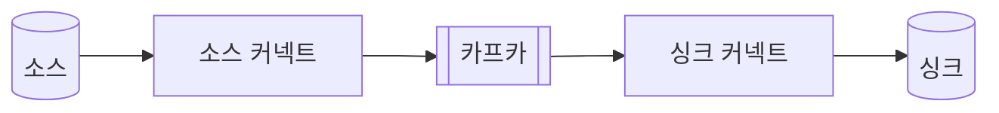
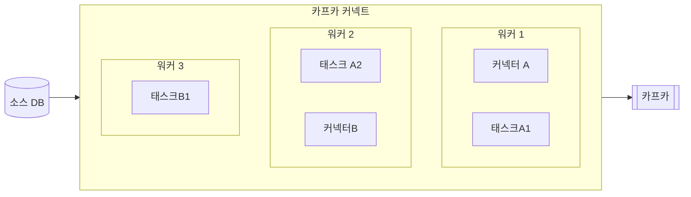

# 11.1 카프카 커넥트의 핵심 개념

- 카프카 커넥트 (Kafka Connect)
    - 아파치 카프카의 오픈소스 프로젝트
    - 외부 DB 시스템과 카프카를 손쉽게 연결하기 위한 프레임워크
    - 코드 없이 대용량 데이터를 카프카 안팎으로 손쉽게 이동시킬 수 있다.
    - 카프카 커넥트에서 제공하는 REST API를 통해 상황에 맞게 유연히 대응 가능
- 카프카 커넥트 주요 장점
    - 데이터 중심 파이프라인
        - 카프카로 데이터 전송 및 가져오기 가능
    - 유연성과 확장성
        - 단독 모드와 분산 모드 지원
    - 재사용성과 기능 확장
        - 기존 커넥트터를 활용하거나 요구사항에 맞춰 빠르게 확장 가능
    - 장애 및 복구
        - 워커 노드의 장애에도 유연히 대응 가능
- 카프카 커넥터는 클러스터 구성 후 아래 그림처럼 카프카 클러스터 양 옆에 배치 가능하다.
    - 소스 커넥터는 프로듀서, 싱크 커넥터는 컨슈머 역할을 한다고도 볼 수 있다.

- 커넥트 내부를 상세하게 살펴보면 아래와 같다.
    - 아래는 3대 워커를 실행한 분산 모드 소스 커넥터이다.
    - 워커
        - 커넥트 프로세스가 실행되는 서버 또는 인스턴스
        - 태스크나 커넥터가 워커에서 실행된다.
    - 커넥터
        - 직접 데이터를 복잡하지 않고 데이터를 어디로 복사할지 작업을 정의, 관리한다.
        - 작업 정의 후 각 태스크들을 워커에 분산
    - 태스크
        - 커넥터가 정의한 작업을 수행
        - 커넥터의 작업 정의대로 데이터를 복사

