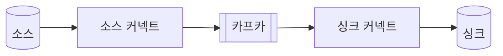
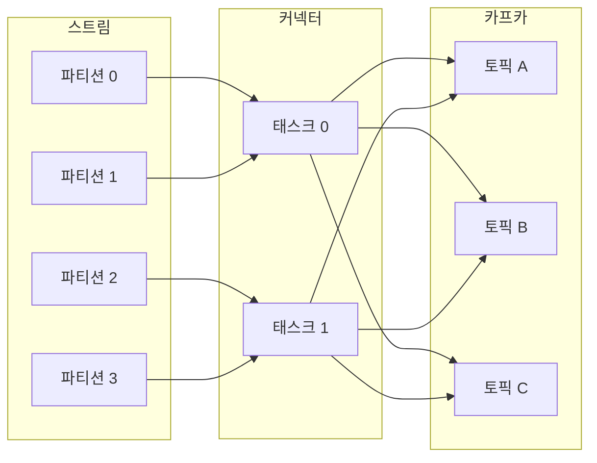

# 11.2 카프카 커넥트의 내부 동작

- 분산 배치된 각 태스크들은 메시지들을 소스에서 카프카로 혹은 카프카에서 싱크로 이동시킨다.
- 커넥트는 파티셔닝을 적용해 데이터들을 하위 집합으로 나눈다.
    - 카프카가 토픽을 파티션으로 나누듯이
    - 나뉜 파티션들은 오프셋과 같이 순차적으로 레코드들을 정렬시킨다.
- 소스 커넥터 내부 동작 구성
    - https://docs.confluent.io/platform/current/connect/devguide.html

- 커넥터에서 복사돼야 하는 데이터들은 레코드 순서에 맞춰 파티셔닝 되어야 한다.
    - 스트림 영역에서 데이터가 파티셔닝된 것을 볼 수 있다.
    - 스트림에서 나뉜 각 파티션들이 커넥터 영역 태스크에 할당된다.
    - 태스크들은 실제 데이터를 이동하는 동작을 처리한다.
- 각 파티션엔 오프셋도 있기에 장애/실패 시 지정된 위치부터 복구가 가능하다.
